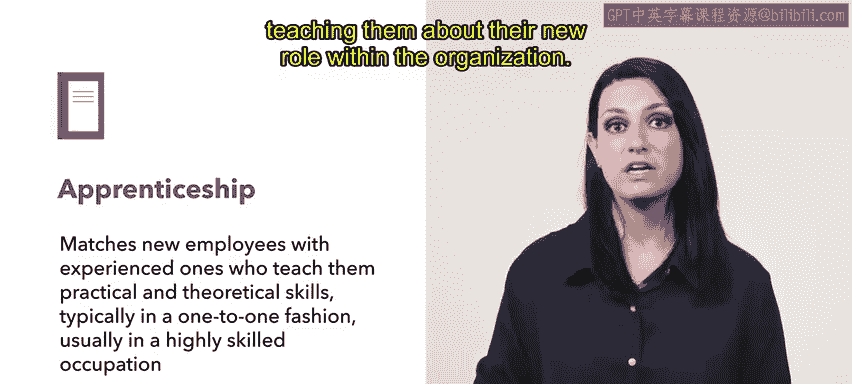
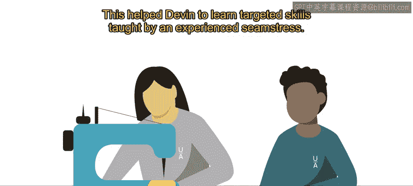
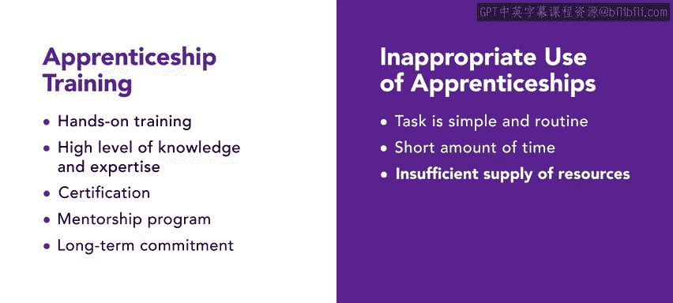

# HRCI《人力资源助理（招聘、学习发展、薪酬福利，1-3课／共5课）》：P92：25_学徒制

## 🎯 概述

在本节课中，我们将要学习一种名为“学徒制”的培训方法。我们将了解学徒制的定义、运作方式、适用场景以及何时应避免使用它。

---

## 📚 什么是学徒制？

学徒制是一种培训方式，它将新员工与经验丰富的资深员工配对，以帮助新员工深入了解其职位。

在学徒制中，新员工与能够教授他们实践和理论技能的资深员工配对，通常采用一对一的形式。在您的人力资源角色中，您可能会被要求识别出适合参与学徒计划的员工候选人。这些资深员工将负责指导新员工，并教导他们在组织中的新角色。

---

## 🏢 学徒制的应用实例

上一节我们介绍了学徒制的基本概念，本节中我们来看看一个具体的应用实例。

Urban Attire 是一家拥有实体零售店的公司，同时也有仓库，裁缝师们在仓库里生产零售店销售的服装。

在 Urban Attire，新员工 Devin 开始在仓库工作。Devin 具备一些基本的缝纫知识，但并非专家。为了提高他的技能，人力资源代表评估了 Devin 的能力并确定了需要改进的领域。他们将 Devin 与一位经验丰富的裁缝师配对，以学习这门手艺。这帮助 Devin 从经验丰富的裁缝师那里学到了有针对性的技能。

---

## ✅ 学徒制的适用场景

了解了具体实例后，我们来看看学徒制在哪些情况下最为有效。

以下是学徒制培训的适用场景：

*   **任务需要实践操作培训时**：当新员工从事需要实践操作培训的任务时，学徒制是有效的。例如，Urban Attire 让经验丰富的裁缝师向新员工展示如何提升缝纫技能。
*   **任务需要高水平知识和专业技能时**：当培训员工从事需要高水平知识和专业技能的任务时，学徒制是有效的。例如，Urban Attire 有特定的服装版型，必须精确完成以确保一致性。这需要对版型和风格有高水平的了解。学徒制之所以有效，是因为新员工能够与之前制作过这些版型的资深员工一对一工作。
*   **任务需要认证时**：当培训员工从事需要认证的任务时，学徒制是有效的。例如，在 Urban Attire 的仓库中，需要 OSHA 认证以确保安全。观察其他裁缝师如何在工作流程中实施安全协议，将帮助新员工学习这些协议和最佳实践。
*   **任务需要导师指导计划时**：当培训员工从事需要导师指导计划的任务时，学徒制是有效的。Urban Attire 经常使用“导师制”一词来描述资深裁缝师与新员工之间的关系。资深员工成为新员工的导师，这使新员工在遇到问题、疑虑或需要反馈时有一个可以求助的人。
*   **任务需要长期投入时**：当培训员工从事需要长期投入的任务时，学徒制是有效的。例如，培训一名新裁缝师是一项长期投入，可能需要数月甚至长达一年的时间来培训一名新员工掌握高技能。

---

## ⚠️ 何时应避免使用学徒制

除了适用场景，了解何时不应使用学徒制同样重要。

在以下情况下应避免使用学徒制培训：
*   任务简单且常规时。
*   时间紧迫或组织没有足够的人力来维持学徒制培训时，因为这种培训耗时且需要大量资源投入。

---

## 📝 总结

本节课中我们一起学习了学徒制培训。我们了解到，这种培训方式在多个职业和领域中都占有一席之地，它通过实践操作的方式，让新员工和受训者学习新角色，具有诸多益处。在后续课程中，您将继续学习更多提高效率和工作素养的培训方法。