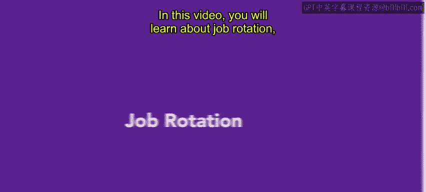
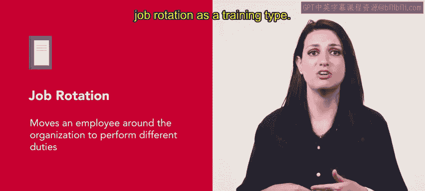
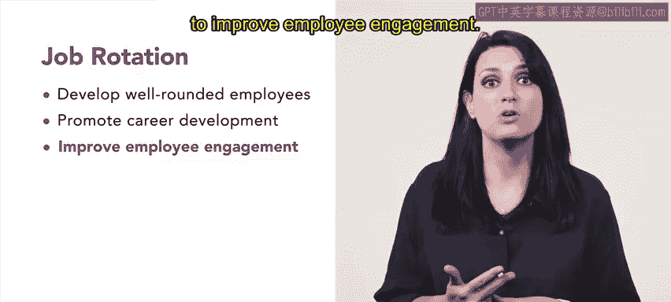
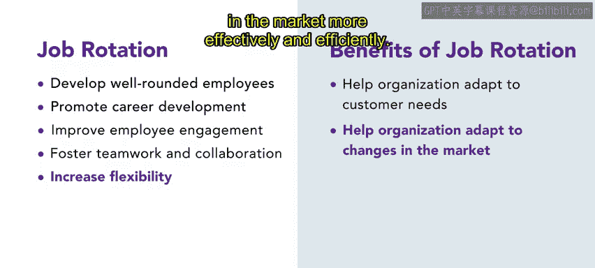
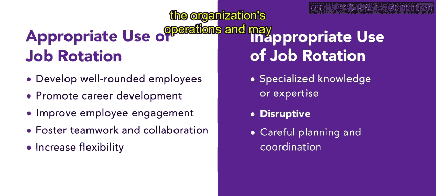

# HRCI人力资源助理课程：第26课：工作轮换 📊

在本节课中，我们将学习一种特定的培训方法——工作轮换。工作轮换也被称为交叉培训，常作为工作丰富化的一种形式，用于管理类或专业类员工。这种方法通过让员工在组织内轮换岗位、承担不同职责来进行培训。

## 概述

工作轮换的核心在于将员工调动至组织的不同岗位以执行不同的任务。让员工经历一系列工作可以增加他们的工作兴趣和动力，并鼓励员工之间进行协作。在员工的职业发展旅程中留住他们，是运用工作轮换作为培训类型的一个重要考量。

## 工作轮换的应用场景

工作轮换可以在多种情况下使用。以下是一些典型的应用场景：

1.  **当组织希望培养全面发展的员工时**：通过在不同部门和岗位职能间轮换，员工能更好地理解组织的运作以及不同部门间的协作方式。
2.  **当组织希望促进职业发展时**：通过接触不同的岗位职能和部门，员工可以识别自己感兴趣和有潜力的领域，规划在组织内的职业路径。
3.  **当组织希望提升员工敬业度时**：给予员工学习新技能、迎接新挑战的机会，能让他们在工作中获得更强的成就感和参与感。
4.  **当组织希望促进团队合作与协作时**：通过在不同岗位职能和部门间轮换，员工可以学习如何与来自不同背景、拥有不同技能组合的同事有效合作。
5.  **当组织希望增加灵活性时**：拥有多样化技能和知识的员工，能帮助组织更有效、更高效地适应变化、客户需求或市场转变。

## 工作轮换的实例

以一家受欢迎的披萨连锁店“SliciceU”为例。一位在收银台处理堂食订单的员工，在需要时，可能会在短期内承担披萨配送员或服务员的工作职责。

## 工作轮换的局限性

除了适用的情况，这种培训方法也存在一些不尽如人意的场景。例如：

*   如果任务需要**专业知识或专长**，工作轮换培训可能效果不佳。
*   此外，工作轮换培训可能会**干扰组织的正常运营**，需要仔细的规划和协调。

## 总结

本节课我们一起学习了工作轮换。工作轮换是一种培训形式，它通过提升工作道德、效率并为员工提供成就感，为组织带来诸多益处。在后续课程中，你将学习更多关于不同培训方法的知识，以更好地理解如何提升生产力和客户满意度。