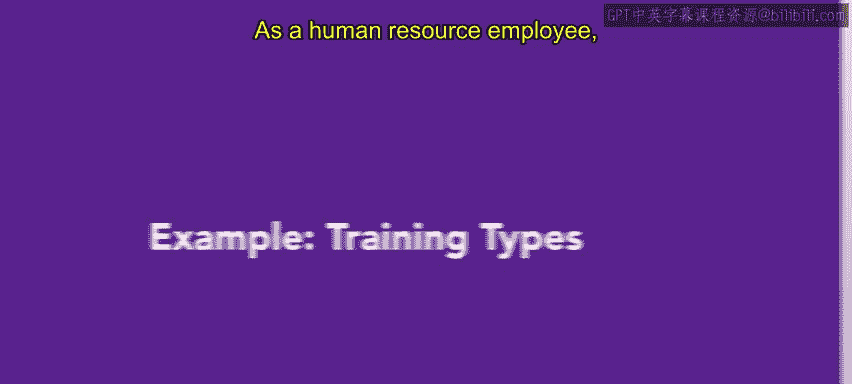
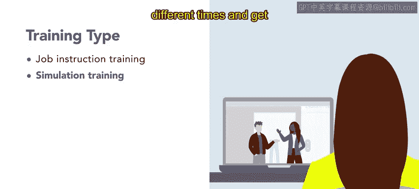
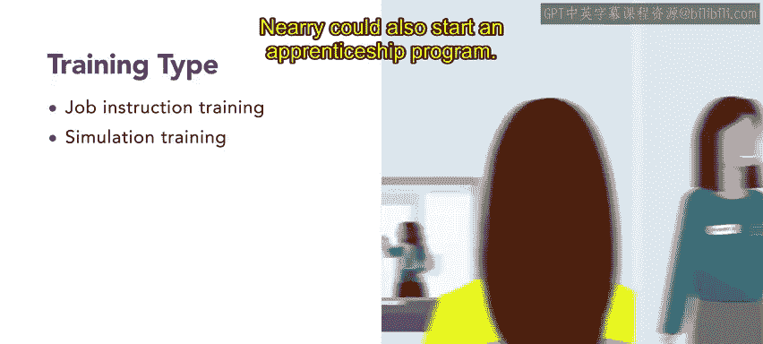
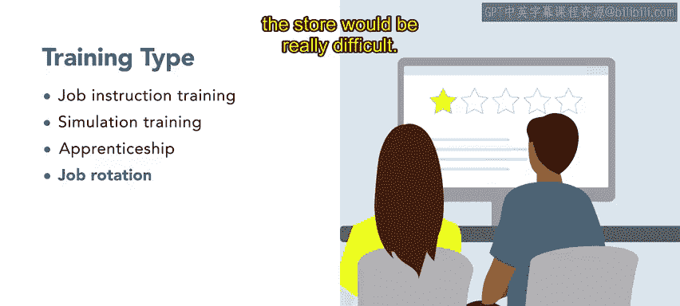

# HRCI人力资源助理课程：第3课：示例：培训类型 🎯

在本节课中，我们将通过一个具体案例，学习如何为不同的培训需求选择合适的在职培训方法。我们将跟随人力资源专员Neri，看她如何为一家服装公司的客服团队设计冲突解决培训。

---

## 概述

作为人力资源从业者，您需要为不同的培训目标设计合适的方案。本节课程将以“Urban Attire”公司的冲突解决培训为例，探讨四种常见的在职培训方法：工作指导培训、模拟培训、学徒制和工作轮换。我们将分析每种方法的适用场景、优势与挑战。

---

## 案例背景：Urban Attire公司

上一节我们介绍了培训设计的基本概念，本节中我们来看看一个实际应用案例。

Urban Attire是一家专注于现代都市休闲服饰的中型企业。公司拥有工厂、实体门店和总部，员工规模较大，人力资源部门责任重大。

公司管理层要求人力资源专员Neri负责组织一次冲突解决培训，目标是让客服销售代表掌握处理棘手客户的方法。

由于冲突解决是一项技能，Neri决定采用在职培训的方式进行。接下来，她需要评估哪种具体的在职培训方法最为合适。

---

## 培训方法选项分析

以下是Neri考虑采用的四种在职培训方法。

### 1. 工作指导培训

这种方法为执行某项任务或流程提供循序渐进的指导。对于Neri的冲突解决培训，可以通过材料分解与客户解决冲突的步骤。

具体做法可能包括：
*   提供包含一些场景和解决指南的培训材料。
*   让代表们在教室环境中，通过角色扮演练习与棘手客户互动的技巧。

采用工作指导培训能提供更直接的指导，但需要所有参与者集中时间进行小组面对面培训。

### 2. 模拟培训

模拟培训通过模仿真实场景，为学习提供一个逼真且安全的环境。Neri认为，一个能复现客服冲突的模拟程序会非常有用。

其优势在于：
*   学员可以多次运行模拟程序，练习冲突解决技巧并获得表现反馈。
*   学员可以在不同时间完成培训，并通过模拟的“真实”互动获得反馈。

### 3. 学徒制

学徒制指学员在有经验的导师指导下工作，以学习一门手艺或技能。Neri考虑是否可以通过冲突解决学徒计划，将经验不足的客服代表与经验丰富的代表配对，以发展冲突解决技能。

此外，该计划还可以包括与人力资源代表的定期检查或反馈会议，以确保新手代表取得进步。

经过思考，Neri认为学徒制更适用于技术技能培训，对于冲突解决这类软技能培训可能不是最佳选择。

### 4. 工作轮换

工作轮换涉及让员工在不同部门或岗位间流动，以获取经验和培养技能。Neri觉得这个想法很有趣，学员可以轮换到同样需要冲突解决技能的部门，例如销售或市场部。

例如，客服代表可以观察市场部的同事如何处理社交媒体上的投诉。这种方法有助于代表们学习不同视角，更广泛地理解冲突解决技能。

然而，Neri清楚客服代表团队大部分是兼职员工。在维持门店运营的同时，安排他们与办公室员工进行轮换，时间上会非常困难。

---

## 总结与决策考量

本节课中，我们一起学习了四种在职培训方法在一个具体案例中的应用分析。

无论Neri最终选择哪种方案，员工都将获得有助于日常工作的培训。在您未来的人力资源工作中，也需要选择一种既能满足组织需求，又能平衡**成本**、**员工时间**以及**所有相关人员可用性**的方案。

关键决策公式可简化为：
**最佳培训方案 = 满足组织目标 + 控制成本 + 最小化对运营的干扰**