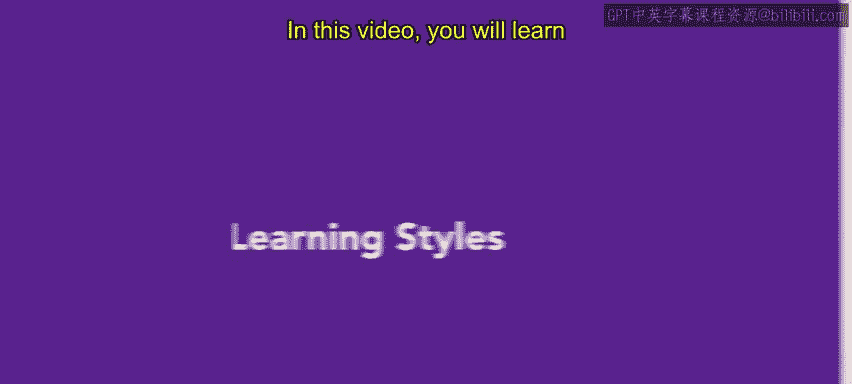
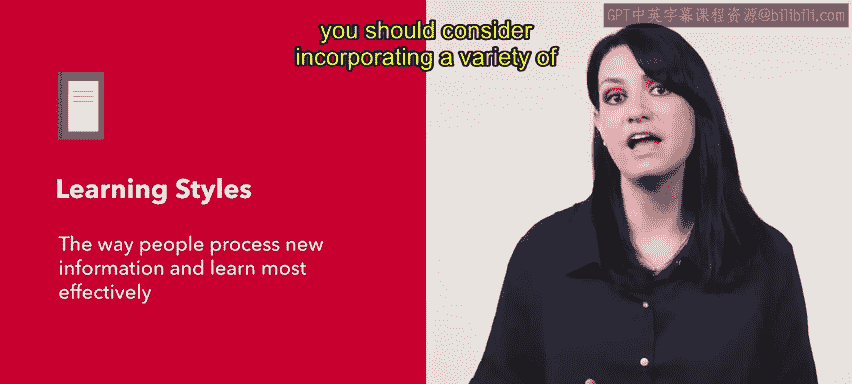
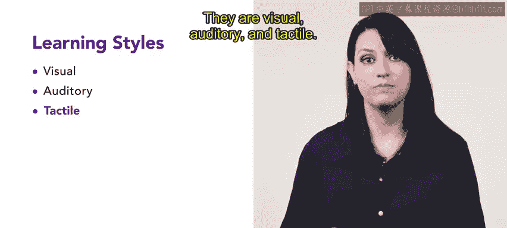
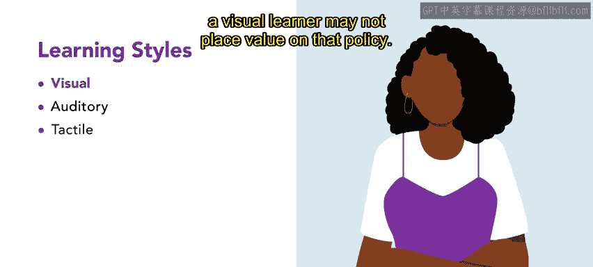
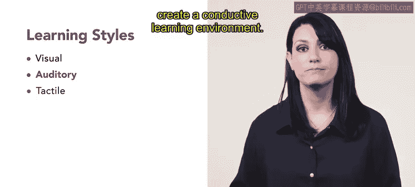
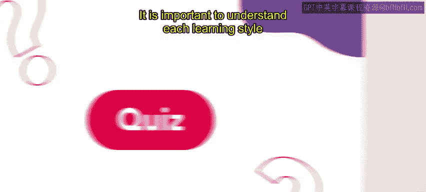
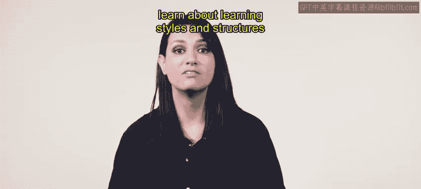

# HRCI《人力资源助理（招聘、学习发展、薪酬福利，1-3课／共5课）｜HRCI Human Resource Associate》 - P97：30_学习风格.zh_en - GPT中英字幕课程资源 - BV1qi421r7ba

In this video， you will learn about different types of learning styles In your human resources role。

 you will use various learning styles to deliver effective training for your employees。

 A learning style is the way people process new information and learn most effectively when planning training sessions as an HR professional。

 you should consider incorporating a variety of elements to meet the needs of different learning styles。

Let's examine the three main learning styles， they are visual， auditory， and tactile。

Visual learners learn best by seeing or observing information。

 they tend to process information through visual aids such as pictures， diagrams， videos， and graphs。

Visual learners often also draw or create charts to establish relationships between ideas。

 Exles of training methods for visual learners include PowerPoint presentations。

 infographics and diagrams。Handouts， books and articles with illustrations and images。

 educational videos， animations and demonstrations， mind maps， flow charts and concept maps。

 and virtually or augmented reality for immersive and interactive learning。

Visual learners are often equipped to note nonverbal cues。

 such as crossed arms or facial expressions。 These nonverbal cues can affect how an employee perceived information presented。

 For example， if a supervisor rolls their eyes while announcing a new policy。

 a visual learner may not place value on that policy。

Auditory learners learn best by hearing information。

 they tend to process information by listening to lectures， discussions or recordings。

 and interesting fact， auditory learners often process information best in their own voice so they may repeat or read out loud written materials。

Auditory learners are also quick to read verbal cues such as tone or tempo， for example。

 if a presenter outlines a new policy in a monotone voice。

 an auditory learner might assume that the policy is boring and therefore can be ignored。

Examples of training methods for auditory learners are lectures， podcasts or audio recordings。

Group discussions， read alouds and self recordings。

 audio based learning tools such as language learning apps or audio books and music or ambient sounds that create a conductive learning environment。

Finally， tactile or caninethetic learners learn best by doing and experiencing information。

 they tend to process information through hands on activities， role plays and real life examples。

Tactile learners often move their bodies， such as bouncing a knee or tapping a pencil as they are processing information。

 They may stand or change positions while listening to a lecturer or training session。

 It is important to provide training sessions with a high level of engagement for these types of learners。

Here are several training methods for tactile learners。Hands on activities， experiments。

 simulations or projects， group activities such as games， team building exercises or scavenger hunts。

Physical props like models， manipulatives or puzzles， skill practice such as role plays。

 case studies and real life scenarios and movement based learning tools like virtual reality。

 interactive whiteboards and motion based controllers。

It is important to understand each learning style and how to use them to create effective training。

 incorporating audio components， visual guides and handson activities will ensure that all learning styles are covered in this module you will continue to learn about learning styles and structures。

