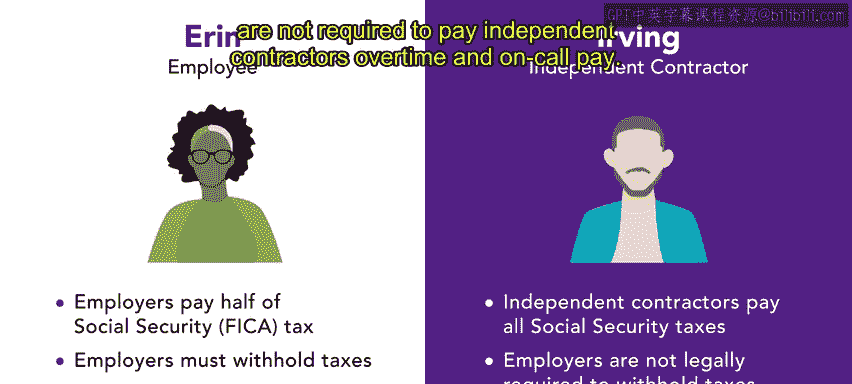

# 7：独立承包商 👷‍♂️

在本节课中，我们将学习如何区分不同类型的劳动者，特别是独立承包商。我们将探讨独立承包商的定义、他们与正式员工的区别，以及雇佣他们的潜在利弊。

---

上一节我们讨论了如何预测组织的用人需求。在确定需求后，接下来必须决定由哪种类型的劳动者来满足这些需求。本节中，我们来看看**独立承包商**。

独立承包商是指同意或签约为其他个人或组织完成特定工作的个人。他们不被视为雇员。独立承包商可能按项目工作，并可能同时受雇于多个组织或客户。

在美国，国税局和劳工部都提供了标准来判定某人是雇员还是独立承包商。
*   **国税局**使用基于SS-8表格的**20项测试**。
*   **劳工部**则考虑**7项因素**。

这两套标准在措辞和分析深度上有所不同，但描述的情况相似。在本课程后续部分，我将提供详细解释这两项测试的资源。

---

区分雇员和独立承包商非常重要，因为雇主对两者承担的义务不同。我们来比较同一组织内的两名劳动者：艾琳是雇员，欧文是独立承包商。

以下是两者在税务和薪酬方面的主要区别：

*   **社会保险税**：雇主必须支付雇员一半的社会保险税（FICA税）。独立承包商则需自行支付全部社会保险税。
*   **税款代扣**：雇主必须从雇员工资中预扣联邦和州税。法律不要求雇主为独立承包商预扣这些税款。
*   **加班与待命工资**：雇主必须向雇员支付加班费和待命工资。雇主通常无需向独立承包商支付加班费和待命工资。

根据具体情况和组织需求，雇佣独立承包商可能非常有益。

---

本节课中，我们一起学习了独立承包商的核心概念，包括其定义、与正式员工的关键区别，以及相关的税务和法律义务。下一节，我们将探索用于识别独立承包商的实用资源，并介绍其他类型的劳动者，如零工和临时工。