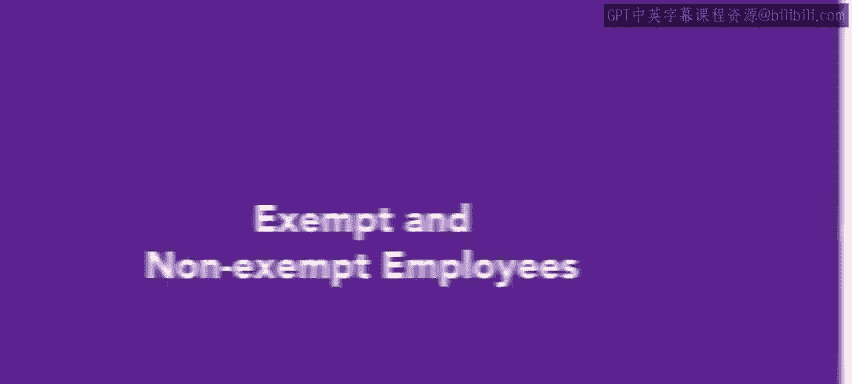
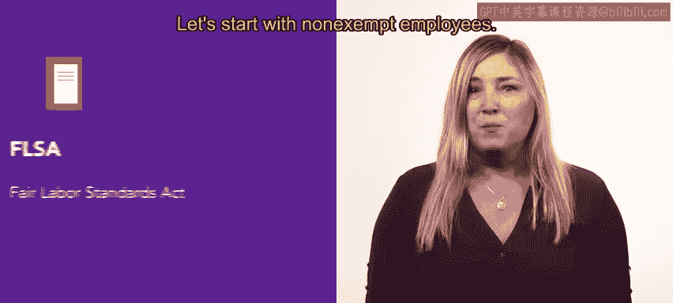
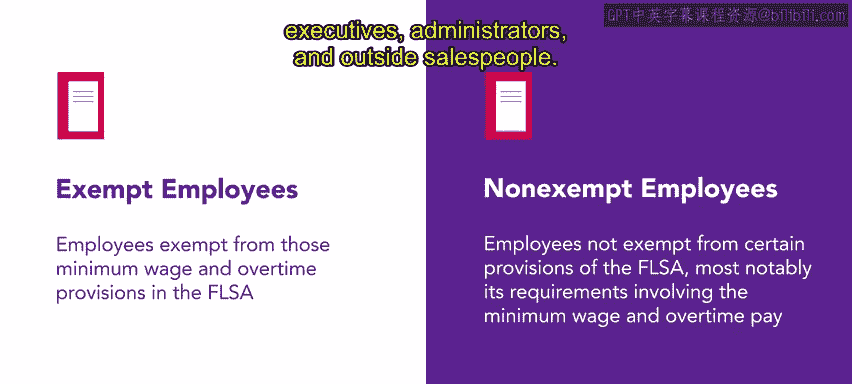
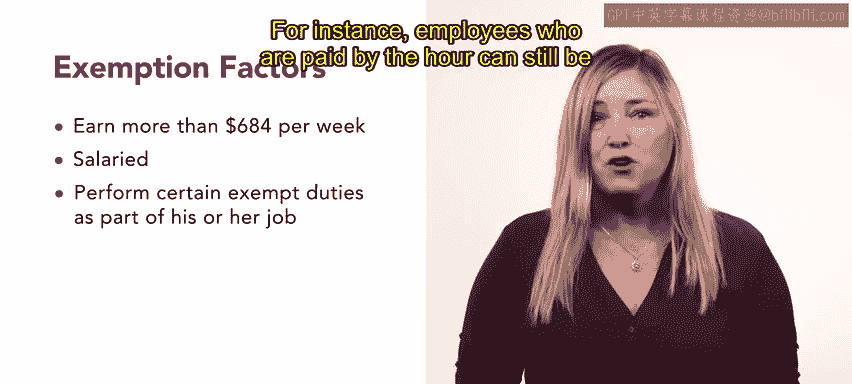
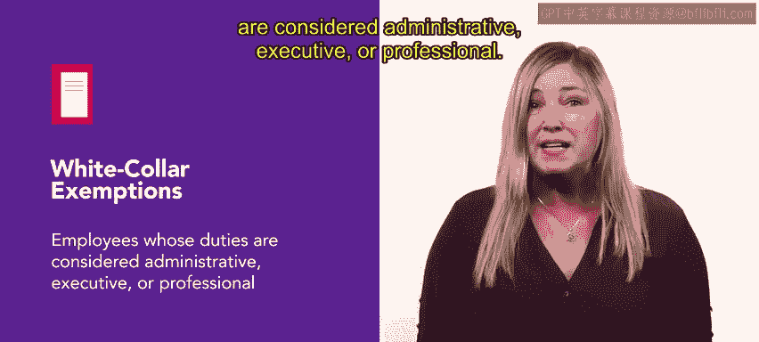
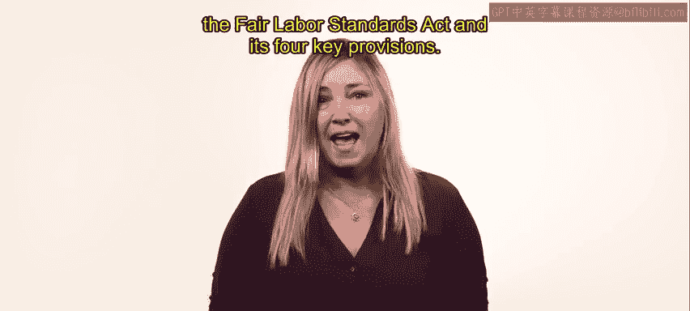

# 10：豁免与非豁免员工 👥



## 概述
在本节课中，我们将学习一个对人力资源专业人士至关重要的概念：**豁免员工**与**非豁免员工**的区别。理解这一区别对于确保公司遵守美国《公平劳动标准法案》（FLSA）至关重要，它直接关系到员工的最低工资、加班费计算以及其他劳动条款。

---

## 员工类型的重要区分

上一节我们介绍了组织中可能存在的多种员工类型。本节中，我们来看看一个基于美国《公平劳动标准法案》（FLSA）的关键法律区分：**豁免**与**非豁免**员工。这两个类别决定了FLSA中哪些条款适用于特定的员工。

## 什么是非豁免员工？ ⚖️

非豁免员工**不豁免**于FLSA的某些核心条款。



具体而言，他们受到以下条款的保护：
*   **最低工资**：必须获得不低于联邦规定的最低时薪。
*   **加班费**：在适用的情况下，超过标准工作时间的劳动必须获得加班报酬。

**公式**：`加班费 = 1.5倍 * 正常时薪 * 加班时数`

大多数按小时计酬的员工都属于非豁免类别。

## 什么是豁免员工？ 🧑‍💼

顾名思义，豁免员工**豁免**于FLSA中关于最低工资和加班费的规定。



豁免员工通常包括多种职业分类，例如：
*   专业人员（如医生、律师、教师）
*   行政人员
*   高管
*   外部销售人员

## 豁免资格的判定标准 🔍

要被视为豁免员工，员工通常必须通过以下三项测试或满足所有标准：

以下是判定豁免身份的三个核心标准：

1.  **薪资水平测试**：每周薪资必须超过**684美元**（约合年薪35,568美元）。
2.  **薪资基础测试**：必须是**受薪员工**（即按月或按周领取固定薪水，而非按小时计酬）。
3.  **职责测试**：其工作职责必须属于FLSA定义的豁免职责范畴。

**代码示例（概念性判断）**：
```python
def is_exempt(weekly_salary, is_salaried, job_duties):
    if weekly_salary > 684 and is_salaried and job_duties in ["executive", "administrative", "professional"]:
        return True
    else:
        return False
```



> **注意**：每条规则都存在例外情况。例如，某些高薪（年薪超过107,432美元）的时薪员工也可能符合豁免条件。最常见的豁免职责是所谓的“白领豁免”，涵盖行政、管理和专业职责。

## 为什么这一区分至关重要？ 📋

无论您的组织雇用何种类型的员工，准确判断其属于豁免或非豁免类别都至关重要。

这一区分的影响不仅限于工资和加班费，还涉及：
*   童工条款
*   记录保存要求




准确分类有助于企业规避法律风险，并确保公平对待所有员工。

---

## 总结

本节课中，我们一起学习了：
1.  **非豁免员工**受FLSA最低工资和加班费条款保护。
2.  **豁免员工**则豁免于这些条款。
3.  判定豁免身份需主要依据**薪资水平**、**薪资基础**和**工作职责**三大测试。
4.  正确区分员工类别是人力资源合规管理的基础。



接下来，我们将更深入地探讨《公平劳动标准法案》（FLSA）及其四项关键条款。