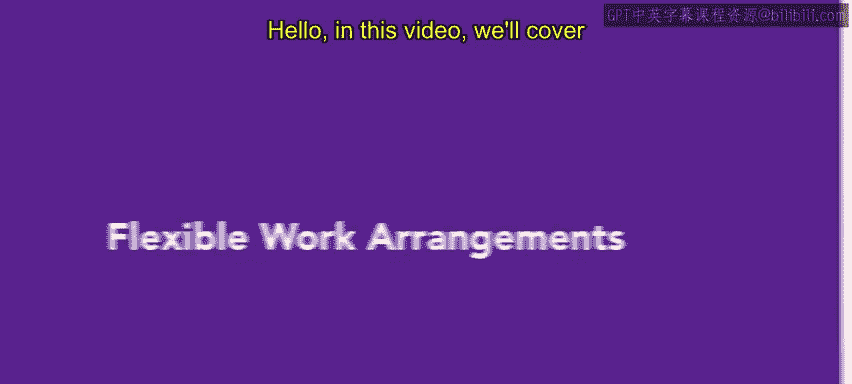
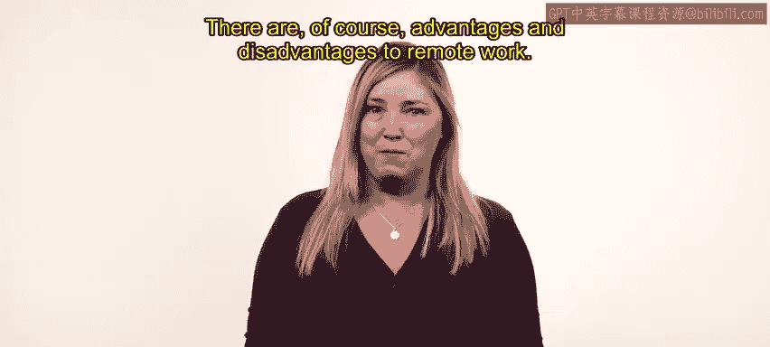
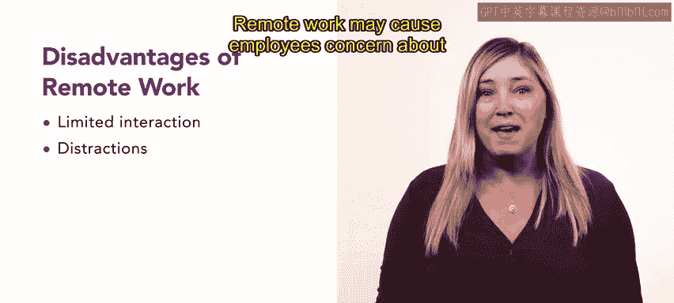
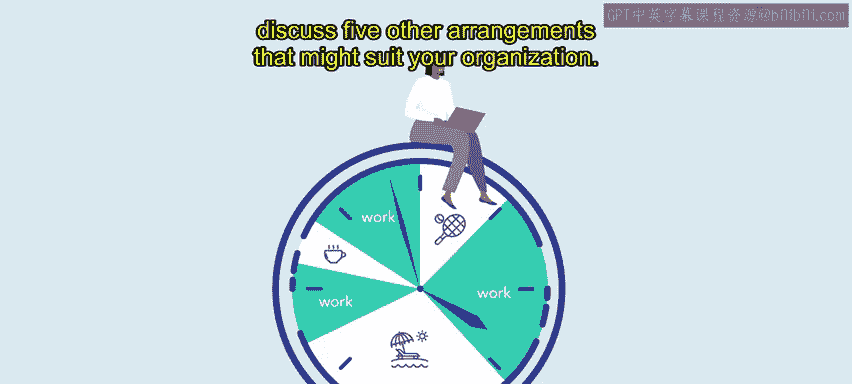
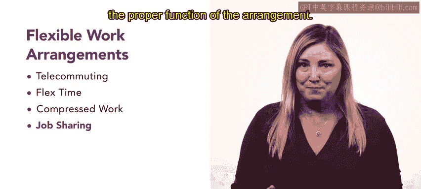

# 11：灵活工作安排 💼

在本节课中，我们将学习多种灵活工作安排。在许多情况下，要求全职员工完全在办公室工作可能并非最高效的选择。灵活的工作安排有时能更好地满足组织的需求。

## 远程工作 🏠

远程工作是指在传统办公空间之外完成的工作。在这种安排下，员工无需到办公室上班。如今，远程工作比历史上任何时候都更为普遍。许多公司正根据其在新冠疫情期间的经验，重新评估其工作模式。技术是推动远程工作的主要动力。如今，只要有一台电脑和网络连接，工作可以在任何地方完成。此外，视频聊天、通讯应用和文档共享等程序为团队协作提供了虚拟平台。

当然，远程工作有其优点和缺点。以下是其主要优点：

*   **减少通勤**：远程工作减少了员工因通勤，特别是长途通勤或高峰时段通勤，可能产生的沮丧感和时间浪费。
*   **环境效益**：减少汽油通勤意味着降低碳排放和空气污染。远程工作也减少了对大型办公楼供暖、制冷和供电的需求。
*   **扩大人才库**：不再受地域限制，雇主可以从任何地点雇佣有才华的员工，从而创造一个更具竞争力和多样化的劳动力市场。
*   **提升幸福感与效率**：许多研究表明，远程工作者比办公室内的同事更快乐、更高效。当员工能更好地控制其工作环境和日程时，他们通常报告有更好的工作与生活平衡。远程工作也让个人能更好地管理饮食和锻炼计划。
*   **提高员工保留率**：远程工作也与更高的员工保留率相关。
*   **降低运营成本**：远程工作可以降低实体办公空间、材料和设备的间接成本。当然，企业仍需投资于适当的培训和技术，以帮助远程员工取得成功。

尽管远程工作有许多优点，但仍有一些缺点需要考虑：

*   **互动减少**：与现场工作相比，远程工作减少了与同事的互动。这些互动既包括与工作相关的面对面活动，也包括午餐交谈等社交方面。
*   **家庭干扰**：远程工作地点可能涉及配偶、子女、宠物和家务等干扰因素，可能对工作与生活平衡产生负面影响。
*   **职业发展担忧**：远程工作可能引起员工对其相对于办公室同事职业发展前景的担忧。

## 其他灵活工作安排 🔄

上一节我们介绍了最常见的远程工作。本节中，我们来看看其他五种可能适合您组织的安排。

*   **远程办公**：远程办公与远程工作相似。两者的主要区别在于地点。远程工作者可以居住在世界任何地方。远程办公者通常居住地离工作地点更近。远程办公者可能在家工作几天，并且通常可以到办公室参加会议和协作工作。两者都在办公室等传统环境之外工作，但可能有不同的期望。您必须向求职者和员工明确工作安排的条件以确保成功。
*   **弹性工作时间**：弹性工作时间是一种允许员工在指定的日期和小时范围内选择工作时间的安排。例如，一名员工可能从上午7:30工作到下午3:30，而另一名员工从上午9点工作到下午5点。在某些行业，员工可能从周日工作到周四，而不是周一到周五。雇主和员工共同制定弹性工时计划。这些计划通常要求员工每周工作40小时，每周工作五天。他们必须参加会议，但员工可以控制每天工作的开始和结束时间。弹性时间表可以赋能员工，也是招聘和留住人才的工具。
*   **压缩工作周**：压缩工作周允许员工在比通常所需更少的工作日内完成一定时长的工作。根据美国商务部的规定，压缩工作周要求员工在少于10个工作日内完成双周工作要求。这意味着，一名需要工作80小时的全职员工必须在少于10天内完成所有80小时的工作。流行的压缩工作周安排包括“4/10安排”（工作4天，每天10小时，周末休息3天）和“9/80安排”（工作9小时工作日，每隔一个周五休息）。即使在压缩工时下，员工也需在组织设定的核心工作时间内在岗。他们可以在核心工作时间前后调整开始和结束时间。
*   **工作分担**：工作分担指将一个全职岗位的工作由两个人分担。两名员工共同对该岗位的全部工作成功负责。他们分担一个全职岗位的职责。这类员工通常按比例获得薪资和带薪休假。通常需要创造性的排班来满足工作分担者和部门的需求。工作分担安排可以平均分配，也可以按60/40或任何适合组织和员工需求的组合进行。日程表也可能根据需要重叠。在工作分担安排中，分担者通常负责该安排的良好运作。如果其中一人被解雇或辞职，剩下的工作伙伴可能需要暂时或永久地恢复全职岗位。如果剩下的员工和组织无法找到继续工作分担的解决方案，该员工可能会辞职。
*   **分阶段退休**：分阶段退休是发生在员工生命周期末端的一个过程。临近退休的员工可能倾向于减少工作职责和计划工时，以逐步过渡到退休。这个过程是员工与其部门之间的共同协议。

## 总结 📝

本节课中，我们一起学习了多种灵活工作安排。这些灵活的工作安排或其组合可能非常适合您组织中的某些员工。在接下来的课程中，您将回顾一个真实案例。您将运用在本课中学到的概念，并将其应用到一个模拟组织中。