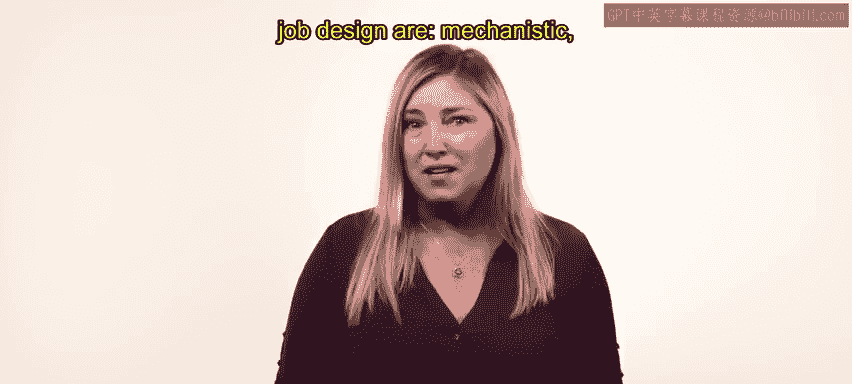
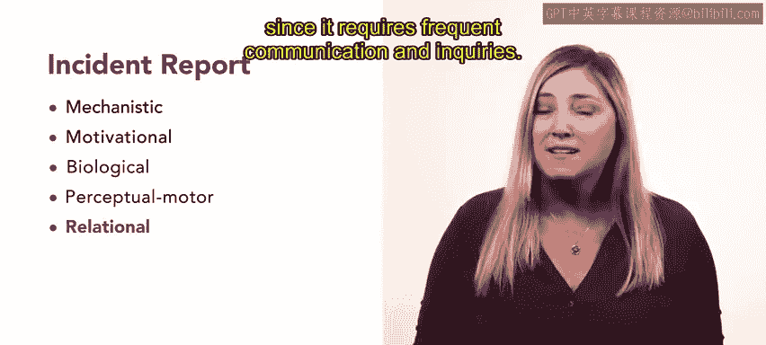
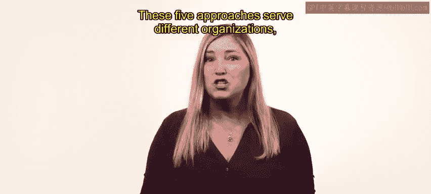

# 14：工作设计方法 🛠️

在本节课中，我们将学习五种不同的工作设计方法。理解这些方法有助于改善员工体验并提升组织效率。

上一节我们介绍了工作设计与再设计的基本概念，本节中我们来看看具体的设计方法。

## 概述

工作设计能够提升员工体验与组织效率，因此选择正确的方法至关重要。视频中总结了五种不同的工作设计方法，它们分别是：机械型方法、激励型方法、生物型方法、感知运动型方法和关系型方法。

## 五种工作设计方法详解

以下是五种主要的工作设计方法。

### 1. 机械型方法

机械型方法基于经典的工业工程概念，与运筹学有共通之处。它侧重于评估特定工作中简单、重复性的任务。

这种方法更适用于涉及装配的工作，例如制造企业中的岗位。某些办公室工作甚至电话营销也可根据机械型方法进行设计，因为它们要求高度的一致性。

**核心公式**：`效率最大化 = 简化任务 + 减少错误`

机械型方法有助于设计那些需要简单培训、能实现最高效率和生产率、并降低错误率的工作。然而，这种方法不一定能鼓励工作满意度或动机。当员工反复执行相同任务时，可能会感到无聊和缺乏动力，这些情绪可能导致高缺勤率和离职率。

### 2. 激励型方法

激励型方法强调，如果员工感到有控制感、能够运用自身技能并理解其工作成果，他们会对其工作更满意。

你可以使用激励型方法来重新设计那些能带来高水平员工满意度的工作。然而，这种方法最适合需要广泛培训的岗位，以及那些在其职位上能够发挥创造力和创新能力的员工。

**核心概念**：`工作满意度 = 自主权 + 技能运用 + 结果认知`

采用激励型方法设计的工作可能存在显著差异，这可能产生负面结果。组织可能为这些专业化岗位承担更高的培训和招聘成本，也可能遇到生产率降低和错误倾向增加的问题。在选择工作设计方法时，应仔细考虑这些潜在影响。

### 3. 生物型方法

生物型方法植根于人体工程学，即研究工人如何利用机器和设备以实现最佳绩效。这种方法与体力要求高的工作最相关。

此方法考虑员工的舒适度。它评估员工使用的设备、工作环境的噪音和温度，或工作时间。

**核心关注点**：`工作环境 + 设备设计 → 员工健康与舒适`

如果你的目标是在工作设计中解决健康与福祉问题，生物型方法会很有帮助。然而，调整设备和环境的成本可能很高。

### 4. 感知运动型方法

这种方法强调特定工作的脑力需求。它识别成功完成工作所需的注意力广度和记忆力。

感知运动型方法旨在平衡工作的认知要求与员工的技能。这种平衡可以减少压力和无聊感，从而减少错误或事故。

**核心平衡**：`工作认知需求 ≈ 员工认知能力`

这种方法的缺点在于，它没有考虑激励型方法所关注的一些问题，这可能导致员工觉得自己的工作缺乏意义。

### 5. 关系型方法

关系型方法评估特定的工作阶段或场所。这种评估侧重于工作任务在流程中的位置，以及员工之间、员工与最终用户之间的关系。

尽管这种方法最初由牛顿韦尔斯利医院在护理患者时开创，但它也可应用于教育和咨询工作中的项目。关系型方法可以帮助你强调跨团队的及时、准确沟通与协作。

**核心关系**：`工作影响他人 → 员工受到激励`

当员工意识到他们的工作如何影响他人时，这也能激励他们。然而，这可能是一种耗时的方法，因为它需要频繁的沟通和询问。

## 总结

本节课中，我们一起学习了五种不同的工作设计方法：机械型、激励型、生物型、感知运动型和关系型。这些方法服务于不同的组织、工作类型和需求。对每种方法的基本理解将有助于你未来的工作设计任务。