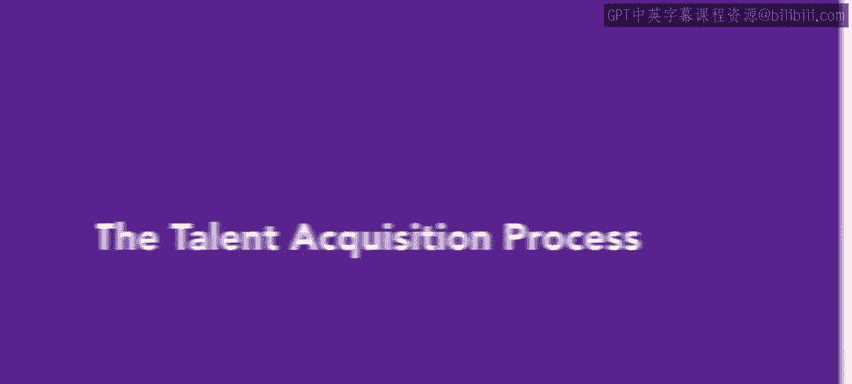
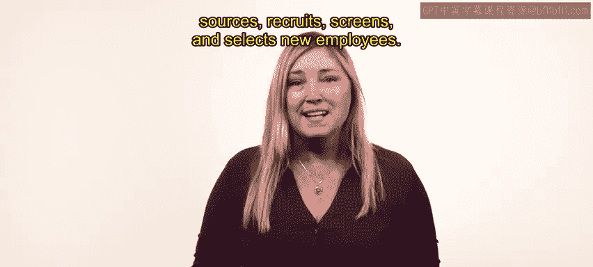
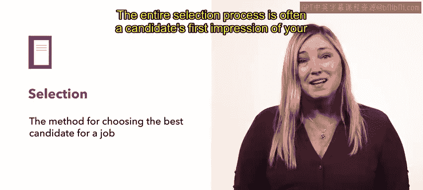
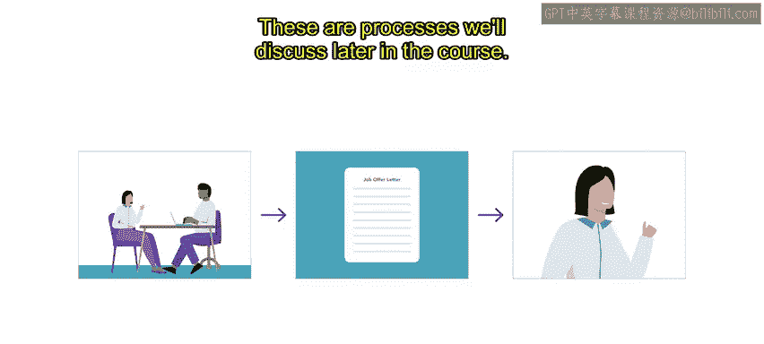
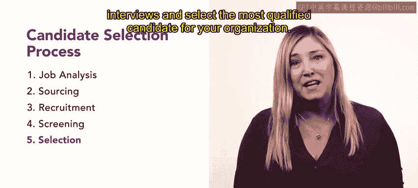

# 19：人才获取流程 👥

在本节课中，我们将学习人才获取的整体流程。理解这一流程是掌握后续职位分析与描述等具体环节的基础。我们将了解人力资源团队如何规划、寻找、招募、筛选并最终选拔新员工，以满足组织目标。

---

在深入探讨员工选拔流程之前，让我们先思考一些可能遇到的挑战。例如，如果招聘经理选错了人，或者直线经理不公平地对待应聘者，会带来什么后果？这些因素使得选拔过程充满挑战，并可能给公司造成损失。请带着这些思考继续学习。

员工选拔过程包含五个核心步骤：**职位分析**、**寻源**、**招募**、**筛选**和**选拔**。

以下是每个步骤的详细说明：

*   **第一步：职位分析**
    这是选拔过程的开端。在寻找候选人之前，必须明确职位的要求。你需要通过创建一份详细而准确的**职位描述**来完成这一步。

*   **第二步：寻源**
    在清晰理解特定职位的需求后，下一步是寻源。寻源是指运用主动的招聘技巧，为职位识别合格的候选人。

*   **第三步：招募与筛选**
    寻源之后是招募与筛选。招募是吸引、筛选并雇用合格人员担任某个职位的过程。在筛选过程中，你需要基于多种因素评估申请人，包括他们的申请表、简历、推荐信以及技能评估结果。符合资格的人将进入下一轮面试。

*   **第四步：面试与公平性**
    面试阶段的公平性至关重要。任何招聘工作都必须融入多元化和包容性。多元化招聘与传统招聘一样，基于候选人的优点和与职位的匹配度。然而，多元化招聘旨在消除选拔过程中的偏见，为所有申请人提供平等的机会。为了实现这一目标，你和你的组织可以审查所有招聘环节，包括筛选评估和选拔系统，以识别并减少潜在的偏见。所有的招聘活动，如征集、筛选和面试候选人，都应在职位分析完成后进行。

*   **第五步：候选人选拔**
    招募之后是候选人选拔阶段。在此阶段，你需要从候选人池中选择最合格的人选。这一步标志着员工选拔过程的结束。

---

整个选拔过程通常是候选人对你所在组织的**第一印象**。它帮助候选人判断你的组织是否与他们的价值观和目标相符。

员工选拔过程完成后，你将进入后续的**雇用**和**入职**流程，这些内容我们将在课程后面讨论。

---

**总结**

本节课我们一起学习了员工选拔的全过程。首先，你需要确定职位要求；接着，招募并筛选候选人；然后，进行无偏见的面试；最后，为你的组织选择最合格的候选人。希望本节课能让你对整个人才获取流程有一个初步的理解。在接下来的课程中，我们将更详细地探讨这些概念和流程。下一节，我们将学习职位分析。