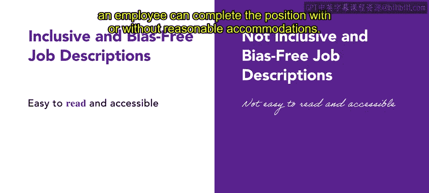

# 22：工作描述 📝

在本节课中，我们将学习工作描述的核心组成部分及其重要性。工作描述是成功进行工作分析的关键文件之一，它帮助组织为每个职位找到合适的候选人。我们将详细探讨其构成要素，并了解如何创建包容、无偏见的工作描述，以吸引多元化的申请者。

---

## 工作描述的定义与回顾

上一节我们介绍了工作分析需要工作描述和工作规范两个关键部分。本节中，我们来深入探讨工作描述。

工作描述是一份书面文件，用于描述员工的工作活动。它包含几个特定的组成部分。

以下是工作描述的核心组成部分：

*   **职位名称**：显示员工在组织中的职责。
*   **所属部门**：显示员工的工作地点。
*   **汇报关系**：详细说明员工向谁汇报、是否管理其他员工以及与谁密切合作。它还应列出任何外部相关方，例如工会和供应商。
*   **主要职责范围**：包含该角色的关键责任领域，并明确员工对其工作日程和决策的控制程度。它还应包括用于衡量员工绩效的标准。
*   **雇佣条款**：涉及工作状态的多个方面，包括工作时间、薪酬和福利。

---

## 核心组成部分详解

现在，让我们逐一详细了解这些组成部分。

在编写主要职责时，区分**基本职能**和**非基本职能**至关重要。基本职能是指不改变就无法调整工作的任务和责任。非基本职能则可以在不改变工作本质的情况下进行调整。根据美国平等就业机会委员会的规定，雇主必须考虑那些在合理便利条件下能够履行基本职能的候选人，并且绝不能因为候选人无法履行非基本职能而将其排除在外。

关于雇佣条款，需要明确职位是永久性还是临时性，是全职还是兼职，以及是否包含健康福利等。对于**独立承包商**（如自由职业者或顾问），他们通常是临时性的，不具备正式员工的法律地位或工作保障。大多数情况下，这些人员与雇主签订的是**随意雇佣合同**，意味着任何一方都可以随时终止雇佣关系，而无需提供理由。

此外，工作描述必须说明该职位是否**豁免于**最低工资或加班规定，以符合《公平劳动标准法》的要求。

---

## 创建包容性的工作描述

了解了工作描述的组成部分后，现在让我们关注工作描述的包容性。

无论公司是寻找特定技能还是考虑广泛选择，工作描述都应始终保持包容和无偏见。公司可以通过提供更灵活、易于获取并能适应员工个人需求的工作来实现这一点。

性别偏见会限制申请职位的合格候选人数量。工作描述中带有男性化倾向的措辞可能会阻碍女性申请，无论该职位是传统上认为的男性化、女性化还是中性职位。例如，可以将“强大而果断的领导技能”重新措辞为“优秀的领导和管理技能”，以避免男性化倾向的措辞。

包容性工作描述的另一个方面是必须易于理解和获取，例如使用更易于阅读的字体（如无衬线字体）。重要的是要在工作描述中体现包容性，并恰当地展示组织的目标和价值观。目标是照顾到所有能力的员工，并明确说明员工是否可以在有或没有合理便利的情况下完成该职位。

---

## 总结与预告

本节课中，我们一起学习了如何创建有效且包容的工作描述。我们探讨了工作描述的各个组成部分，包括职位名称、部门、汇报关系、主要职责和雇佣条款。我们还重点讨论了区分基本与非基本职能的重要性，以及如何避免性别偏见和确保描述易于理解，从而吸引更广泛、更多样化的合格候选人，并建立更具包容性的团队。

接下来，你将探索创建一份工作描述的具体实践步骤。