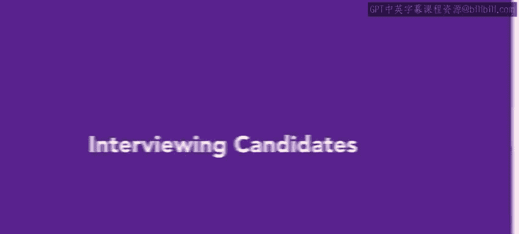
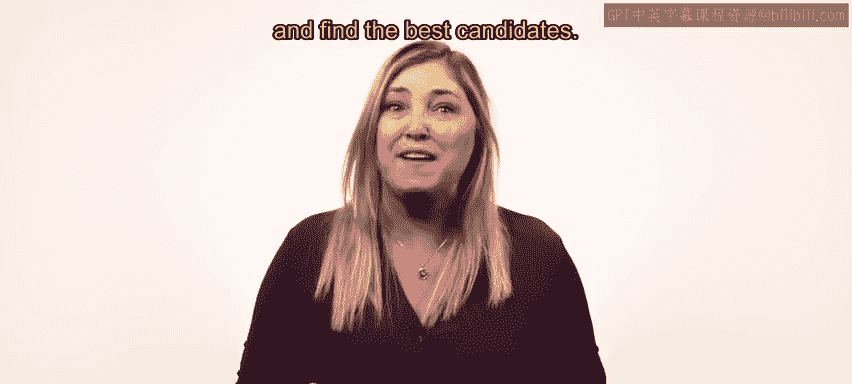
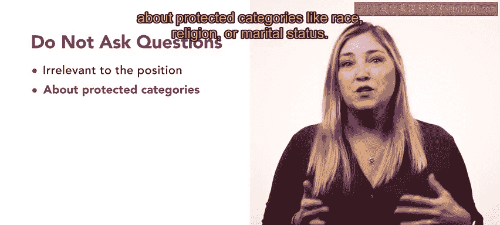
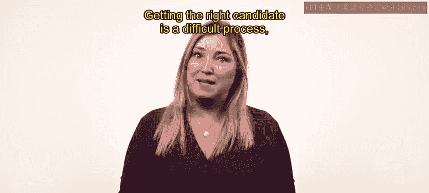

**第3：面试候选人**

在本节课中，我们将学习招聘流程中的关键环节——面试。我们将探讨面试的目的、如何设计有效的问题，以及面试中应避免的常见误区。

---

上一节我们介绍了筛选流程，本节中我们来看看选拔流程的下一步：面试候选人。

面试帮助你从通过筛选、符合职位要求的候选人名单中，找出最合适的人选。面试用于**深入探究与工作相关的更多信息**，并有助于评估申请者的动机和人际交往能力。同时，这也是申请者判断该职位是否适合自己的机会。

在面试中，雇主应尽可能多地了解所考虑的申请者。实现这一目标的一种方法是提出开放式问题，并避免那些答案显而易见或过于简单的问题。

**最佳的问题应与候选人预期担任角色的具体部分相关**。例如，如果一个职位需要员工具备领导技能，你可以问：“请分享一次你必须担任领导角色的经历。”

在构建面试结构时，需要记住后续要对候选人进行比较。**向候选人提出相同的问题，或覆盖相同主题的问题**，以便更轻松地比较他们的答案。避免询问与职位范围无关的问题，有助于减少对候选人的偏见。

以下是面试中需要避免的其他潜在陷阱：
*   询问关于受保护类别的问题，例如种族、宗教或婚姻状况。

找到合适的候选人是一个艰难的过程，但通过提出正确的问题，你可以确定哪位候选人最适合你组织中的这个角色。

---

在后续课程中，你将学习不同类型的面试，以及如何有效利用它们，从面试过程中获得最佳结果。

本节课中，我们一起学习了面试的核心目的——评估匹配度与获取深层信息，掌握了通过设计与职位相关的开放式问题、保持问题一致性来有效组织面试的方法，并明确了应避免询问涉及偏见或与工作无关的个人问题。