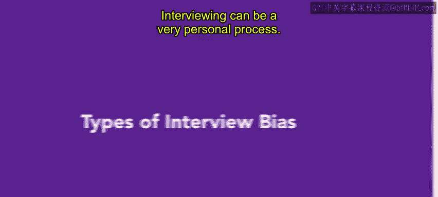
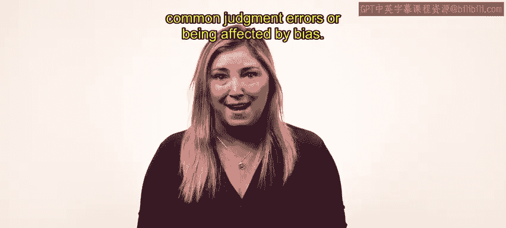
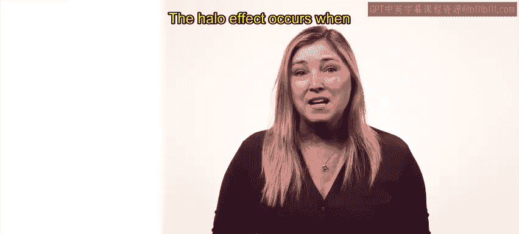
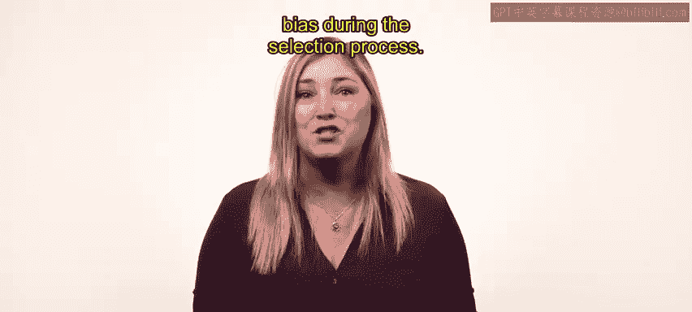

# 42：面试偏见类型 🎯

在本节课中，我们将学习面试过程中可能出现的各种偏见类型。了解这些偏见是确保招聘公平、客观，并为企业选拔到最合适人才的关键一步。

面试是一个高度个人化的过程。在此阶段，管理者容易犯下常见的判断错误或受到偏见的影响。存在许多不易察觉的无意识偏见。

## 光环效应 ✨

上一节我们提到了面试中的个人化特性，本节中我们来看看第一种常见偏见——光环效应。光环效应指面试官仅凭申请者的某一项特质做出判断，并让这项特质影响其对其他不相关特质的评价。

**公式**：`对特质A的积极印象 → 泛化至对特质B、C、D的积极评价`

例如，你可能因为某人谈吐优雅、词汇丰富，就假设他/她也会是一名才华横溢的工程师。

## 刻板印象 🏷️

与光环效应类似，刻板印象也是一种基于片面信息进行概括的偏见。刻板印象指管理者根据申请者所属的群体成员身份来对其进行评判，尽管该申请者可能并不具备该群体的典型价值观或特征。

以下是刻板印象的一个例子：
*   年长的一代不精通技术且抗拒改变。

## 趋中倾向偏差 ⚖️

趋中倾向偏差指面试官给所有候选人都打出相似的分数，通常集中在评分表的中间区域。面试官可能不想给候选人打太低的分，同时也犹豫是否给其他人打太高的分。结果是每位候选人的最终得分都很接近，尽管他们在职位资格上存在差距。

## 对比效应误差 ↔️

对比效应误差发生在将候选人与单一候选人进行比较时。如果这个单一的候选人匹配度很弱，相比之下，其他所有候选人可能都显得很强。

例如，如果第一位申请者缺乏说第二语言的能力，那么后续的候选人即使缺乏其他期望的特质，也可能显得更强。

## 文化噪音 🗣️

文化噪音指候选人试图根据他们认为面试官想听到的或社会普遍接受的观点来回答问题，而不是给出事实性的答案，而面试官没有意识到这个答案并不真诚。

以下是文化噪音的一个例子：
*   候选人告诉面试官他们更喜欢团队合作，而实际上他们独立工作时效率最高。候选人推断团队合作是一个更被社会接受的回答。

## 亲和力偏见 👥

亲和力偏见指倾向于与那些拥有相似外貌、信仰、经历和背景的人沟通，并给予他们更高的评价。这些相似点可能包括共同的文化传承，或对某项特定课外活动（如攀岩）的喜爱。

## 证实性偏见 🔍

证实性偏见指面试官对结果已有先入为主的看法，然后寻找信息来证实或确认这一判断。

例如，面试官可能假设有某种特定口音的人缺乏决心或专注力。他们随后可能会问一些关于完成困难任务的引导性问题，希望候选人会建议走捷径。

## 非语言偏见 🙅

非语言偏见指面试官受到肢体语言、外貌或眼神交流的影响。例如，在面试中腿部不停抖动的申请者，可能会让面试官认为该候选人焦虑而非兴奋。

## 总结与过渡 📝

本节课我们一起学习了面试中可能出现的多种偏见类型，包括光环效应、刻板印象、趋中倾向偏差、对比效应误差、文化噪音、亲和力偏见、证实性偏见和非语言偏见。尽管你可能抱有最好的意图，但在开始选拔流程前，意识到这些无意识偏见至关重要。这将确保你的选择反映出该职位的最佳候选人。

在了解了这些偏见之后，接下来你将学习如何通过组建面试小组等最佳实践，来在选拔过程中避免偏见。