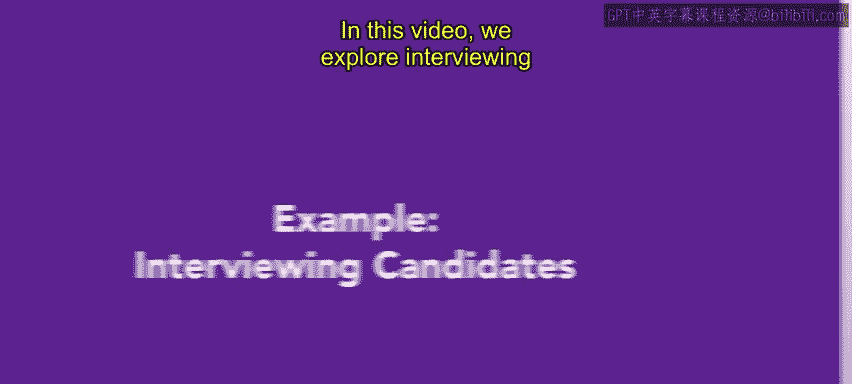
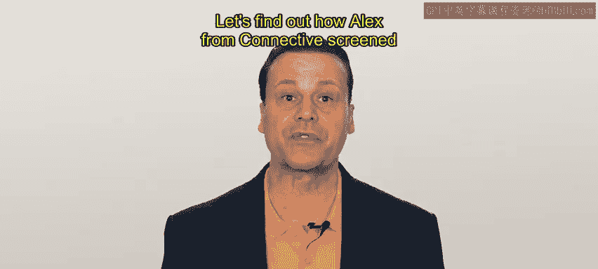
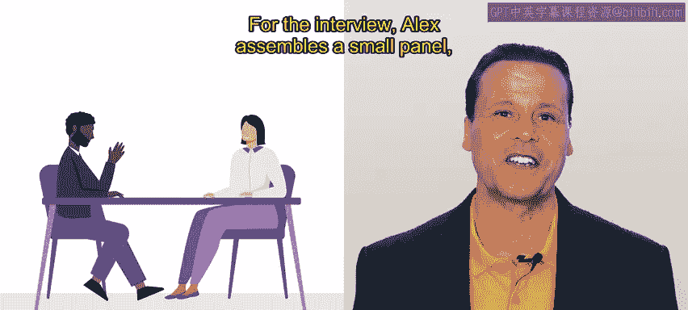
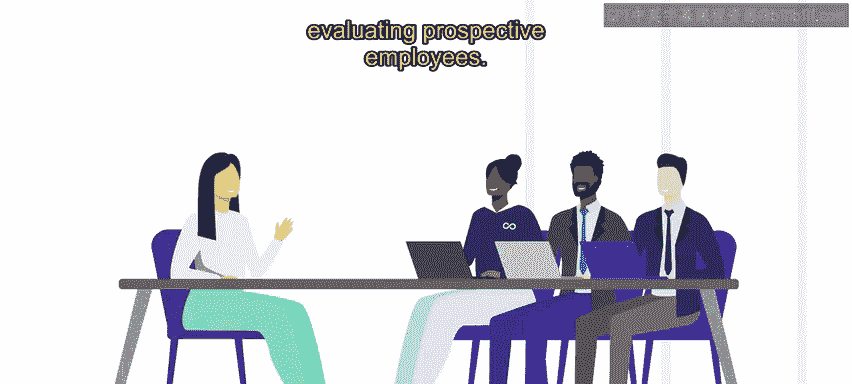

# 44：示例：面试候选人

在本节课中，我们将学习如何在完成初步筛选后，在真实场景中面试候选人。我们将回顾筛选工具和不同类型的面试，并重点讨论在面试过程中意识到无意识偏见的重要性。

## 场景背景介绍

上一节我们介绍了招聘的初步工作，本节中我们来看看具体的面试环节。让我们通过康奈克蒂夫公司的亚历克斯如何筛选和面试一个空缺职位的候选人，来了解这个过程。

康奈克蒂夫是一家现代化的通信公司，专门帮助企业保持联系。他们致力于帮助分布式团队协作，提供视频会议和基于云的电话系统等软件工具。

## 面试前的准备工作

人力资源部的亚历克斯正在为销售团队填补一个职位空缺。在一次成功的大型营销活动后，销售团队难以满足激增的需求。之前，亚历克斯已经为这个职位招募了候选人。现在，是时候筛选和面试潜在候选人了。

以下是亚历克斯为初级销售代表职位所做的准备工作：

*   **创建标准化申请**：亚历克斯为该职位创建了一份申请表，要求申请人附上简历。申请表有助于收集每位申请人一致的信息，而简历则提供了可能与职位相关的技能和经验的额外信息。
*   **决定筛选方式**：对于这个职位，亚历克斯决定不要求工作样本或进行任何筛选测试。在与销售团队沟通后，他们认为面试过程将比纸笔测试提供更有用的信息。

## 面试结构与偏见意识

在面试安排上，亚历克斯组建了一个小型面试小组，包括销售团队负责人以及将帮助培训新员工的资深销售代表。

亚历克斯主导准备了与职位相关的问题，并确保能以相同的方式向每位候选人提问。

在面试前，亚历克斯回顾了最近一次偏见培训中的笔记。亚历克斯知道自己过去曾无意中对销售角色的人产生过刻板印象，并希望在本轮面试中避免这种情况。亚历克斯对此感受强烈，因为作为一个有纹身的人，曾在之前的求职面试中被反复问及此事。亚历克斯仍然认为，刻板印象和一些非语言偏见是导致那个人未能进入第二轮面试的因素之一。

## 面试过程示例

所有准备工作完成后，让我们来看看亚历克斯与候选人米卡的部分面试对话。

**亚历克斯**：你好，感谢你今天前来面试。你能先介绍一下自己，并简单谈谈你在销售方面的经验吗？

**米卡**：嗨，谢谢邀请。我有些销售经验。我最近刚从大学毕业，过去一年一直在零售销售岗位工作。😊。我真的很享受与客户互动以及达成销售目标的挑战。

**亚历克斯**：很高兴听到这些。你能告诉我们一次你必须克服销售障碍的经历吗？

**米卡**：当然。有一次，我遇到一位顾客似乎对购买犹豫不决。我问了一些开放式问题以更好地理解他们的顾虑，并通过强调产品的好处来解决了这些问题。谈话结束时，顾客很乐意地完成了购买。😊。

**亚历克斯**：谢谢，这是一个处理客户异议的好例子。顺便说一句，我真的很喜欢你的鼻环。那是永久性的吗？

**米卡**：哦，是的，我以前可以把它取下来，但现在基本上一直戴着。

**亚历克斯**：很酷。你能告诉我你如何组织你的销售任务和销售线索吗？

**米卡**：我使用客户关系管理系统来跟踪我的任务和销售线索。我喜欢安排后续任务并设置提醒，以免遗漏任何事情。我还会详细记录与客户的每次互动，以便以后参考。

**亚历克斯**：你会说自己非常注重细节吗？

**米卡**：我会说是的，我喜欢像记日记一样做笔记，并且我对清单和待办事项列表非常认真。

**亚历克斯**：我也是这样。完全是A型人格。😊。很高兴听到这些。你能告诉我一次你必须与一位难缠的客户打交道的经历吗？

**米卡**：当然。有一次，一位顾客对他们购买的产品非常不满。我倾听了他们的顾虑并表示理解。然后我与我的经理合作，找到了一个能让顾客满意的解决方案。互动结束时，顾客非常感激我们的努力。

**亚历克斯**：这是一个处理难缠客户的好例子。你如何衡量自己在销售方面的成功？

**米卡**：我通过达到并超越销售目标来衡量我的成功。我也会关注客户反馈，并努力为我接触的每个人创造积极的体验。

**亚历克斯**：回答得很好。😊。你为什么特别想为我们公司工作？

**米卡**：我关注贵公司有一段时间了，我相信你们在视频通信方面正在做出一些很棒的改进。我很兴奋能有机会与一个从事如此酷工作的团队共事。

## 面试回顾与总结

我们的面试示例就到这里。要完全消除偏见的可能性并不容易，但亚历克斯有几件事做得很好。

本次面试中的问题在很大程度上可以复用于下一位候选人，并且这些问题几乎完全与职位相关。面试还会继续进行一段时间，但亚历克斯的部分就到此为止。

面试可以既有趣又充满挑战，并且是大多数人力资源工作的一部分。希望本节课为你提供了一些基本的流程，让未来的面试工作变得更轻松。

在接下来的课程中，你将学习如何评估潜在的员工。😊。

**本节课总结**：我们一起学习了面试候选人的完整流程，包括面试前的准备工作（如组建面试小组、设计标准化问题）、面试中的提问技巧，以及在整个过程中保持对无意识偏见的警惕。通过康奈克蒂夫公司的具体示例，我们看到了如何将这些理论应用于实践。