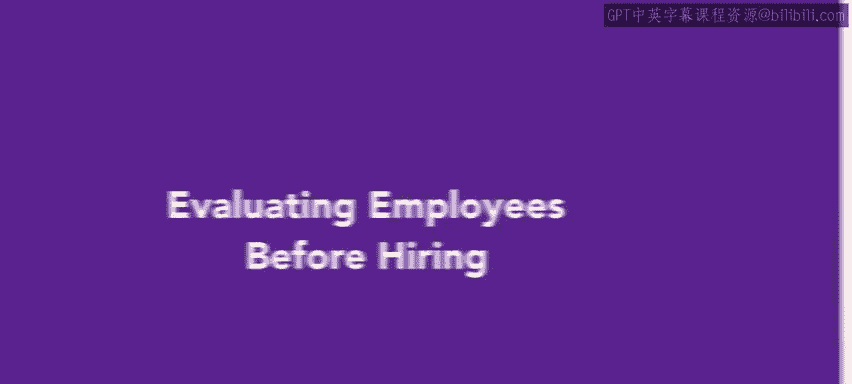

# 45：雇用前评估员工



## 概述

在本节课中，我们将要学习在做出最终录用决定前，如何通过一系列评估步骤来进一步筛选候选人。我们将了解各种评估方法，并掌握其核心原则，以确保评估过程公平、合法且有效。

上一节我们介绍了筛选和面试候选人。本节中，我们来看看如何通过评估来进一步缩小候选人范围，并最终在录用前选定员工。

在做出最终选择前，还有几个评估步骤可以帮助我们找到最佳候选人。选择候选人是我们甄选流程金字塔的最后一层。你需要尽可能多地了解候选人执行特定工作的能力，同时也要确保该员工不会对工作场所安全或组织财务构成明显风险。

## 评估的核心原则

在候选人被录用前，他们应通过几项基本测试和审查。以下是实施评估时必须遵循的两项核心原则：

1.  **相关性原则**：确保测试或审查与你正在招聘的职位相关。
2.  **公平性原则**：确保所有可能的候选人都能平等地接受任何测试。

例如，你可能会要求潜在的呼叫中心客服代表进行打字测试，但他们不需要参加数学能力测试。数学能力测试则适用于收银员，而收银员不一定需要参加打字测试。这些测试都不应设置不必要的难度。它们的作用是让候选人在正式录用和培训开始前，展示他们已经具备的技能。


## 评估方法详解

接下来，我们将更详细地分解这些评估方法。以下是几种主要的评估方法：

*   **背景与记录审查**
*   **消费者报告**
*   **纸笔测试**
*   **医疗测试**
*   **实操测试**
*   **雇佣资格确认**
*   **测谎仪测试**

我们将从背景与记录审查开始，逐一了解这些方法。

### 背景与记录审查

背景与记录审查是核实候选人过往信息的重要步骤。这通常包括：

*   **犯罪记录检查**：确认候选人是否有相关犯罪史。
*   **信用记录检查**：评估候选人的财务责任，尤其适用于涉及财务的职位。
*   **教育背景核实**：确认候选人声称的学历和证书真实有效。
*   **工作经历核实**：联系前雇主，核实候选人的职位、职责和在职时间。

进行此类审查时，必须遵守相关法律法规，并确保审查内容与职位要求直接相关。

### 测试类评估

测试类评估旨在直接衡量候选人的技能、知识或能力。主要包括：


*   **纸笔测试**：用于评估知识水平、认知能力或性格特质。例如，行政职位可能进行**办公软件技能测试**。
*   **实操测试**：让候选人实际执行一项工作任务，以展示其技能。例如，程序员职位的**编码测试**可以写为：
    ```python
    # 示例：要求候选人编写一个函数来反转字符串
    def reverse_string(s):
        return s[::-1]
    ```
*   **医疗测试**：用于确保候选人能够安全地履行工作职责，通常仅在发出有条件录用通知后进行，并需符合《美国残疾人法案》等规定。

### 其他审查与确认

除了上述方法，还需完成一些必要的法律和合规性步骤：

*   **雇佣资格确认**：在美国，这通常指填写**I-9表格**，以核实员工在美国工作的合法身份。
*   **消费者报告**：这是一份包含个人信用记录、犯罪记录等信息的综合报告，用于雇佣决策时需遵守《公平信用报告法》。
*   **测谎仪测试**：在大多数情况下，私营部门雇主使用测谎仪测试是被禁止的，仅有少数例外（如安保公司、制药公司等）。

## 总结


本节课中，我们一起学习了在录用前评估候选人的关键步骤和多种方法。我们明确了评估必须遵循**相关性**和**公平性**两大原则。我们详细探讨了背景审查、技能测试、医疗检查等具体方法及其适用场景。记住，有效的评估不仅能帮你找到最能胜任工作的员工，还能降低雇佣风险，为组织做出更稳妥的用人决策。