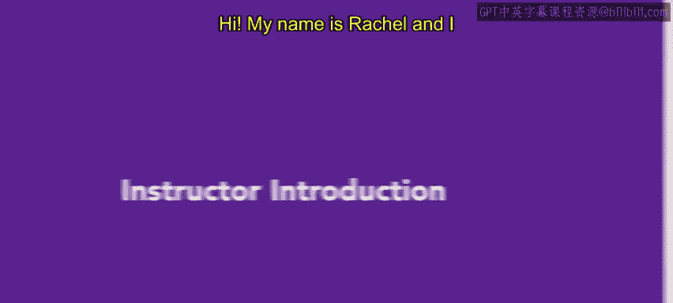
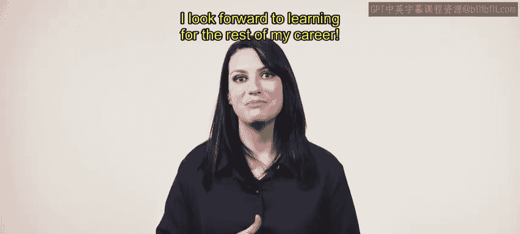

P69：讲师介绍

在本节课中，我们将了解本课程的讲师背景与职业经历，这有助于我们理解课程内容背后的实践经验。

大家好，我是Rachel，我将担任本课程的讲师。在课程开始前，我想先介绍一下我自己和我的背景。

我毕业于洛约拉玛丽蒙特大学，获得了传播学荣誉学位。我选择学习传播学，是因为这门学科可以应用于广泛的领域，而我当时尚未完全确定自己的职业方向。尽管如此，人力资源一直是我心中的一个选项，因为它仿佛流淌在我的血液中。我的父亲在人力资源领域工作了超过40年。在成长过程中，我总是充满好奇并不断提问，因此我人生的大部分时间都在吸收人力资源相关的知识。

大学毕业后，我在旧金山的一家科技初创公司担任行政职务。我立刻意识到，这是一家能让我学习和成长的公司。我从办公室支持工作起步，并很快发现工作中我最喜欢的部分是：帮助新员工入职、与员工互动、协助处理员工问题——基本上所有与员工相关的事务。我表达了希望成长的意愿，并最终获得了加入人力资源团队的机会。我不断学习、成长，并逐步晋升为一名人力资源通才。在这家公司任职后期，我管理着员工生命周期的各个方面，从筛选面试候选人、入职福利，到员工培训等，涵盖了所有环节。我还处理了所有移民案例，包括国际和国内事务，并建立了公司完整的国际雇佣架构，该架构覆盖了14个不同的国家。这段经历向我证明，选择一家不仅允许员工成长，而且愿意投资于员工及其未来的公司是多么重要。

我将永远感激那些帮助我在多方面——无论是作为个人还是作为人力资源专业人士——取得进步的经历和导师们。最近，我一直在从事人力资源咨询工作，我发现每一次经历都能让我以不同的方式在人力资源领域学习和成长。

我热爱人力资源的部分原因在于，这个领域包含众多不同的方面和职能，因此你总能学到新东西。我期待在未来的职业生涯中持续学习。说到学习，让我们开始吧。😊

本节课中，我们一起了解了讲师的学术背景、职业发展路径以及在人力资源领域的实践经验，这为后续课程内容奠定了现实基础。