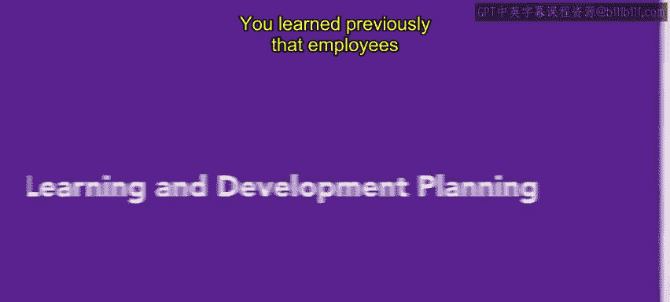
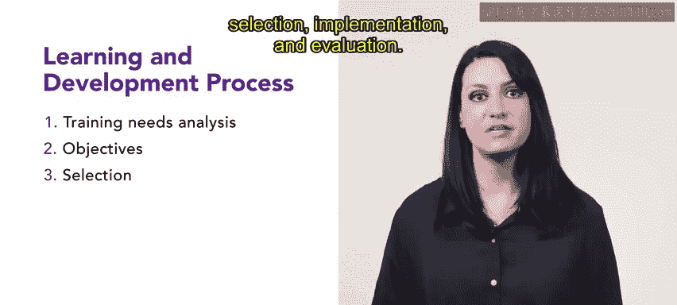
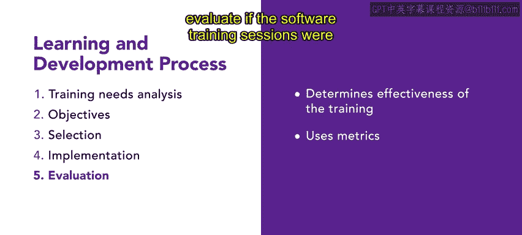

# 76：学习与发展规划 📚



在本节课中，我们将要学习学习与发展规划的核心流程。此前我们介绍了新员工入职引导，本节中我们来看看员工融入组织后，如何通过系统的学习与发展规划来支持他们的持续成长。




学习与发展规划是人力资源团队将培训与发展资源整合到组织中的重要环节。该过程包含五个关键步骤。

以下是学习与发展流程的五个步骤：

1.  **培训需求分析**：识别员工培训目标。
2.  **设定目标**：定义培训或发展目标。
3.  **选择**：确定受训对象与培训方法。
4.  **实施**：执行培训或发展计划。
5.  **评估**：衡量培训或发展的有效性。

接下来，让我们对每个步骤进行更详细的定义。

首先，**培训需求分析**，简称 **TNA**。它帮助人力资源团队通过审视组织内需要改进的领域，来识别员工的培训目标。同时，它也会考虑员工直接提出的培训请求。例如，人力资源团队进行了一项调查，调查识别出希望获得更多培训的员工以及他们希望涵盖的主题。这些评估为需求分析提供了信息，并有助于确定哪种类型的培训是合适的。

上一节我们介绍了如何识别需求，下一步是**设定目标**。这一步定义了培训或发展的具体目标。目标应包含**影响目标**，即明确培训将如何影响组织的绩效。例如，组织推行了一套新软件，员工要求额外培训。你提供了培训课程和软件问答会。此次培训的影响目标是：完成培训后，员工在使用该软件完成任务时将更加自信和高效。其核心公式可表示为：
**培训后绩效 ≥ 培训前绩效 + 技能提升**

目标明确后，便进入**选择**阶段。这一步确定谁应该接受培训或发展，以及应采用何种交付方法。在我们的软件示例中，假设你邀请软件公司的代表或第三方培训师来举办产品研讨会，那么只有使用该软件的员工才会参加培训。

确定了对象和方法，接下来就是**实施**。实施关乎培训或发展计划应如何执行。实施培训计划的方式多种多样。例如，某个团队可能需要课堂式的培训课程，而其他团队可能需要模拟技能或知识才能成功。这取决于需求、主题和团队的具体情况。

流程的最后一步是**评估**。评估用于确定培训或发展的有效性。例如，你可以通过比较培训前后任务完成的时间，来评估软件培训课程是否有效。其评估逻辑可以用以下伪代码表示：
```python
if 培训后任务完成时间 < 培训前任务完成时间:
    培训效果显著
else:
    需要分析原因并调整培训方案
```




学习与发展规划是人力资源团队的一个重要工作元素。提供培训和其他机会以满足员工需求，是向员工展示组织关心团队及其成长的好方法。


本节课中，我们一起学习了学习与发展规划的五个核心步骤：需求分析、设定目标、选择、实施与评估。掌握这一系统流程，有助于为员工设计有效的成长路径，从而提升组织整体效能。接下来，你将学习关于职业发展工具的知识。