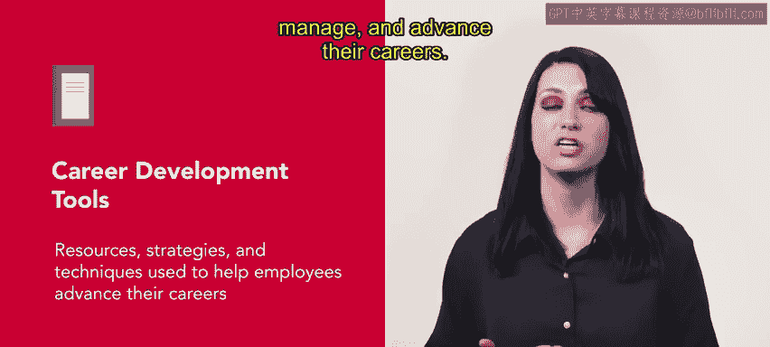
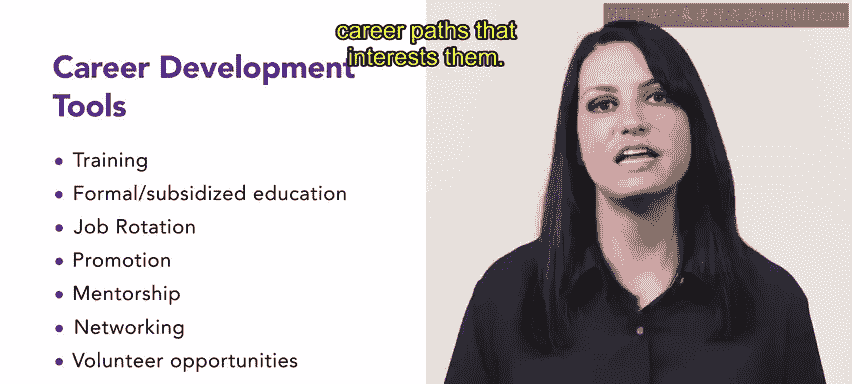

# 78：职业发展工具 🛠️

在本节课中，我们将学习职业发展工具的概念，并了解组织如何利用这些工具来支持员工的成长与晋升。

某些职业领域已建立起获取额外认证或展示技能的既定路径。这些标准通常被视为职业发展的标志。雇主也可以提供支持员工学习与发展的工具。

## 什么是职业发展工具？ 📚

职业发展工具指的是用于帮助个人规划、管理和推进其职业生涯的资源、策略和技术。

## 常见的职业发展工具示例

雇主可以根据员工所在领域和资历级别，提供多种职业发展工具。以下是几种常见工具的示例。

### 1. 培训
培训为员工提供了在组织内部或外部晋升所需的技能。例如，一家名为Connective的电信组织通过其内部学习系统，为员工提供编程和公开演讲等宝贵技能的课程。雇主也可以资助员工的正式教育学费。这项发展工具使雇主能够为员工提供扩展知识和技能的机会。符合条件的路径多种多样，组织可以帮助维修工人获得高中同等学历文凭，或帮助中层管理者完成MBA学业。例如，Connective为在附近大学修读课程的员工提供学费报销。

### 2. 岗位轮换
岗位轮换让员工接触到多样化的经验，对于任何有志于进入高层管理的人来说尤为重要。在Connective，员工被允许为特定项目临时调动到其他部门，或跟随特定岗位进行学习。这拓宽了他们的技能组合，并使他们能够更全面地了解组织。

### 3. 晋升
晋升为员工提供了新的挑战，并促进了他们的职业成长。例如，Connective在晋升时优先考虑内部员工。这种认可帮助他们推进职业生涯，并激励他们留在组织内。

### 4. 导师制
导师制也是一种有效的职业发展工具。经验较少的员工与教练合作，以获得额外技能并推进其职业生涯。在Connective，希望学习或分享某项技能的员工可以通过导师计划与同事匹配。

### 5. 建立人脉网络
建立人脉网络鼓励员工结识其行业内或组织内不同职能部门的个人。一些组织会举办夏季庆祝活动，来自全市各办公室的员工在团队建设和学习活动中相互了解。

### 6. 志愿者机会
志愿者机会可以提升组织形象，并使员工接触到新的思维和工作方式。例如，Connective为当地非营利组织提供技术培训。员工可以自愿贡献时间来进行这些培训或提供现场支持。

### 7. 正式职业规划
最后但同样重要的是，正式职业规划为员工提供资源，包括人力资源代表的专业知识，以评估他们的职业需求。人力资源团队随后可以帮助员工制定目标及实现目标的计划。一些组织还与职业顾问合作，使员工能够探索他们感兴趣的职业道路。

## 总结与展望 🎯

本节课中，我们一起学习了雇主可以提供给员工的多种职业发展工具。无论选择哪种工具，你都将为你的员工和团队奠定成长与成功的基础。接下来，你将学习职业规划的概念。请继续保持出色的学习状态。