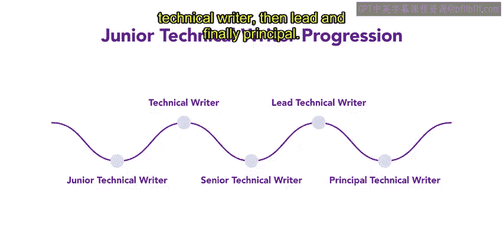

# 79：12_职业规划

## 概述

在本节课中，我们将要学习组织内部用于促进人才持续发展的职业规划工具。上一节我们介绍了培训需求分析等发展工具，本节中我们来看看另外两种重要的职业规划方法：继任计划和双轨职业阶梯。

## 继任计划

继任计划的核心在于识别有潜力在未来担任组织内管理或高管职位的优秀员工。其目标是确保关键岗位在人员变动时能够平稳过渡。

以下是一个典型的继任计划实施步骤：

1.  **识别关键岗位与潜在继任者**：确定即将出现空缺的重要职位，并寻找内部具备潜力的候选人。
2.  **制定发展计划**：为潜在继任者量身定制培养方案。
3.  **实施发展活动**：通过多种方式提升继任者的能力。
4.  **评估与过渡**：持续评估准备情况，并在时机成熟时完成岗位交接。

例如，假设Connectiva公司有一位高级执行官计划在未来几年退休。组织内部已确定了一位潜在的继任者。为了确保该员工做好准备，公司可以启动继任计划流程。

组织可以为这位潜在继任者制定计划，具体措施包括：

*   提供领导力培训。
*   安排与现任高级执行官进行工作见习和导师辅导。
*   让其领导重要项目以积累技能并承担更多责任。

随着时间的推移，这位潜在继任者将获得担任高级执行官角色所需的知识与经验，从而在当前高管退休时实现平稳交接。这便是一个成功的继任计划案例，组织为未来的关键领导职位识别并培养了核心员工。

## 双轨职业阶梯

上一节我们介绍了继任计划，本节中我们来看看双轨职业阶梯。这是一种针对那些对管理或监督职位不感兴趣，但同样表现优异的员工的晋升工具。它引入了第二条晋升通道，通常允许员工晋升到高级技术职位。

例如，在Connectiva公司，有软件开发人员和技术文档工程师两类员工。

传统上，这两类角色的职业路径可能都是从初级员工开始，最终晋升到管理岗位，负责管理一个开发或文档团队。然而，如果只提供从初级到管理的单一路径，可能会迫使一些技术专家离开其擅长的专业领域。

因此，该组织创建了一个双轨职业阶梯系统。这允许员工在其选择的专业领域内获得晋升，而无需成为管理者。

对于软件开发人员，双轨职业阶梯可能如下所示：

*   **初级开发员** -> **开发员** -> **高级开发员** -> **首席开发员** -> **主任开发员**

对于技术文档工程师，双轨职业阶梯可能类似：

*   **初级技术文档工程师** -> **技术文档工程师** -> **高级技术文档工程师** -> **首席技术文档工程师** -> **主任技术文档工程师**

双轨职业阶梯的每一级都伴随着责任的增加、更高的薪酬以及不同的专业发展机会。该系统允许员工推进其职业生涯，而不必被迫转入管理岗位，并为他们所选择的专业提供了清晰的职业发展路径。

## 总结

本节课中我们一起学习了两种重要的组织内部职业规划工具。**继任计划**侧重于为未来的关键领导岗位识别和培养内部人才，确保领导力的连续性。**双轨职业阶梯**则为技术专家提供了与管理通道并行的专业发展路径，使员工能在不担任管理职务的情况下获得认可、职责和薪酬的提升。这两种工具共同帮助组织系统地规划和促进人才的持续发展。