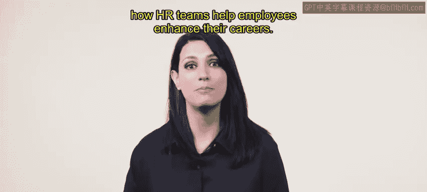
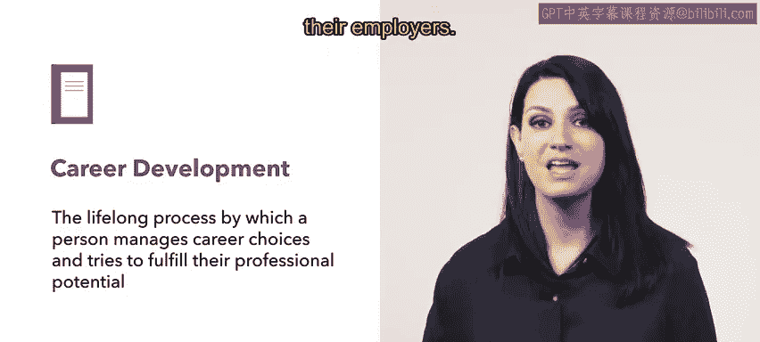
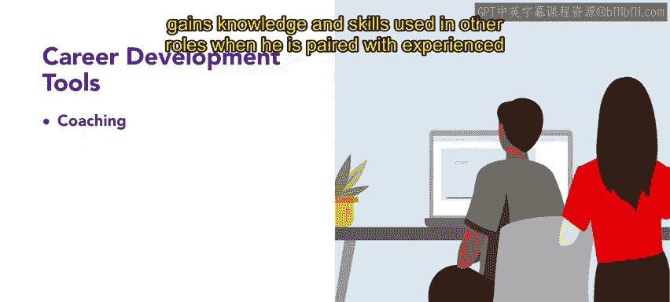

# 81：职业发展 🚀

在本节课中，我们将学习职业发展的概念，了解其作为一项终身过程的重要性，并探讨人力资源团队如何通过多种工具和机会来帮助员工提升职业生涯。

---

在现代经济中，专家指出普通人平均会更换职业五到七次。这一估计强化了职业发展是一个至关重要的终身过程的观念。

## 职业发展的定义与责任

职业发展指的是个人管理职业选择并努力实现其专业潜能的终身过程。职业发展是个人与其雇主共同承担的责任。

上一节我们明确了职业发展的定义，接下来我们来看看组织可以提供哪些具体的职业发展工具和机会。

## 组织提供的职业发展工具

以下是组织可以用于支持员工职业发展的关键工具。

*   **辅导**：通过辅导，员工可以学习新任务、获得新技能或处理其当前职位之外的问题。
    *   **示例**：Urban Attire公司的新员工Ari，通过与不同部门的经验丰富员工结对，获得了可用于其他角色的知识和技能。
*   **咨询**：咨询为员工提供与工作相关的规划或问题的建议与支持。
    *   **示例**：Urban Attire公司与职业顾问合作，为员工提供职业指导和支持。
*   **导师制**：导师制帮助员工应对组织内部的政治环境。导师可以为员工向高级管理层争取利益，或就如何在公司晋升提供建议。导师制对双方都有益，既帮助被指导者，也帮助提供指导的导师。
    *   **示例**：在Urban Attire公司，Ari参与了一个将新员工与经验丰富员工配对的导师计划。该计划帮助员工发展技能并适应组织文化。
*   **评估优势与劣势**：评估员工的优势与劣势也是一种职业发展工具。
    *   **示例**：Urban Attire公司进行年度员工调查，以评估团队成员的优势、劣势和培训需求。这些信息被用于制定培训与发展计划，帮助员工充分发挥潜力。
*   **自我认知机会**：为员工提供了解自身新知识的机会也是一种职业发展工具。
    *   **示例**：作为新员工，Ari为Urban Attire公司进行了一项心理测量测试，以识别他的学习、领导和沟通风格。这种洞察通过优化培训、工作量和团队文化以实现更高效的合作，使Ari和团队都受益。

当组织鼓励职业发展时，它不仅体现了对员工在组织内满意度和成长的关心，也体现了对整个劳动力发展的关注。

## 职业发展的阶段与机遇

雇主有各种机会来促进职业发展。除了上述工具，理解职业发展的不同阶段也很重要。

在接下来的内容中，你将了解个人在其职业生涯中经历的不同阶段。

---

**总结**：本节课我们一起学习了职业发展作为一项终身共同责任的概念。我们详细探讨了组织可以提供的五种核心职业发展工具：**辅导**、**咨询**、**导师制**、**优势劣势评估**以及**自我认知机会**，并通过实例说明了它们如何在实际中应用。最后，我们了解到职业发展贯穿不同阶段，需要持续的关注与投入。