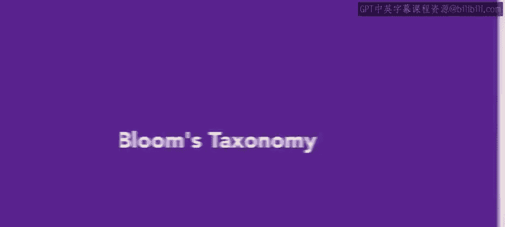
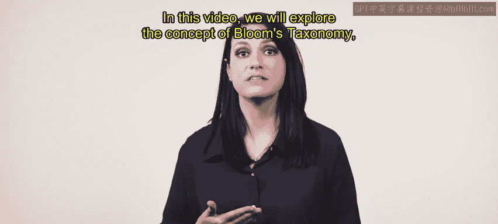
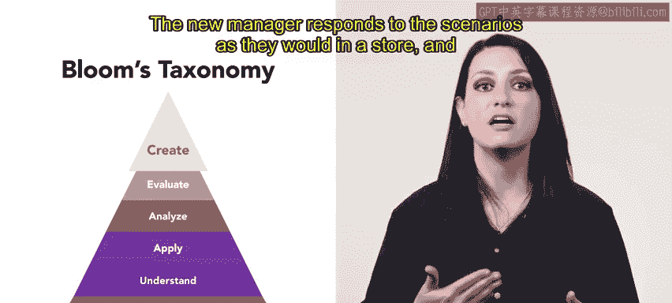
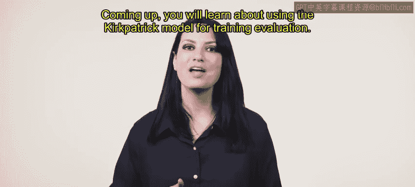

# 87：布鲁姆分类法 📚

在本节课中，我们将学习布鲁姆分类法。这是一个用于设计有效员工培训项目的框架。我们将通过一个具体的例子，了解该分类法的六个层次，并学习如何将其应用于实际培训场景中。

---

## 概述

在人力资源工作中，培养人才包括为员工设定期望的结果和目标。布鲁姆分类法是一个关于学习、教学和成就的框架，它可以帮助我们创建结构化的员工培训。该框架将学习过程分为六个阶段，通常以金字塔形式呈现。

## 布鲁姆分类法的六个层次

接下来，我们将逐一探讨布鲁姆分类法的六个层次。我们将跟随Urban Attire公司的HR专业人士Mary的例子，看她如何为新经理设计培训项目。这个培训项目的目的是教育新经理如何运营实体店的日常业务。

### 一层：记忆

在金字塔的最底层是“记忆”阶段。在此阶段，学习者回忆事实和概念。

以下是Mary为支持“记忆”阶段所采取的措施：
*   Mary为新经理创建了一本培训工作手册。
*   手册中包含了组织内部使用的系统名称、定义和描述。
*   经理们需要记住这些信息。
*   手册还提供了客户服务场景的示例，并描述了根据公司标准应如何处理这些场景。

### 二层：理解

上一节我们介绍了基础的记忆阶段，本节中我们来看看“理解”阶段。在此阶段，学习者解释想法和概念，他们可能会讨论、描述一个主题，或者识别和转述事实。

以下是工作手册中用于培养“理解”能力的部分：
*   新经理被要求用自己的话解释Urban Attire公司每个系统的目的。
*   他们还被要求利用手册提供的空间，集思广益解决客户服务场景的方法。

### 三层：应用

理解了概念之后，学习者需要将知识付诸实践。在“应用”阶段，学习者将所学信息用于新的情境中，包括解决问题、演示想法和解释含义。

以下是Mary在培训项目中设计的“应用”活动：
*   Mary将新经理们聚集在一个虚拟教室中。
*   他们被呈现各种可能在工作中遇到的场景。
*   新经理们分组工作，扮演这些场景，并运用从工作手册中学到的技能来解决问题。

### 四层：分析

应用知识解决了具体问题后，我们需要培养更深层次的思维能力。在“分析”阶段，学习者通过运用批判性思维技能来区分、组织、关联、比较、对比和测试他们的知识。

在Mary的培训中，“分析”阶段是这样进行的：
*   新经理观看展示潜在客户服务互动和技术挑战的视频。
*   经理们分析视频，并解释每个场景中哪些做得好，哪些本可以改进。

### 五层：评估

基于深入的分析，学习者可以形成自己的判断。在“评估”阶段，学习者通过评价情境、并基于所学进行论证、辩护、判断、批评或支持来证明某个决定的合理性。

在Urban Attire的培训中，“评估”体现为：
*   新经理必须论证或说明他们处理客户服务或技术问题的想法，为何比视频中展示的方法更好。

### 六层：创造

布鲁姆分类法的最高层次是“创造”。在此阶段，学习者产生新的或原创性的内容。

在Mary的培训中，“创造”通过以下方式实现：
*   每位新经理与一位经验丰富的经理配对。
*   经验丰富的经理扮演常见的客户服务或技术场景。
*   新经理像在店里一样对场景做出反应。
*   经验丰富的经理提供即时反馈。

---

## 总结

本节课中我们一起学习了布鲁姆分类法。这是一个培训师用来创建强大培训项目的工具，旨在帮助员工掌握技能。它有助于识别员工当前的知识水平，并运用不同的技巧来扩展它。在我们的例子中，Mary的培训为新经理提供了应对意外情况的信心和解决问题的技巧。

接下来，你将学习如何使用柯氏模型进行培训评估。