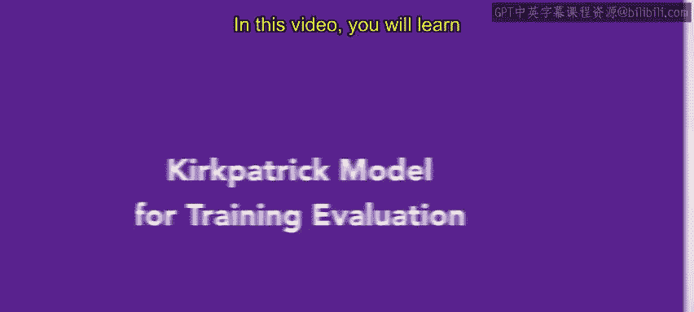
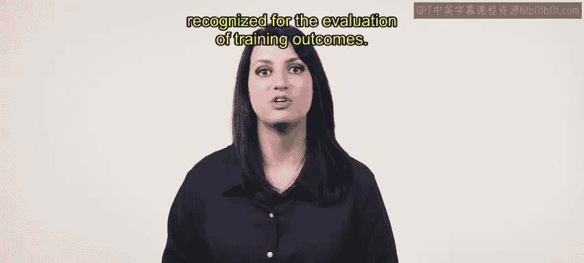
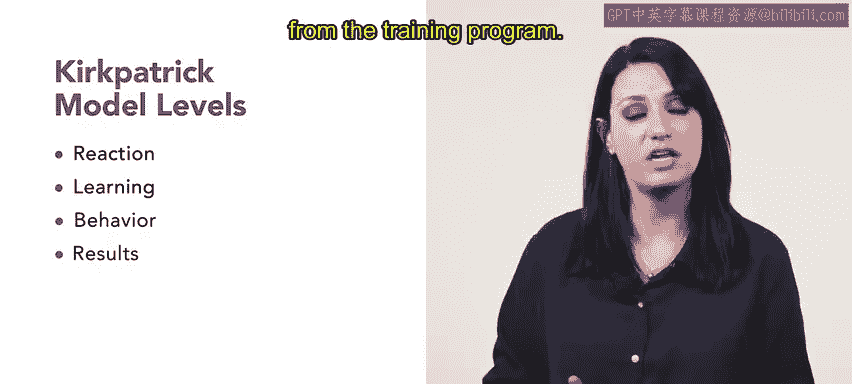
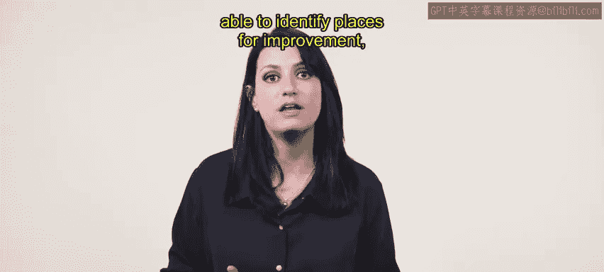

# 88：柯克帕特里克培训评估模型 📊

在本节课中，我们将学习柯克帕特里克模型。这是一个用于设计和评估员工培训效果的全球公认模型。我们将了解该模型的四个评估层级，并通过一个具体案例来理解其应用过程。

---

## 模型概述与四个层级

上一节我们介绍了培训设计的一般概念，本节中我们来看看一个专门用于评估培训效果的经典框架——柯克帕特里克模型。该模型将培训项目的评估定义为四个递进的层级：

**柯克帕特里克模型 = 反应 + 学习 + 行为 + 结果**

以下是该模型的四个具体层级：

1.  **反应**
    第一级是反应层。在此层级，测量应追踪员工对培训材料的初始反应。最有价值的信息是了解所呈现的材料被接受的程度，这对培训师和演讲者是重要的反馈。

2.  **学习**
    第二级是学习层。此层级的测量旨在确定参与者在培训项目中对所学材料的掌握程度。一个流行的测量方法是进行**前测和后测**，以比较员工在这些考试中的表现。

3.  **行为**
    第三级是行为层。在此层级，测量用于评估培训后的工作表现。这些评估聚焦于培训后六周至六个月内的绩效，旨在确定培训中传授的技能是否被应用于实际工作中。测量基于观察、访谈、测试和调查。

4.  **结果**
    最后，第四级是结果层。此层级收集来自结果评估的反馈，这是最有意义的部分。培训项目需要投资，因此雇主需要培训项目能产生实际成果。结果评估旨在衡量培训项目是否为组织的目标带来了切实的利益。

---

## 模型应用实例

了解了模型的四个层级后，我们通过一个具体案例来看看它是如何运作的。假设Connectives公司想要评估一个针对远程员工使用公司通讯工具的培训项目的效果。

请记住，柯克帕特里克模型是培训的评估工具，因此在培训项目开始后实施。

以下是该公司应用该模型四个层级的步骤：

*   **第一步：评估反应（第一级）**
    培训师使用柯克帕特里克第一级来评估学员对培训项目的反应。他们要求学员完成一份调查问卷，以衡量他们对培训项目的满意度。问卷包含诸如“你觉得培训项目有用吗？”、“培训项目达到你的期望了吗？”、“你会向同事推荐这个培训项目吗？”等问题。根据调查结果，培训师发现学员对培训项目非常满意，从而可以评估下一层级。

*   **第二步：评估学习成果（第二级）**
    接下来，培训师使用柯克帕特里克第二级来评估学员在知识、技能和态度上的收获。他们进行了一次**前测和后测**，以评估学员对Connectives公司提供的通讯工具的了解程度。培训师发现，学员的后测分数显著高于前测分数。

*   **第三步：评估行为改变（第三级）**
    然后，培训师使用柯克帕特里克第三级来评估学员在工作中应用所学知识的程度。他们进行了一次后续调查，以评估学员在远程与其他团队成员工作时，是否使用了在培训中学到的通讯工具。根据调查结果，培训师发现学员已将所学通讯工具应用于工作。

*   **第四步：评估组织影响（第四级）**
    最后，培训师使用柯克帕特里克第四级来评估培训项目对组织目标的影响。通过分析，他们确定培训项目是否对组织的绩效和效率产生了积极影响。基于分析，培训师发现，由于远程员工增加了对通讯工具的使用，该培训项目对组织的绩效和效率产生了积极影响。

---

## 课程总结

本节课中，我们一起学习了柯克帕特里克培训评估模型的功能与目的。这个全球接受的模型，以及其他评估工具，对于课程设计者至关重要，它能帮助识别需要改进的地方，并确认所学的技能是否得到了实际应用。