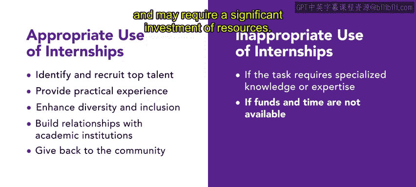

# 94：实习培训详解 🎓

在本节课中，我们将学习一种被称为“实习”的培训类型。我们将探讨实习的益处，并了解它与学徒制的区别。

---

## 什么是实习？

上一节我们介绍了培训的多种形式，本节中我们来看看实习的具体定义。

实习为那些正在接受培训、准备进入某个领域的人提供了获得实践经验的机会。

---

## 实习与学徒制的区别

理解了实习的基本概念后，我们来看看它与学徒制有何不同。

实习与学徒制通常存在区别。学徒制更多出现在需要进入**特定行业或手艺**的培训背景下，而实习则通常发生在需要**高等教育背景**才能进入的职场环境中。

此外，实习可能是有偿的，也可能是无偿的。无偿实习需要获得美国劳工部的额外考量，并通过合作项目获得学分。

---

## 实习案例：Urban Attire公司

为了更具体地理解实习的应用，让我们看一个假设案例。

假设你在Urban Attire公司的人力资源部门工作，你的部分职责是招聘有才华的实习生。

Alex希望成为一名时尚编辑，并且需要两年的实习经验才能获得一份入门级的时尚编辑工作。你决定在Urban Attire公司聘用Alex作为实习生，这将有助于Alex的职业生涯，同时也有益于组织。

---

## 实习对组织的益处

在什么情况下，实习对组织是有益的呢？以下是几个关键场景：

*   **识别与招募顶尖人才**：通过提供实习机会，组织可以评估潜在员工的技能、职业道德，并判断他们是否适合组织。
*   **提供实践经验**：组织可以为学生提供将课堂所学应用于真实工作场景的机会，获得能丰富其简历和未来工作前景的实践经验。
*   **增强多样性与包容性**：通过为来自不同背景的人提供实习机会，可以为组织引入新的视角，从而增加多样性。
*   **与学术机构建立关系**：组织可以与学术机构建立伙伴关系，这可以带来合作研究项目、招聘机会和其他益处。
*   **回馈社区**：通过提供宝贵的实习经验和指导机会，组织可以回馈社区。

---

## 实习的局限性

尽管实习有很多好处，但在某些情况下可能并非最佳选择。

如果某项任务需要**专业知识或专业技能**，应避免使用实习作为培训形式。此外，实习培训可能耗时较长，并且可能需要投入大量资源。

---

## 总结与展望

本节课中，我们一起学习了实习培训的各个方面。

总而言之，实习在组织内部具有诸多益处。一旦人力资源代表确定了特定职位所需的知识、技能和能力，就可以通过分配实习机会来加强受训者的技能和经验。

在接下来的课程中，你将学习更多关于不同类型培训的知识。