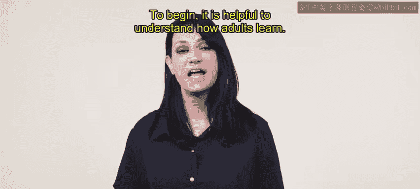
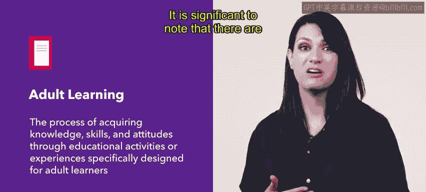
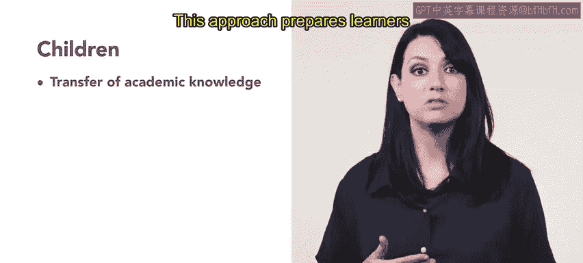
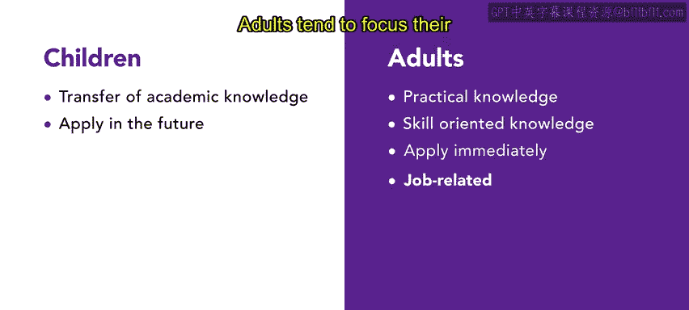
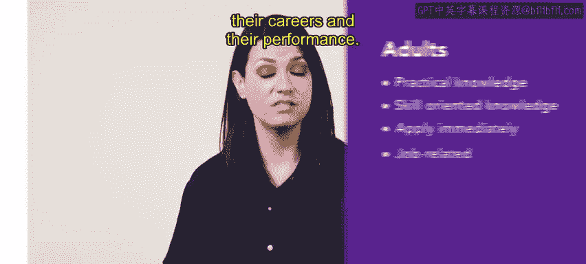
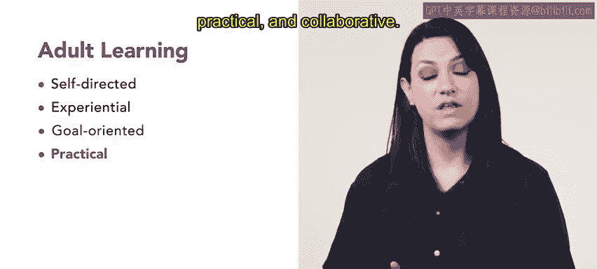

# 96：29_成人学习

在本节课中，我们将学习如何为组织内的员工创建有效且高效的培训。首先，理解成人如何学习至关重要。

成人学习是指通过专门为成人学习者设计的教育活动或经验来获取知识和技能的过程。研究成人如何学习的科学被称为**成人教育学**。

需要指出的是，成人与儿童的学习方式存在显著差异。

对于儿童，学习原则通常强调学术知识的传授。这种方法旨在让学习者为未来应用知识做好准备。

然而，成人学习的原则通常侧重于实用和技能导向的知识。在这种方法中，学习者获取的是可以立即投入使用的知识。

成人寻求教育机会的最常见原因是与工作相关。成人倾向于将学习重点放在解决问题和获取对其职业及绩效有益的信息上。

成人以工作和生活经验作为学习的基础。他们的学习意愿与其角色需求密切相关，无论是在社会还是工作相关的情境中。同时，请记住，内部动机比外部动机更强大。

这种区别意味着，成人在追求知识之前，希望知道为什么要学习它。

成功的成人学习项目通常具有以下特点：自我导向、经验性、目标导向、实用性和协作性。😊

人力资源团队利用这些原则来设计或开发针对成人的有效培训。请记住，要使培训具有实用性并能立即应用。

接下来，我们将重点关注不同的学习风格，以及它们如何影响培训设计。

本节课中，我们一起学习了成人学习的基本概念、其与儿童学习的区别，以及成人学习的关键原则。理解这些是设计有效员工培训的基础。