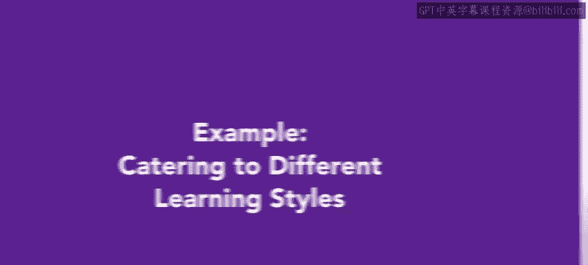
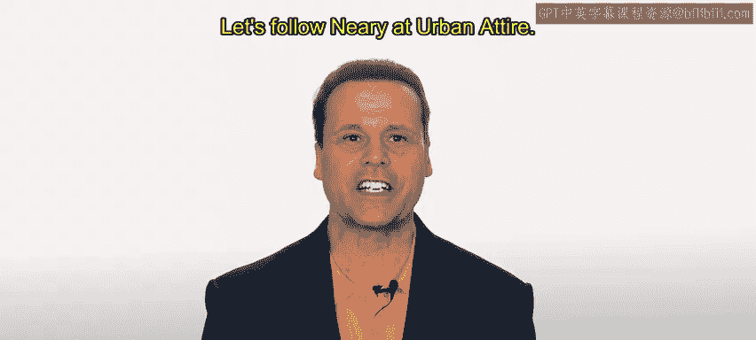
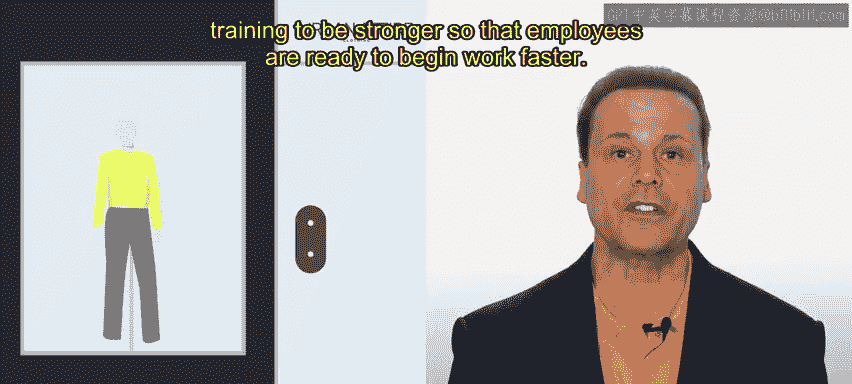
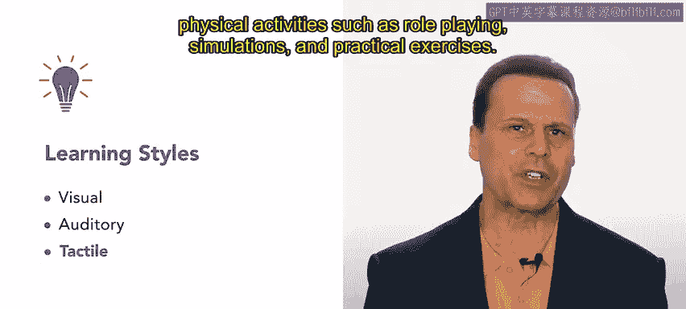
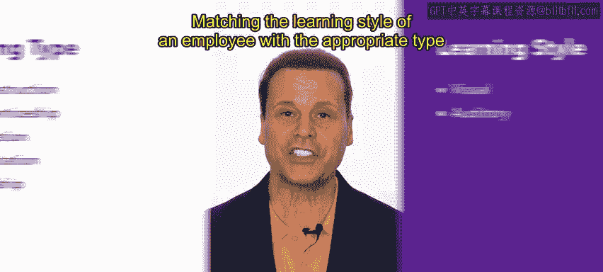
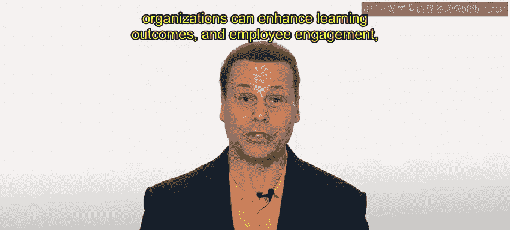

# 98：匹配培训类型与学习风格 🎯

在本节课中，我们将探讨如何将培训类型与员工的学习风格相匹配。理解学习风格与培训类型之间的联系，有助于制定更有效的职业发展计划。

让我们跟随Urban Attire公司的Neri。需要提醒的是，Urban Attire是一家专注于为现代都市生活提供休闲服饰的中型企业。该公司为顾客提供一系列时尚且实用的服装选择。公司拥有工厂、实体店和总部，人力资源部门需要负责大量员工。

Urban Attire的人力资源部门正在改进入职培训，使其更加强大，以便员工能更快地投入工作。Neri负责这次改进工作。

---

## 学习风格回顾 👓

部门希望提供适合员工学习风格的入职培训选项，以确保更好的信息留存，并以最适合他们学习的方式进行培训。

请记住，主要有三种不同的学习风格：
*   **视觉型学习者**：他们倾向于通过视觉辅助工具学习，例如图表、图像和视频。
*   **听觉型学习者**：他们倾向于通过听和口头指导学习，例如讲座、讨论和播客。
*   **动觉型学习者**：他们倾向于通过动手实践和身体活动学习，例如角色扮演、模拟和实际操作练习。

---

## 培训类型与学习风格的匹配 🔄

以下是Neri考虑的几种培训类型，以及它们各自最适合的学习风格。

上一节我们回顾了三种主要的学习风格，本节中我们来看看如何为每种风格匹配合适的培训方法。

### 工作指导培训

这种培训适合**动觉型学习者**，他们通过动手实践和身体活动学习得最好。这类培训为学习者提供实践经验，并有机会在真实情境中应用技能。

Neri在Ari身上尝试了这种方法。Ari是Urban Attire的新收银员，通过与经验丰富的员工结对，学习如何使用收银机。Ari先观察员工操作，然后过渡到自己独立完成任务。

### 学徒培训

这种培训非常适合**视觉型学习者**（他们偏好图表等视觉辅助工具）和**听觉型学习者**（他们偏好讲座等口头指导）。这类培训结合了理论和实践学习，因此对两种学习者都适用。

学徒培训适合从外部招聘的、担任管理职位的视觉和听觉型学习者。Ari学习Urban Attire的流程，例如使用收银系统和整理店铺，同时从经验丰富的团队成员那里获得对公司文化的了解。

### 模拟培训

这种培训非常适合**动觉型学习者**，他们偏好通过动手实践和身体活动学习。这类培训为学习者提供了一个安全的环境，通过模拟和角色扮演活动来练习和发展技能。

模拟用于培训收银员和客服团队中的动觉型学习者，通过呈现真实情境，让他们识别应该采取哪些行动。

### 工作轮换培训

这种培训非常适合**视觉型学习者**（偏好视觉辅助工具）和**动觉型学习者**（偏好动手经验）。这类培训为学习者提供了在不同岗位上获得实践经验的机会，增强了他们的适应能力和解决问题的能力。

工作轮换可用于培训从外部招聘、需要领导团队的视觉和动觉型学习者员工作为动觉型学习者，这类培训对Ari非常有效，因为他们通过“做”来学习效果最好。工作轮换让Ari能够练习他们的新工作角色。了解店铺中不同角色如何协同工作，将有助于他们在自己的岗位上更有效率。

### 实习培训

这种培训非常适合**视觉型学习者**（偏好视觉辅助工具）和**听觉型学习者**（偏好口头指导）。这类培训为学习者提供了在其所选领域的实践经验，同时也接受理论培训。

实习为员工提供了一个机会，让他们在入职Urban Attire时决定这里是否适合自己。视觉或听觉型学习者通过实习学习他们所选岗位将用到的任务，会表现得很好。

---

## 总结与启示 📝

将员工的学习风格与适当的培训类型相匹配，可以显著提高培训的有效性。

雇主在设计和实施培训计划时，应考虑**VAK学习风格模型**。通过提供与员工学习风格一致的培训，组织可以提升学习效果和员工参与度，从而改善工作绩效。

在本节课中，我们一起学习了如何识别不同的学习风格（视觉型、听觉型、动觉型），并探索了如何为每种风格选择最有效的培训类型（如工作指导、学徒制、模拟训练等）。理解并应用这一匹配原则，是设计高效入职与发展计划的关键。