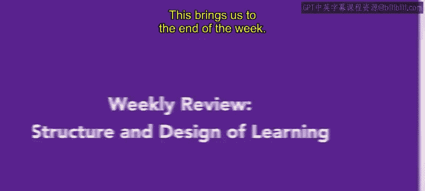
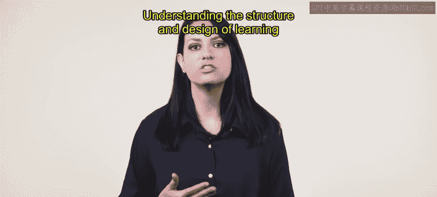
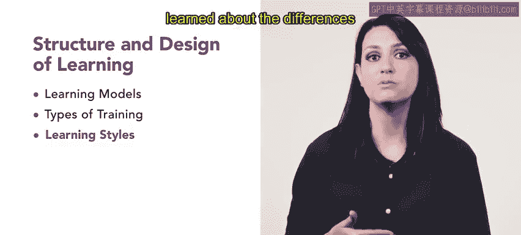

# 99：学习的结构与设计回顾 📚

在本节课中，我们将回顾第二周关于“学习的结构与设计”的核心内容。我们将总结本周学习的关键模型、培训类型以及学习风格，为进入下一周关于培训交付方法的学习打下基础。

---

## 课程概述

本周课程已结束，祝贺你完成了本课程的第二周学习。你学习了大量关于学习结构与设计的知识。对于人力资源专业人士而言，理解学习的结构与设计是一项重要技能。

---

## 本周内容回顾

现在，让我们回顾一下本周所涵盖的内容。

### 一课：学习模型介绍

在第一课中，我们介绍了多种学习模型。你学习了许多不同的学习模型，例如**ADDIE模型**、**KSA模型**、**布鲁姆分类法**以及用于培训评估的**柯氏四级评估模型**。课程最后，你参与了一个基于场景的示例，练习了如何识别培训需求。

以下是本课介绍的核心模型：
*   **ADDIE模型**：一个系统化的教学设计框架，包含分析、设计、开发、实施和评估五个阶段。
*   **KSA模型**：指代知识、技能和态度，是培训设计的目标维度。
*   **布鲁姆分类法**：将教育目标按认知复杂度分为记忆、理解、应用、分析、综合和评价六个层次。
*   **柯氏四级评估模型**：从反应、学习、行为和结果四个层面评估培训效果。

### 二课：培训类型介绍

在第二课中，我们介绍了不同的培训类型。我们讨论了多种培训类型，包括在职培训、工作指导培训、模拟培训、学徒制培训、工作轮换和实习培训。此外，你还了解了不同的培训机会。

以下是本课讨论的主要培训类型：
*   **在职培训**：员工在实际工作岗位上接受指导。
*   **工作指导培训**：按步骤分解任务进行系统教学。
*   **模拟培训**：在模拟的工作环境中进行练习。
*   **学徒制培训**：在资深员工指导下进行长期实践学习。
*   **工作轮换**：让员工在不同岗位间轮换以获取广泛经验。
*   **实习培训**：为学生或新人提供短期实践工作机会。

### 三课：学习风格与成人学习

在第三课中，我们介绍了三种不同的学习风格，并学习了成人与儿童学习之间的差异。

---

## 总结与展望

本周关于学习结构与设计的回顾到此结束。下周，你将基于本模块的信息，进一步学习不同的培训交付方法。第三周包含许多对你的人力资源工作有用的信息和实用技巧，请继续保持良好的学习状态，迎接第三周的课程。

---

**本节课总结**：本节课我们一起回顾了第二周的核心内容，包括主要的学习模型（如ADDIE、KSA）、多种培训类型（如在岗培训、模拟培训）以及不同的学习风格。这些知识是设计和评估有效培训项目的基础。