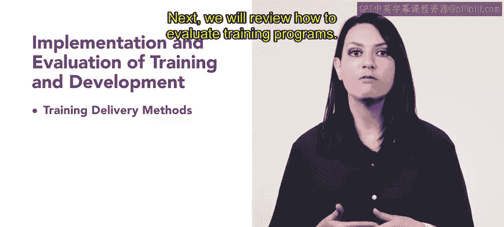

# 100：培训与发展的实施和评估 🎯

在本节课中，我们将学习如何实施和评估培训与发展项目。我们将介绍不同的培训交付方法，探讨如何评估培训项目的有效性，并了解关键的学习衡量指标。这些知识对于人力资源专业人员确保培训投资获得回报至关重要。

## 培训交付方法 📚

上一节我们介绍了课程概述，本节中我们来看看具体的培训交付方法。掌握不同类型的培训交付方法对于人力资源专业人员至关重要，因为它直接影响培训的效果和员工的接受度。

以下是几种常见的培训交付方法：

*   **课堂培训**：传统的讲师引导式培训，通常在实体教室内进行。
*   **在线学习（e-Learning）**：通过数字平台进行的培训，学员可以自主安排学习进度。
*   **混合式学习**：结合面对面教学和在线学习的培训方式。
*   **在职培训（OJT）**：员工在实际工作岗位上，通过观察和实践来学习技能。
*   **模拟与角色扮演**：通过模拟真实工作场景或扮演特定角色来练习技能。

## 培训项目评估方法 📊

了解了如何交付培训后，我们需要评估其效果。接下来，我们将回顾如何评估培训项目。评估培训的方法多种多样，它帮助我们衡量培训是否达到了预期目标。

本节课将涵盖最常见的几种评估方法：

*   **反应评估**：测量学员对培训的即时感受和满意度。通常通过课后问卷进行。
*   **学习评估**：测量学员通过培训获得了多少知识、技能或态度上的改变。可通过测试或实践考核进行。
*   **行为评估**：测量学员在回到工作岗位后，其工作行为是否因培训而发生了改变。通常通过上级观察或绩效评估进行。
*   **成果评估**：测量培训对组织产生的最终影响，如生产率提升、质量改进或成本节约。

## 学习衡量指标 📈

评估培训效果离不开具体的数据。最后，我们将介绍学习衡量指标。这些指标对于评估培训与发展方法的成功与否非常重要，它们将评估结果量化，为决策提供依据。

关键的学习衡量指标包括：

*   **参与率**：参加培训的员工比例。`参与率 = (实际参训人数 / 应参训总人数) * 100%`
*   **完成率**：成功完成所有培训要求的员工比例。
*   **知识保留率**：衡量培训结束后一段时间，学员对知识的掌握程度。
*   **投资回报率（ROI）**：衡量培训产生的货币收益与培训成本之间的关系。`ROI = [(培训收益 - 培训成本) / 培训成本] * 100%`
*   **技能应用率**：衡量员工在工作中实际应用所学技能的频率和效果。

---

本节课中，我们一起学习了培训与发展的实施与评估全流程。我们从培训的多种交付方法开始，探讨了从反应、学习、行为到成果四个层级的评估模型，最后介绍了量化培训效果的关键学习衡量指标。掌握这些内容，将帮助你有效地设计和评估培训项目，确保其真正支持员工发展与组织目标的实现。