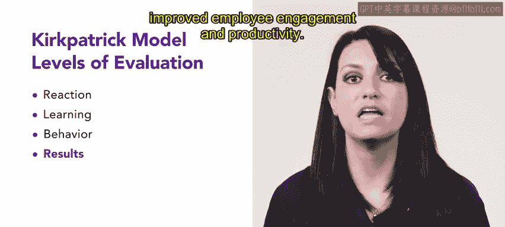
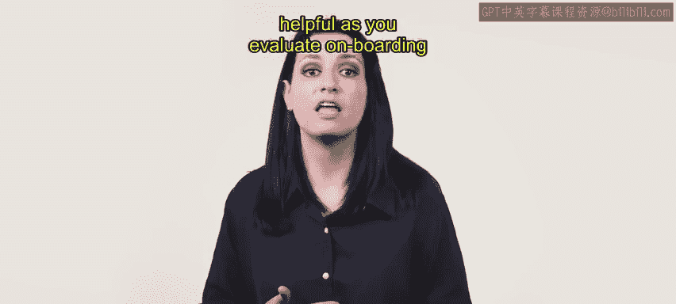

# 106：39_柯克帕特里克模型 📊

在本节课中，我们将深入学习柯克帕特里克模型。这是一个用于评估培训项目有效性的经典框架。我们将通过一个具体案例，详细解析该模型的四个评估层级，并了解如何运用它来衡量培训的实际效果。

在上一节中，我们介绍了使用实验设计来评估培训项目。你可能还记得在第二周曾听说过柯克帕特里克模型。现在，我们将进一步讨论这个模型，并探索Urban Attire公司如何运用它来评估其培训效果。

## 柯克帕特里克模型的四个层级

柯克帕特里克模型包含四个评估层级，分别是：反应、学习、行为和结果。让我们通过以下场景来回顾每个层级包含的内容。

Urban Attire公司最近为其经理们实施了一个新的领导力发展项目。他们希望确保该项目对其员工是有效的。

### 一级：反应评估

第一级评估参与者对培训项目的反应。

以下是我们的示例。培训项目结束后，Urban Attire的员工被要求完成一份反馈调查，以评价他们对项目的满意度。结果显示，大多数参与者感到满意，并认为项目相关且有用。

### 二级：学习评估

第二级评估参与者通过培训学到了多少新知识、技能或态度。这通常在课程开始前进行前测，并在课程结束后进行后测。

Urban Attire员工的测试结果表明，参与者已经掌握了相关知识和技能，在领导力和管理原则的理解上显示出显著进步。

### 三级：行为评估

第三级评估参与者在工作中应用所学知识和技能的程度。

Urban Attire员工被要求在培训项目结束六个月后完成一份自我评估调查，以衡量他们在工作中应用新知识和技能的情况。结果显示，员工应用了这些知识和技能，并且他们的领导和管理实践有了明显改善。

### 四级：结果评估

第四级评估培训项目对组织绩效的影响。

在培训项目结束六个月后，通过衡量员工敬业度和生产率等绩效指标，来评估其对Urban Attire公司绩效的影响。结果显示，该培训对组织绩效产生了积极影响，员工敬业度和生产率均有所提高。

## 评估结论与未来应用

基于使用柯克帕特里克模型进行的评估，可以得出结论：Urban Attire公司的新领导力发展项目有效地提高了参与者的知识和技能，改善了他们的工作行为，并提升了组织的整体绩效。

这些结果可用于未来改进该项目，例如纳入更多实践学习机会，或为经验丰富的经理提供更高级的培训。

## 模型的应用价值

公司可以将柯克帕特里克模型的四个层级用作评估工具，以确定培训是否成功。在你的工作中，当你评估入职培训和合规培训的有效性及组织影响时，可能会发现这个模型很有帮助。

---

本节课中，我们一起学习了柯克帕特里克模型的四个评估层级：**反应**、**学习**、**行为**和**结果**。我们通过Urban Attire公司的案例，看到了如何系统性地评估一个培训项目从学员感受到最终组织成果的全过程。掌握这个模型，将帮助你更科学地设计和衡量培训的有效性。