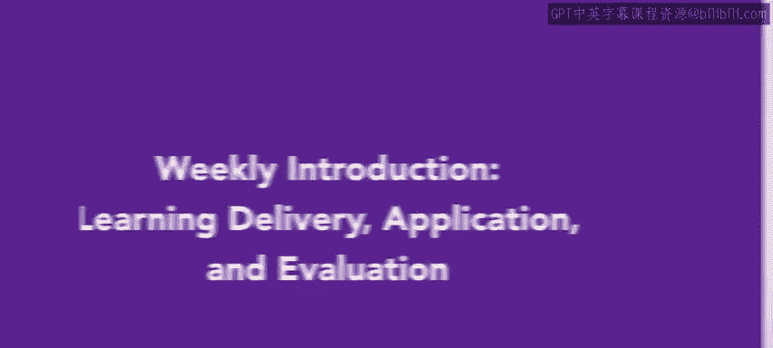
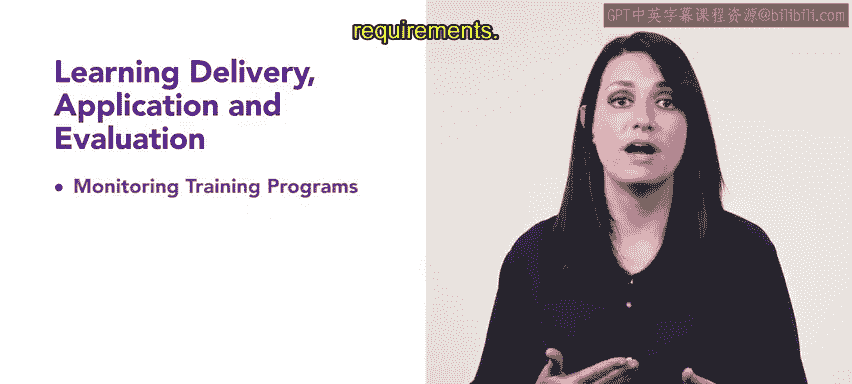
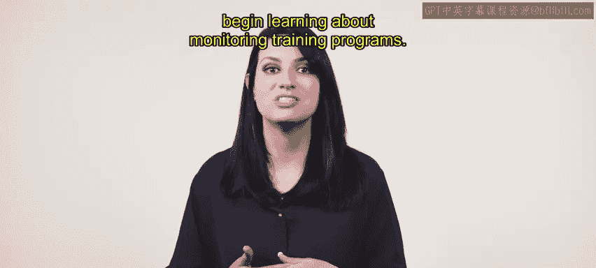

# 117：学习交付应用与评估

在本节课中，我们将学习如何监控培训项目、设计培训体验以及获取职业支持。理解学习如何被交付、应用和评估，对于成为一名专业的人力资源从业者至关重要。

---

## 监控培训项目

上一节我们介绍了学习与发展的整体框架，本节中我们来看看如何确保培训计划得到有效执行。监控培训项目是确保所有员工都遵守培训要求的关键环节。

监控培训项目能帮助人力资源专业人员确认培训需求，并确保每个人都完成了必需的培训。

以下是监控培训项目时需要考虑的几个方面：

*   **合规性跟踪**：确保员工完成了法律法规或公司政策强制要求的培训。
*   **进度管理**：跟踪每位员工在各项培训中的学习进度。
*   **记录保存**：维护准确、完整的培训完成记录。

---

## 设计培训体验

理解了如何监控培训后，接下来我们将探讨如何从头开始构建一个有效的培训。掌握设计培训体验的步骤是核心技能。

在本节中，你将有机会尝试设计一个属于自己的培训方案。

设计一个完整的培训体验通常包含以下步骤：

1.  **需求分析**：确定培训要解决的具体问题或技能缺口。
2.  **设定目标**：明确列出培训结束后学员应达到的学习成果。
3.  **内容开发**：根据目标，组织并创建培训材料与活动。
4.  **选择交付方式**：决定采用线上课程、工作坊、导师制等何种形式进行培训。
5.  **实施与交付**：执行培训计划，并管理培训过程。

---

## 职业支持

最后，我们将关注如何将所学知识应用于个人职业发展。课程将以职业支持作为结尾，帮助你为未来的职业生涯做好准备。

你将学习如何在LinkedIn个人资料中添加必要的信息，并收集更多针对你职业发展的指导信息。

为了提升职业竞争力，你可以采取以下行动：

*   **优化领英档案**：更新你的技能认证、项目经验和职业摘要。
*   **持续学习**：关注行业动态，参与额外的课程或认证。
*   **建立人脉网络**：积极与行业内的专业人士建立联系。

---

本节课中，我们一起学习了监控培训项目以确保合规、设计有效培训体验的步骤，以及如何利用职业支持工具来规划个人发展。掌握这些知识，将帮助你更好地履行人力资源职责，并推动组织与个人的共同成长。