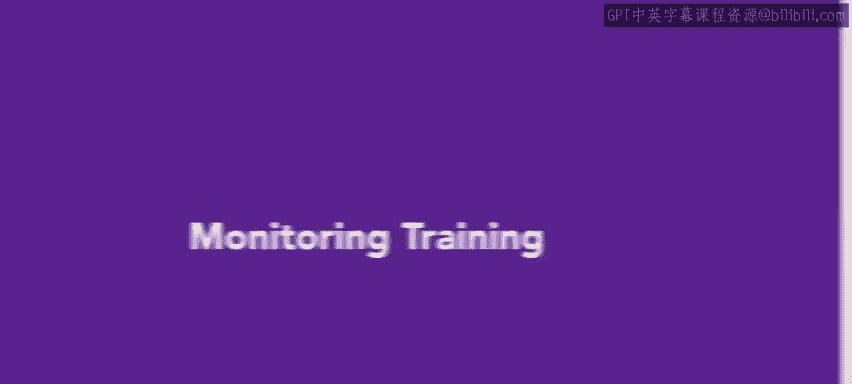
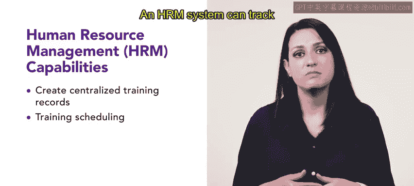

# 119：监控培训 📊

在本节课中，我们将学习监控员工强制性及非强制性培训的各种方法与工具。有效的监控有助于识别员工进展与成功、部门绩效以及组织成长。

## 为什么监控培训很重要？

有效的监控能帮助识别员工的进步与成功、部门的绩效表现以及组织的整体成长。

## 使用人力资源管理系统（HRMS）进行监控

上一节我们介绍了监控的重要性，本节中我们来看看一种核心的监控方法：使用人力资源管理系统（HRMS）。HRMS是一个旨在简化和自动化各项人力资源流程的软件平台，包括员工数据管理、薪酬、福利管理、招聘以及培训管理。

以下是HRMS在监控培训方面的各项能力：

*   **创建集中化培训记录**：集中化的培训记录是追踪员工培训的有效工具，它能确保每位员工都获得有效完成工作所需的培训。HRMS可以通过将已完成的培训、培训日期和结果等信息存储在一个位置供HR经理访问，来帮助创建和维护此记录。
*   **安排培训日程**：安排培训可能具有挑战性，尤其是在需要管理大量员工时。HRMS可以通过帮助HR经理设置培训日程、发送即将到来的活动提醒以及追踪员工出勤情况来简化此过程。
*   **追踪培训完成情况**：HRMS可以通过维护最新的培训记录来追踪员工完成情况。该系统可以帮助HR经理识别哪些员工仍需完成培训，并为他们安排额外的培训。
*   **监控合规性**：HRMS通过监控合规性来帮助追踪培训要求。HR经理可以确保组织遵守相关法规和标准，并避免因不合规而受到处罚。
*   **分析培训数据**：分析培训数据对于识别技能差距和提升员工绩效至关重要。HR系统可以识别趋势，并指出需要改进培训计划的地方。这使得HR经理能够持续改进培训计划，以满足员工和组织的需求。

## 利用HRMS鼓励员工完成培训

现在你已经了解了HRMS在监控员工培训方面的能力，值得注意的是，HRMS也能有效帮助鼓励员工完成培训。组织可以利用HRMS的功能，例如自动邮件提醒、追踪与报告能力以及日程安排工具，来简化培训流程，并确保员工在组织内不断学习与成长。

## 总结

本节课中，我们一起学习了监控员工培训的重要性，并重点探讨了如何使用人力资源管理系统（HRMS）来实现这一目标。我们了解到，HRMS不仅能创建记录、安排日程、追踪完成情况和确保合规，还能通过数据分析优化培训计划，并利用其功能鼓励员工参与学习。