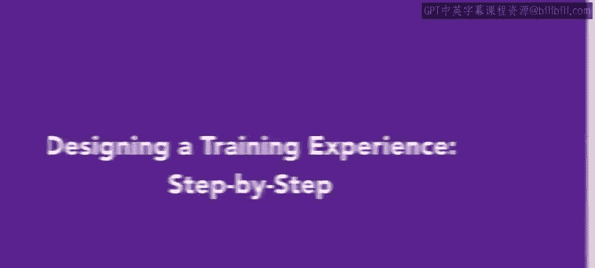
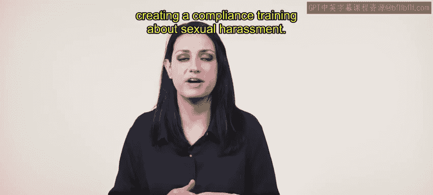
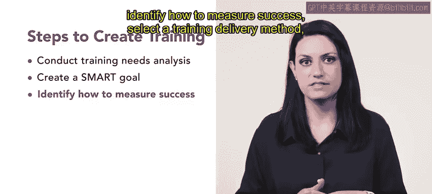
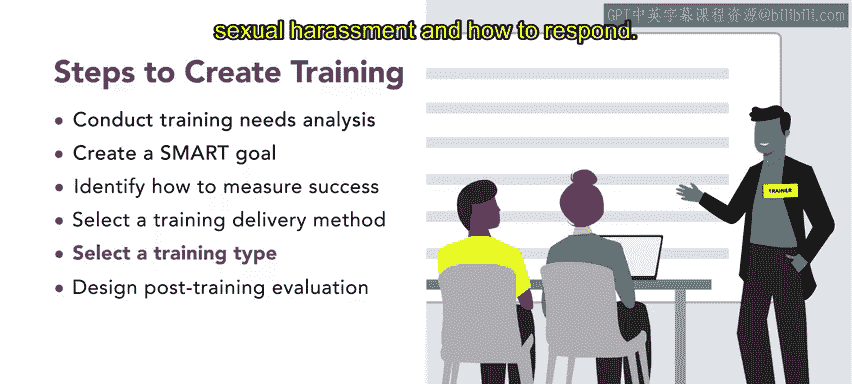
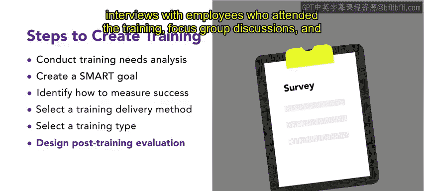
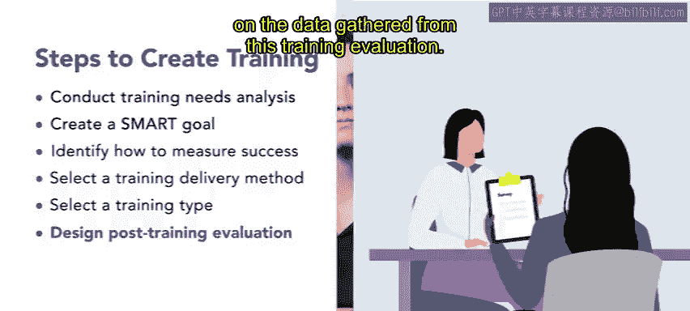
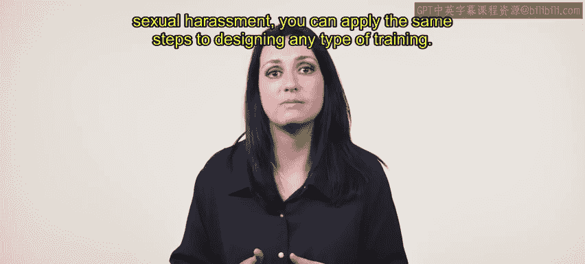

# 120：逐步设计培训体验 🎯

在本节课中，我们将学习如何运用系统化的步骤来设计一项培训，具体以创建关于性骚扰的合规培训为例。我们将从需求分析开始，逐步完成目标设定、方法选择到效果评估的全过程。

---

## 概述：培训设计的核心步骤

上一节我们介绍了培训设计的基本框架，本节中我们来看看如何将这些步骤应用到一个具体案例中。设计一项有效的培训通常包含以下几个关键环节：

1.  进行培训需求分析。
2.  创建一个SMART目标。
3.  确定衡量成功的方法。
4.  选择培训交付方式。
5.  选择培训类型。
6.  设计培训后评估。

接下来，我们将以“Urban Attire”公司创建性骚扰合规培训为例，详细讲解每一步的具体操作。

---

## 一步：进行培训需求分析 🔍

“Urban Attire”公司的人力资源团队希望确保培训具有影响力且与每个岗位相关。为此，他们与组织内不同团队进行了培训需求分析，以识别员工需要改进的领域或现有培训中的差距。

需求分析显示，在以下方面需要进行性骚扰培训：
*   什么构成了性骚扰。
*   如何预防和报告事件。

---

## 二步：设定SMART目标 🎯

在需求分析之后，下一步是为“Urban Attire”设定一个SMART目标，以便有方法衡量培训在整个组织内的实施效果。

经过部门会议讨论，确定的SMART目标是：到合规培训项目结束时，**90%的员工将能够识别并对性骚扰做出恰当反应**，且**每季度性骚扰事件数量降低10%**。

---

## 三步：确定衡量成功的方法 📊

为了衡量针对个体员工的合规培训项目的成功，“Urban Attire”将进行培训前和培训后评估，并比较结果。

在评估中，将呈现一些场景，员工必须判断其是否属于性骚扰案例，然后必须选择对该场景的恰当回应。

---

## 四步：选择培训交付方式 🏢

“Urban Attire”决定采用现场课堂式培训进行交付。现场课堂培训通过消除差旅需求降低了培训成本。此外，它将允许培训师就涉及性骚扰的真实场景提供直接反馈。

对于人力资源部门而言，在员工离开培训前澄清任何误解，获得即时反馈至关重要。

---

## 五步：选择培训类型 👥

接下来，“Urban Attire”确定了培训类型。部门决定采用讲师引导的培训项目，其中包含互动练习、角色扮演场景和小组讨论。

这种类型的培训将使员工能够在安全的环境中参与并练习真实场景。员工还将获得关于识别性骚扰实例以及如何应对的反馈。

---

## 六步：设计培训后评估 📝

最后，需要为培训设计一项评估。部门内部的讨论、对参加培训员工的访谈、焦点小组讨论和反馈表将被用来评估培训。

培训评估结果也将呈现给组织领导层，并且将根据从本次培训评估中收集的数据，对未来的性骚扰培训进行调整。

---

## 总结与展望

本节课中，我们一起学习了“Urban Attire”公司设计性骚扰合规培训的完整步骤。从**需求分析**到**SMART目标设定**（`90%的员工掌握识别与应对，季度事件数降低10%`），再到**评估方法**、**交付方式**与**类型选择**，最后完成**效果评估设计**。

现在你已经看到了“Urban Attire”如何着手创建性骚扰合规培训，你可以将同样的步骤应用于设计任何类型的培训。