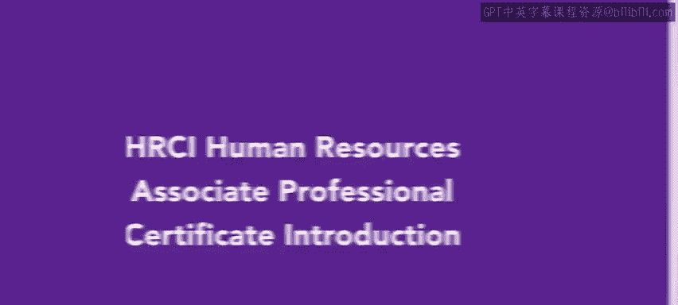

# 122：课程介绍 🎯

在本节课中，我们将要学习HRCI人力资源助理专业证书课程的整体框架与核心内容。该课程旨在为学员提供成为人力资源助理所需的专业技能，并帮助学员准备APHR认证考试。

欢迎参加HRCI人力资源助理专业证书课程。您选择了迈向人力资源职业的道路，这令人振奋。本课程将重点培养作为人力资源助理所需的实用技能。从事人力资源职业将使您能够引导他人完成其职业发展路径，并帮助您的组织凭借强大的员工团队蓬勃发展。

本课程也将为您参加HRCI人力资源助理专业认证考试做好准备。

## 课程模块概览 📚

上一节我们介绍了课程的整体目标，本节中我们来看看具体的课程模块构成。以下是本证书课程包含的五个核心模块：

*   **第一课：人才获取**
    本课程聚焦于人才获取流程的各个方面。您将学习如何预测劳动力需求、寻找和招募优秀候选人，以及如何聘用新员工并使其入职。

*   **第二课：学习与发展**
    本课程将概述在组织中创建有效培训的最佳实践。您将学习识别培训需求和实施培训的不同方法，以及如何评估培训计划的有效性。

*   **第三课：薪酬与福利**
    在本课程中，您将深入探究员工整体薪酬福利包的复杂性。这涉及构建薪酬策略和评估市场福利趋势。您还将学习不同的福利选项，以及如何评估不同的薪酬体系和人力资源技术。

*   **第四课：员工关系导论**
    我们将讨论如何制定和管理组织政策与流程。您将评估管理层与员工之间的价值观和态度，并学习适用于各级员工的绩效管理方法。

*   **第五课：合规与风险管理导论**
    最后一门课程通过审视风险评估和如何培养风险管理思维，来介绍风险管理和合规策略。您将学习不同类型的合规要求，包括法律合规和安全合规，及其在运营政策中的作用。课程最后将探讨人力资源在组织重组中的角色。

## 总结与启程 🚀

本节课中，我们一起学习了HRCI人力资源助理专业证书课程的结构与核心内容。课程涵盖了从人才招聘、培训发展到薪酬福利、员工关系及合规风险管理的完整人力资源助理知识体系。我们有很多内容要学习，现在让我们开始吧。