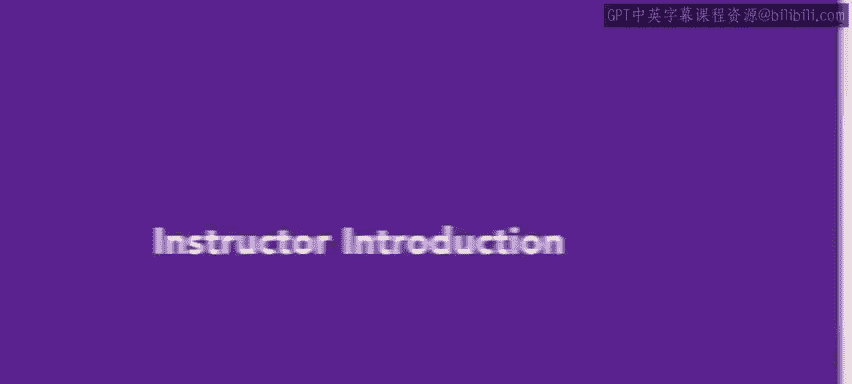

# 124：2_讲师介绍 👩🏫

在本节课中，我们将了解本部分课程的讲师背景，这有助于我们理解她将如何引导我们学习人力资源知识。

---

大家好，我是Riya Batista，我将担任您APHR认证学习之旅中本部分课程的讲师。

在课程开始前，我想简单介绍一下我的个人背景。

我的职业生涯大部分时间都在餐饮行业度过。我曾任职于五星级度假村、酒庄，甚至在旧金山经营过一所烹饪学校。

在这些经历中，我学到了许多宝贵的经验，例如**有效沟通**、**问题解决能力**和**团队协作**。

后来，我在一家初创公司工作时，转型进入了人力资源领域。正是在这里，我发现我之前掌握的所有技能开始真正融会贯通。

人力资源工作包含众多层面。在我自己的人力资源学习之旅中，我亲身经历了为APHR考试备考的过程。准备和参加考试的过程，帮助我明确了我在人力资源领域自然感兴趣的方面。

这也让我更好地理解了人力资源工作，从而能够为我的组织提供更优的解决方案。

我们将要学习的内容非常丰富，现在让我们正式开始吧。

---

---

本节课中，我们一起学习了讲师Riya Batista的背景。她丰富的行业经验与转型至人力资源领域的亲身经历，将为我们的学习提供宝贵的实践视角。在接下来的课程中，她将引导我们系统地覆盖人力资源助理所需掌握的核心知识。