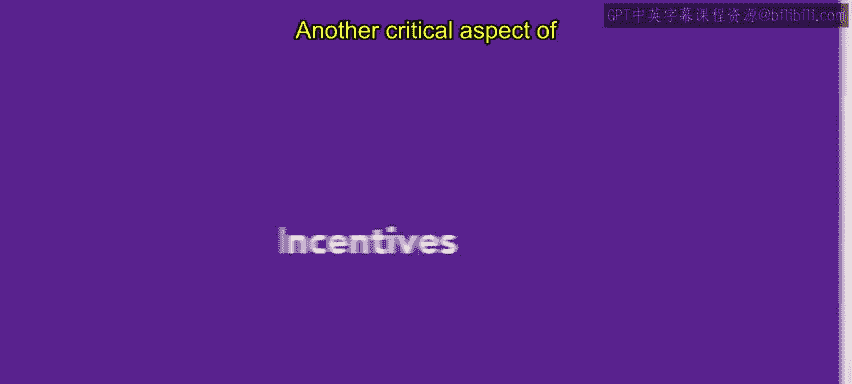

# 129：激励措施 💰

在本节课中，我们将要学习薪酬体系中的另一个关键组成部分——激励措施。我们将了解激励措施的定义、主要形式以及它们如何在实际工作中发挥作用。

## 激励措施概述

上一节我们介绍了薪酬体系的基础构成，本节中我们来看看激励措施。激励措施是薪酬体系中的一个关键方面，通常用于鼓励员工朝着特定目标努力。

激励措施广义上是一种动机或诱因。它可以是货币性或非货币性的奖励，旨在激励员工，例如奖金或额外的休假时间。

## 激励计划的主要形式

以下是几种常见的激励计划形式：

*   **现金奖金**：通常是为实现特定目标而提供的奖励，且侧重于短期目标。年度奖励通常以现金形式支付。有时，现金签约奖金被用来吸引潜在员工加入公司。
*   **公司股票**：如果股票不能立即兑现，其风险可能高于现金支付，因为股票价格受市场波动影响。
*   **股票期权**：这是一种延期支付的形式，员工可以在未来某个时间点将其兑换为公司股票。然而，它们为员工提供了动力，并让员工与公司的长期绩效利益相关。

## 激励措施的实际应用

为了帮助理解，我们来看一个例子。假设Kio在一个销售团队工作。他们的基本工资是一个固定数字。然而，如果他们达到了季度销售目标，他们可以获得5000美元的现金奖金。这笔奖金，连同他们的工资，共同构成了他们的总薪酬。

## 激励措施的作用与意义

激励措施是激励员工的有力工具，尤其是在短期内。像股票这样的激励措施还能让员工对组织产生主人翁意识，从而增加工作动力。

## 课程总结

本节课中我们一起学习了薪酬体系中的激励措施。我们明确了激励措施的定义，探讨了现金奖金、股票和股票期权等主要形式，并通过实例了解了其应用。激励措施是连接员工绩效与组织目标的重要桥梁。接下来，你将学习薪酬体系中的最后一个因素——福利。