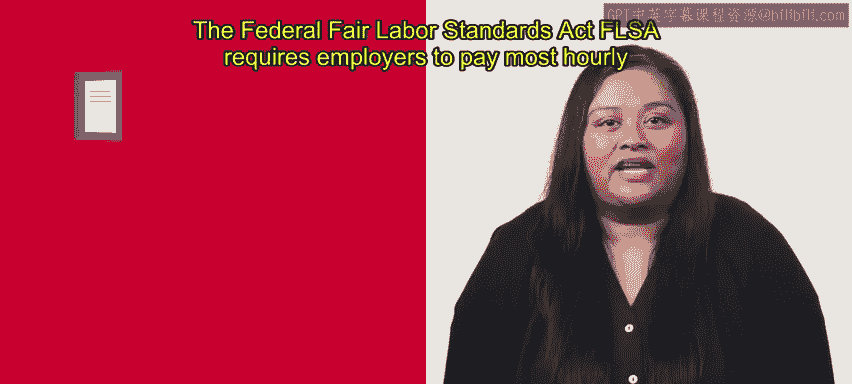
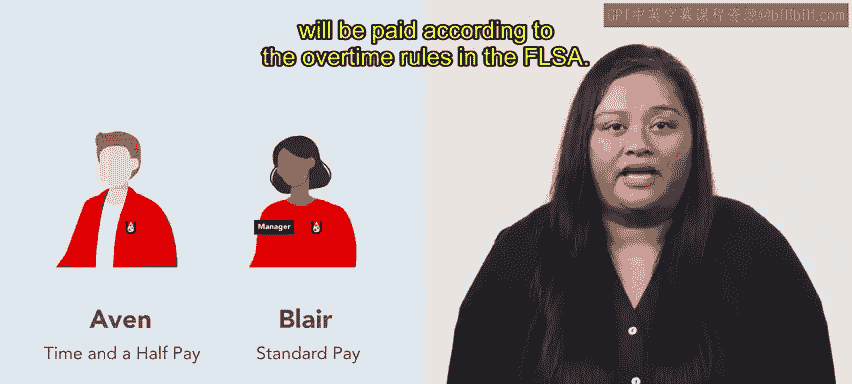
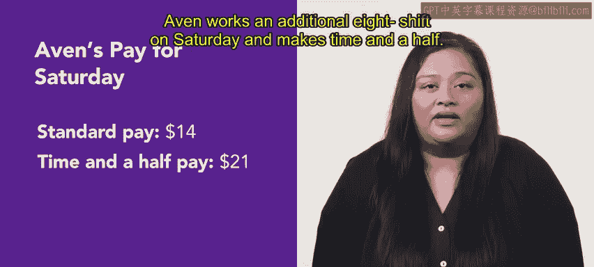

# 132：加班费计算 🕒

在本节课中，我们将学习关于加班费的知识。加班费是一种法律规定的差别工资形式，人力资源从业者需要熟悉其相关规则。我们将详细了解其定义、法律依据、计算方法以及适用人群。

---

## 联邦法律依据

上一节我们介绍了加班费的基本概念，本节中我们来看看其法律依据。美国《公平劳动标准法案》（FLSA）要求雇主在大多数按小时计酬的员工一周工作超过40小时后，必须支付加班费。

加班费的计算标准是基础时薪的1.5倍，通常被称为“一倍半”工资。同时，FLSA也规定了某些类别的员工无需获得加班费，这些员工在法律上被归类为**豁免员工**。

---

## 实例分析：豁免与非豁免员工

了解了法律框架后，我们通过一个实例来具体看看加班费如何应用。以下是关于“Slice You”披萨连锁店两名员工的案例。

*   **埃文**：门店的披萨制作专员，时薪为14美元。
*   **布莱尔**：同一门店的经理，年薪50,000美元，按月支付。

根据他们的薪酬和职责，埃文属于**非豁免员工**，而布莱尔属于**豁免员工**。在本地大学的学期最后一周，该门店非常繁忙。到周五时，两人都已工作40小时，但周六仍需加班。

作为豁免员工，布莱尔不受FLSA加班规则约束，他将在支付期末获得标准的月薪。然而，埃文作为非豁免员工，其加班将根据FLSA规则计算报酬。

---

## 加班费计算

以下是埃文本周的工资计算过程：

1.  **常规工时工资**：埃文本周工作了40小时常规工时。
    *   计算公式：`常规工时工资 = 40小时 × 14美元/小时 = 560美元`
2.  **加班工时与费率**：他在周六额外工作了8小时，应获得“一倍半”工资。
    *   加班费率计算公式：`加班时薪 = 基础时薪 × 1.5 = 14美元 × 1.5 = 21美元/小时`
3.  **加班工资**：
    *   计算公式：`加班工资 = 8小时 × 21美元/小时 = 168美元`
4.  **本周总工资**：
    *   总工资计算公式：`总工资 = 常规工时工资 + 加班工资 = 560美元 + 168美元 = 728美元`

这意味着，埃文在周六加班期间的等效时薪为21美元。尽管本周很忙碌，但埃文很高兴自己的辛勤工作和长时间劳动通过加班费得到了回报。

---

## 总结与前瞻

本节课中我们一起学习了加班费这一常见的差别工资形式。人力资源从业者在管理按小时计酬的非豁免员工时，很可能需要跟踪工作时间并计算加班费率。

在接下来的视频中，你将学习其他类别的差别工资。