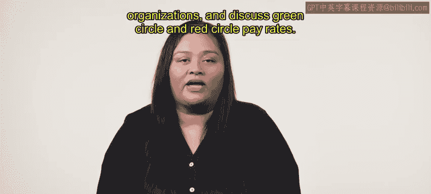
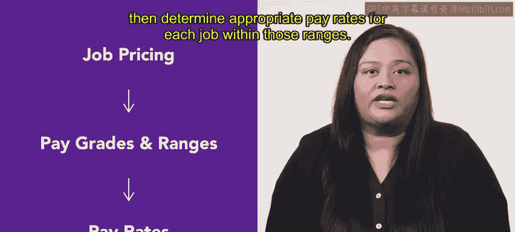
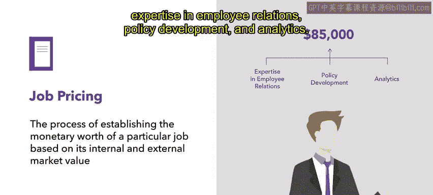
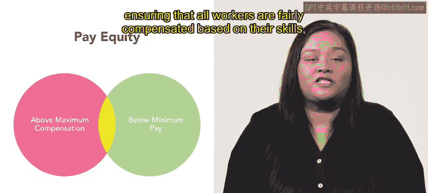

# 141：19_职位定价、薪酬率和薪酬范围 💰

在本节课中，我们将探讨薪酬管理的基本概念，具体聚焦于职位定价、薪酬率和薪酬范围。我们将定义这些术语，提供它们在组织中如何应用的例子，并讨论绿圈薪酬率和红圈薪酬率。

## 职位定价与薪酬等级 🏷️

上一节我们介绍了课程概述，本节中我们来看看薪酬管理的起点——职位定价。

职位定价是根据职位的内部和外部市场价值，确定其货币价值的过程。这包括评估该职位的职责、任职资格和所需技能，然后将其与组织内外的类似职位进行比较，以确定一个公平且有竞争力的薪酬方案。

例如，一名业务伙伴因其在员工关系、政策制定和分析方面的专长，其年薪可能被定为 **85,000美元**。

薪酬等级将价值相似的职位归入不同的薪资组别。其目标是根据经验、教育或技能对职位进行分组。一个组织可能设有三个薪酬等级。

以下是薪酬等级的一个示例：

*   **薪酬等级1**：包含入门级职位，起薪为每小时 **25美元**。
*   **薪酬等级2**：包含初级职位，薪资高于等级1，起薪为每小时 **35美元**。
*   **薪酬等级3**：包含高级职位，薪资高于等级1和2，起薪为每小时 **50美元**。这反映了该薪酬等级内职位所需的更高专业水平。

薪酬等级有上限和下限。一旦员工达到上限，任何加薪都与职位变动挂钩。设计薪酬等级时，避免让高绩效员工因达到上限而失去动力，是维持卓越工作的强大激励因素。

## 薪酬范围与薪酬率 📊

上一节我们介绍了薪酬等级，本节中我们来看看与之紧密相关的薪酬范围。

薪酬等级和薪酬范围紧密相连，因为组织薪酬等级中的每个职位通常都会被分配一个特定的薪酬范围。

例如，在一个组织中，高级软件工程师职位可能被归类为2级薪酬等级。在该薪酬等级内，该职位的薪酬范围是 **每年80,000至120,000美元**。根据员工的技能和绩效，他们可能从该范围的最低点开始，并最终通过努力工作和卓越表现达到最高点。

薪酬范围是基于资格和绩效确定适当薪酬、以及激励员工发挥最佳表现的关键工具。定义过窄的薪酬范围可能会限制员工追求卓越的激励。因此，新员工通常从范围的下限开始。范围的上限可能留作奖励卓越绩效之用。

接下来，薪酬率是指员工因其工作而获得的报酬金额。在许多组织中，薪酬率被组织到薪酬等级中，代表为价值相似的职位提供的一系列薪资。

最后，薪酬公平是公司在支付员工薪酬时的一个重要事项。检查员工的薪酬是否落在具有可比技能和经验的员工的薪酬范围内非常重要。

以下是两种需要关注的薪酬情况：

*   **绿圈薪酬率**：如果员工的薪酬低于其薪酬范围的最低值，这被称为绿圈薪酬率，通常是由于技能或经验不足。
*   **红圈薪酬率**：当员工的薪酬高于其薪酬范围的最大值时，这被称为红圈薪酬率。

理解和处理这些薪酬差异对于确保所有员工都能根据其技能、经验和职责获得公平的薪酬至关重要。

## 总结 ✅

本节课中我们一起学习了薪酬的关键原则，以及如何应用它们来创建公平有效的薪酬策略。我们了解了职位定价是确定工作价值的基础，薪酬等级和范围是构建薪酬体系的结构，而薪酬率则是具体的支付标准。我们还认识了绿圈和红圈薪酬率，它们是维护内部薪酬公平的重要参考指标。