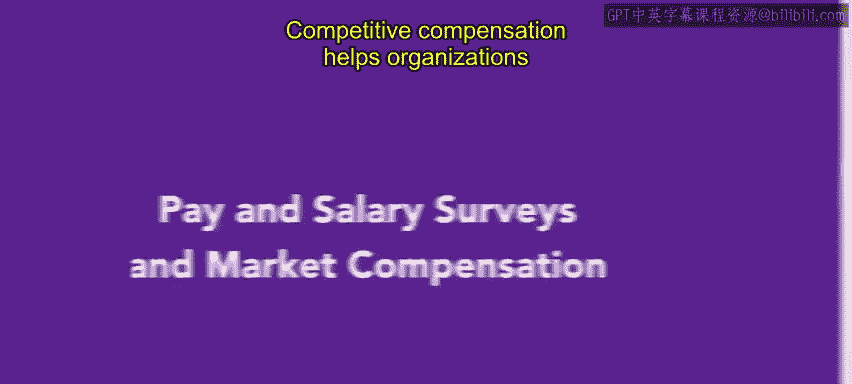
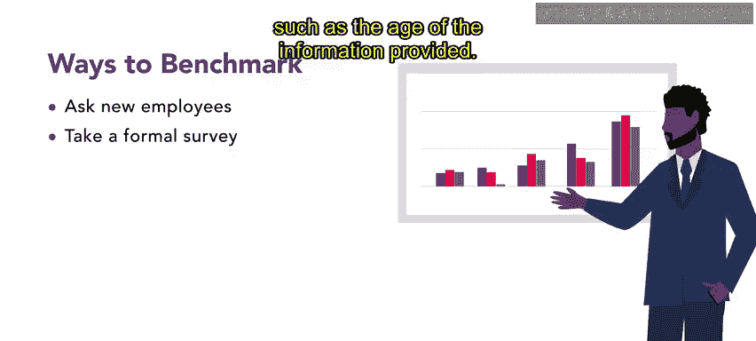
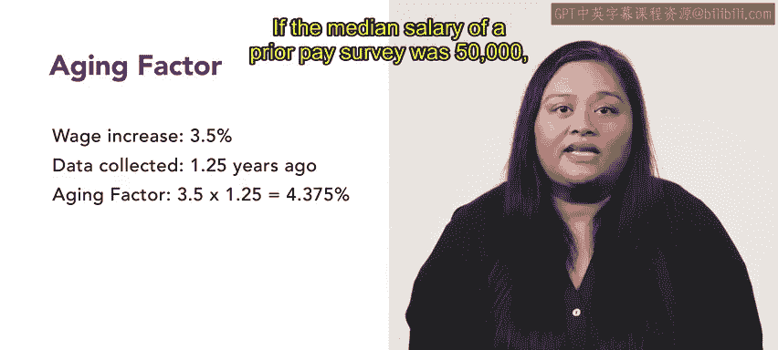

# 150：薪酬调查与市场薪酬 💰

在本节课中，我们将学习薪酬调查与市场薪酬工具。这些工具帮助人力资源专业人士将本组织的薪酬水平与同地区、同行业的其他组织进行比较，从而制定具有竞争力的薪酬方案。

---

## 什么是竞争性薪酬？⚖️

竞争性薪酬是指将你所在组织为某项工作支付的薪酬，与同地区其他组织为相同工作支付的薪酬进行比较。对于人力资源专业人士而言，这类信息非常宝贵。例如，当员工质疑自己的薪酬时，或在进行年度加薪决策时，这些信息都能提供参考。基准测试是判断组织内部是否存在薪酬公平性的有用工具。

基准测试的过程会识别特定岗位所需的技能与职责，并将本组织员工的薪酬方案与其他组织中具备相似技能的员工进行比较。这一过程确保了组织能够提供有吸引力的、具有竞争力的薪酬方案。

---

## 市场薪酬比较工具 🛠️

除了基准测试，人力资源专业人士还可以使用多种工具来比较组织的薪酬方案。以下是几种最常用的方法。

### 1. 与新员工沟通

人力资源专业人士可以向新员工了解他们在前雇主那里获得的薪酬、津贴和福利体验。这是收集市场薪酬信息的简单方法。营造开放沟通的环境有助于组织了解最新的薪酬标准和趋势。

**例如**：当Lou开始在Connective工作时，人力资源团队请其分享之前的薪酬福利方案信息。Lou告知团队，他在另一个州的类似组织中年薪为65,000美元，并且享有一个包含家庭健康计划（每月价值755美元）以及价格相当低廉的牙科和视力保险的福利包。人力资源团队利用这些信息，将本组织的薪酬福利方案与全国其他组织进行比较。

### 2. 进行薪酬调查

人力资源专业人士可以进行正式调查来收集薪酬信息。这有助于为特定职位制定有竞争力的薪酬方案，以吸引更多候选人。

**例如**：Connective公司人力资源团队的Alex在为一个新设岗位招聘时，就进行了一项调查来收集薪酬信息。这些信息帮助他们制定了更具吸引力的薪酬方案。

然而，正式的薪酬调查也存在局限性，例如所提供信息的时效性问题。

### 3. 计算时效调整因子

计算时效调整因子有助于调整从过往调查中获得的中位数薪资数据，以纳入薪酬随时间发生的变化。时效调整因子是年薪平均增长百分比乘以数据收集至今的年数。

**公式**：`时效调整因子 = 年平均薪资增长率 × 数据距今年数`

**例如**：如果工资每年增长3.5%，而数据是1.25年前收集的，那么时效调整因子就是4.375%（3.5% × 1.25年）。如果之前薪酬调查的中位数薪资是50,000美元，应用时效调整因子后的更新薪资为52,187.50美元。

### 4. 利用行业协会

组织也可以考虑利用行业协会获取薪酬调查数据，并了解最新的薪酬趋势。行业协会代表特定行业或专业领域，能提供有价值的见解。在使用行业数据时，组织应始终考虑地理位置对薪酬的影响，因为相同职能的职位在大型都市区的薪酬可能更高。

### 5. 访问第三方网站

诸如Salary.com、Wageweb.com和Payscale.com等第三方网站也提供市场薪酬信息。这些来源包含各种职位和行业的薪资数据。

### 6. 查询政府统计数据

人力资源专业人士还可以使用美国劳工统计局提供的数据，该机构免费提供相关的薪酬信息。

---

## 总结 📝

本节课中，我们一起学习了薪酬调查与市场薪酬工具。人力资源专业人士使用这些工具来确定组织的薪酬是否与市场水平保持一致。请记住，具有竞争力的薪酬方案能够吸引合格的候选人并留住员工。