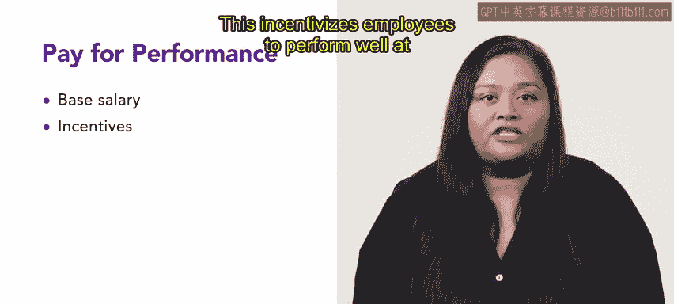
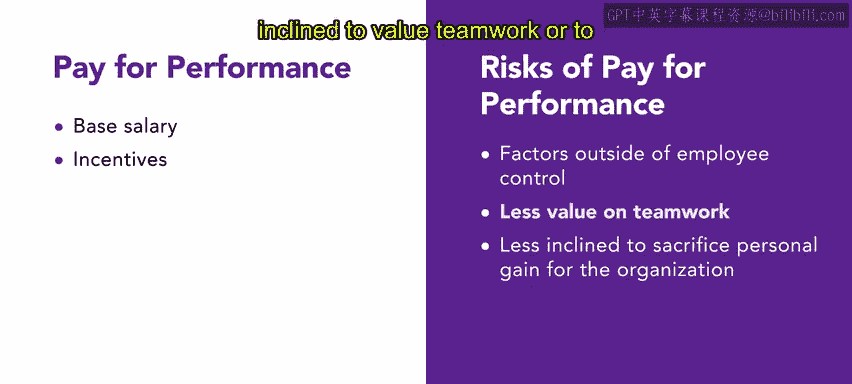
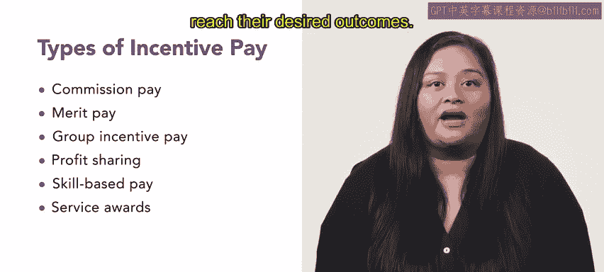

# 152：绩效工资 💰

在本节课中，我们将探讨绩效工资这一薪酬策略，了解它如何体现在员工的基本工资和激励奖金中，并简要介绍佣金、绩效加薪、团队激励、利润分享、技能工资和服务奖励等策略。

## 概述

绩效工资是一种将员工薪酬与其工作成果、行为或目标挂钩的管理策略。在美国，这是最主流的薪酬理念。与基于资历或忠诚度的“应得权利”理念不同，绩效工资允许员工通过优异表现和为组织成功做出贡献来增加收入。这种方法有助于将员工利益与组织目标对齐，激励积极行为，提升士气，并提高生产力。

## 绩效工资的核心概念

上一节我们介绍了绩效工资的基本理念，本节中我们来看看它的具体运作方式和平衡艺术。

绩效工资体现在员工的基本工资和激励奖金两方面。员工的薪酬直接与其绩效挂钩，这意味着员工表现越好，可能获得的加薪和奖金就越多。这激励员工努力工作，并使他们的利益与组织目标保持一致。

平衡基本工资和激励工资是薪酬设计的精细调整过程。如果基本工资相对于激励工资过高，公司就失去了部分影响生产力的杠杆。反之，如果激励工资相对于基本工资过高，则可能引发员工之间严重的收入不平等。员工也可能因无法依赖稳定的薪水而感到不安，从而寻求其他工作机会。

绩效工资的公式可以简化为：
**总薪酬 = 基本工资 + 绩效奖金**

## 绩效工资的风险

尽管绩效工资有诸多好处，但它也存在风险。其中一个风险是，员工的绩效和收入可能受到其无法控制的外部因素影响，例如经济环境或客户购买行为的变化。此外，那些被个人绩效激励的员工，可能不太重视团队合作，或者不愿意为组织利益牺牲个人收益。

## 主要的绩效工资策略

组织会实施多种绩效工资策略来激励员工并达成期望的结果。以下是几种常见的策略，在本课程后续内容中你将学到更多细节。

*   **佣金**：通常用于销售岗位，员工按销售额的一定比例获得报酬。
*   **绩效加薪**：奖励高绩效员工持续的额外工资增长。
*   **团队激励**：奖励达到特定绩效标准的团队或员工群体。
*   **利润分享**：员工获得组织年度利润的一定比例作为奖励。
*   **技能工资**：奖励员工学习和发展新技能。
*   **服务奖励**：表彰长期员工对组织成功的贡献，通常在重要里程碑（如服务满10年）时颁发。

## 总结

本节课中我们一起学习了绩效工资这一薪酬策略。你了解到，绩效工资是一种使员工薪酬反映其生产力的方法。虽然它能激励高绩效并可能帮助公司控制成本，但也伴随着风险，人力资源专业人士在为组织选择激励策略时应予以考虑。在接下来的课程内容中，你将获得关于这些不同策略的更多信息。