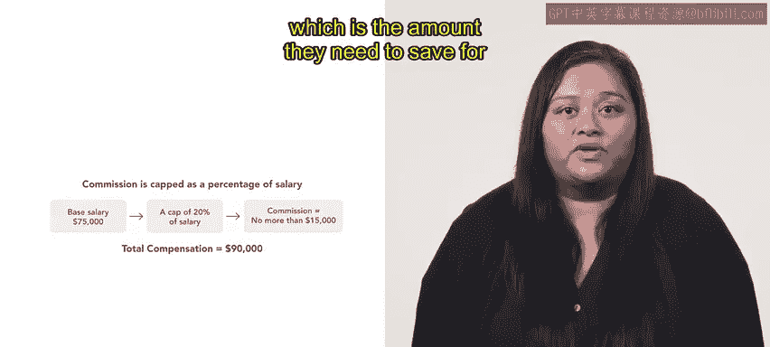

# 153：佣金 💰

在本节课中，我们将深入探讨“佣金”——一种在销售、招聘、金融和房地产领域常见的薪酬实践。你将了解佣金的定义、人力资源专业人士如何设计佣金结构，以及其适用的场景。

佣金是员工每完成一笔销售所获得的奖励。当员工赚取佣金时，他们获得该笔销售额的一部分作为收入。根据组织和行业的不同，可以采用多种佣金结构。接下来，我们来看看三种常见的佣金结构类型。

以下是三种主要的佣金结构：

*   **封顶佣金**：这意味着佣金有一个上限，通常是销售人员基本工资的一个百分比。例如，Alex 在一家 B2B 电信公司 Connective 的销售部门工作。他的基本年薪是 75,000 美元，佣金上限为 20%。这意味着 Alex 最多可以赚取 15,000 美元的佣金（计算公式：`$75,000 * 20% = $15,000`）。这笔钱正好是他为新房首付需要攒的金额。
*   **销售额百分比佣金**：这种结构下，佣金直接基于销售额的一个固定比例计算。例如，Alex 的基本工资是 75,000 美元，如果他的销售额达到 500,000 美元，佣金比例为 3%，那么他的佣金将是 15,000 美元（计算公式：`$500,000 * 3% = $15,000`）。这使他的总薪酬达到 90,000 美元。
*   **个人与团队混合佣金**：这种结构结合了个人佣金和团队佣金。Alex 除了获得基本工资和个人佣金外，还能与其他销售人员共享一个佣金池。在个人与团队混合佣金结构下，Alex 的雇主 Connective 为其 5 人销售团队设置了 50,000 美元的佣金池。这意味着每位销售人员可获得 10,000 美元的团队佣金（计算公式：`$50,000 / 5 = $10,000`）。将个人佣金与团队佣金相加，Alex 的总薪酬达到了 100,000 美元。

本节课中，我们一起学习了佣金的多种结构方式，包括**封顶佣金**、**销售额百分比佣金**以及**个人与团队混合佣金**。这些结构旨在激励销售人员提升业绩，从而可能增加组织的收入。在接下来的课程中，你将学习组织用于奖励员工绩效的其他方法。