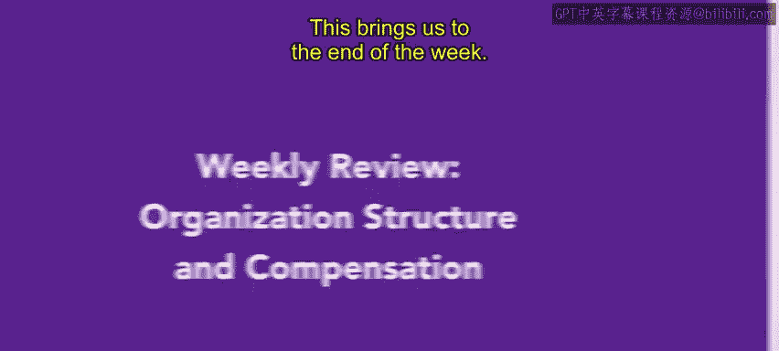
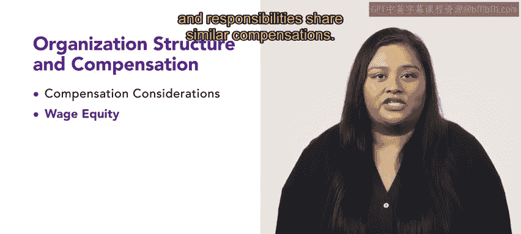

# 161：每周回顾：组织结构与薪酬

## 概述
在本周的回顾中，我们将总结第二周课程的核心内容。我们重点学习了组织结构和薪酬体系，这是人力资源专业人员必须掌握的关键知识领域。

## 本周内容回顾

上一节我们介绍了课程的整体框架，本节中我们来具体回顾本周学习的三个核心模块。

以下是本周学习的第一个核心模块：薪酬考量因素。

*   **竞争性薪酬**：确保公司提供的薪酬在劳动力市场中具有吸引力。
*   **性别薪酬差距**：认识到并致力于消除因性别导致的薪酬不平等现象。
*   **决策前提**：人力资源专业人员必须在做出任何薪酬决策前，充分理解这些不同的考量因素。

理解了薪酬的基本考量后，我们来看看如何实现薪酬的内部公平性。

以下是关于薪酬公平性的关键概念。

*   **职位评估**：系统性地评估不同职位的相对价值。
*   **薪酬范围**：为每个职位等级设定最低、中位和最高薪酬水平。
*   **公平目标**：确保具有相似技能和职责的员工获得相近的报酬。

在建立了公平的薪酬体系基础上，我们可以引入激励措施来提升绩效。

最后，我们学习了绩效薪酬与各种激励形式。

*   **绩效薪酬**：将薪酬的一部分与个人或团队绩效直接挂钩。
*   **激励形式**：包括奖金、佣金、利润分享等。
*   **利益协同**：激励措施能使员工的利益与组织的目标保持一致。

## 总结
本节课中我们一起回顾了第二周关于组织结构和薪酬的全部内容。我们学习了薪酬的多种考量因素、实现薪酬内部公平的方法，以及将薪酬与绩效挂钩的激励策略。掌握这些知识对于人力资源专业人员至关重要。

## 下周预告
请运用本周所学知识，并在此基础上继续深化。下周，我们将开始学习不同类型的员工福利，以及它们如何影响员工和组织。第三周包含大量对您的人力资源角色有用的信息和技巧，请保持努力，我们第三周见。