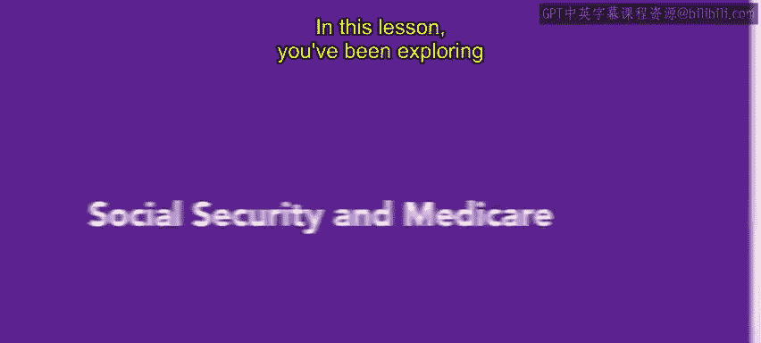
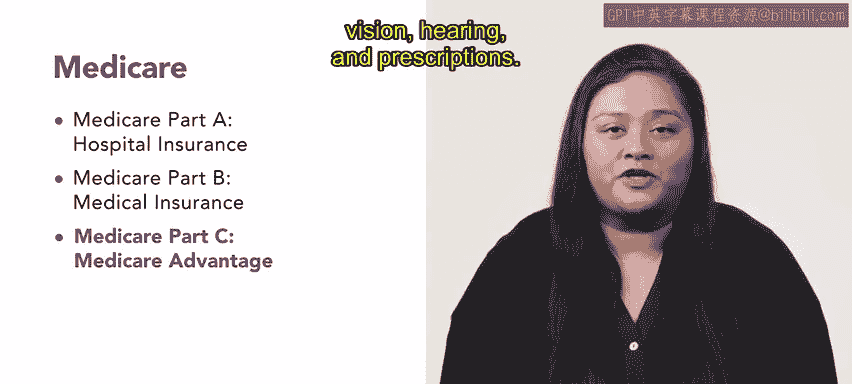

# 171：社会保障与医疗保险 🏥

在本节课中，我们将学习社会保障和医疗保险这两项重要的员工福利。雇主会代表员工管理这两项福利，通常通过从员工薪资中扣除一定比例来缴纳。我们将了解它们的基本概念、运作方式以及资格要求。

上一节我们介绍了作为福利的医疗保险，本节中我们来看看社会保障和医疗保险的具体内容。

## 社会保障：退休与保障计划

社会保障旨在通过提供退休福利、残疾收入、医疗保险和遗属福利，来保护员工及其家属。

与养老金或保险计划不同，从员工处征收的社会保障资金会进入由社会保障管理局管理的信托基金。这些信托基金的资金随后会提供给当时已退休或残疾的个人。这笔资金的征收是一种工资税，由美国国税局从组织的工资单中收取。这项税收被称为**FICA税**（联邦保险贡献法税）。

然而，近年来社会保障体系受到了广泛批评，未来很可能面临修订。由于预期寿命延长导致老年人口增长，正在工作并向社会保障缴费的人数与领取社会保障福利的人数之间的比例已经失衡。

以下是关于社会保障修订的常见讨论：
*   调整支付金额。
*   提高退休年龄。
*   建立私人社会保障账户。

## 医疗保险：医疗保健保障

员工和雇主还需要将薪资的一定比例缴纳给医疗保险计划。该计划于1965年作为《社会保障法》的修正案而设立，旨在为退休或残疾的公民提供医疗保健，无论其收入如何。

如果您满足以下任一条件，即有资格享受医疗保险：
*   您年满65岁或以上。
*   您患有终末期肾病，这意味着您正在接受透析或需要肾移植。
*   您领取社会保障残疾保险已超过两年。

## 医疗保险的组成部分

医疗保险由四个部分组成。

以下是医疗保险四个部分的详细介绍：
1.  **医疗保险A部分**：也称为医院保险，涵盖住院护理、临终关怀和一些健康服务，以及大多数护理机构的住院护理。A部分是强制性的，成员无需为基本保障支付额外保费。
2.  **医疗保险B部分**：涵盖医疗保险，涉及与医生就诊、门诊护理、预防性服务、筛查、手术费用以及物理和职业治疗等相关的费用。B部分不是强制性的，因此大多数成员需要支付保费以获得保障。
3.  **医疗保险C部分**：是A部分和B部分的替代方案，称为“医疗保险优势计划”。它涉及从医疗保险批准的HMO或PPO组织获得服务。符合A部分和B部分资格的个人也符合医疗保险优势计划的资格，但他们必须等待每年的开放注册期才能注册。该计划为牙科、视力、听力和处方药等额外服务提供保障支持。
4.  **医疗保险D部分**：涵盖处方药费用。个人必须支付月费才能获得保障，并且必须符合A部分资格并已注册B部分。

## 总结与展望

本节课中，我们一起学习了社会保障和医疗保险为员工提供的福利，以及雇主如何为其做出贡献。了解这些知识对于制定福利方案非常有用。

在下一课中，您将学习以家庭为导向的福利。