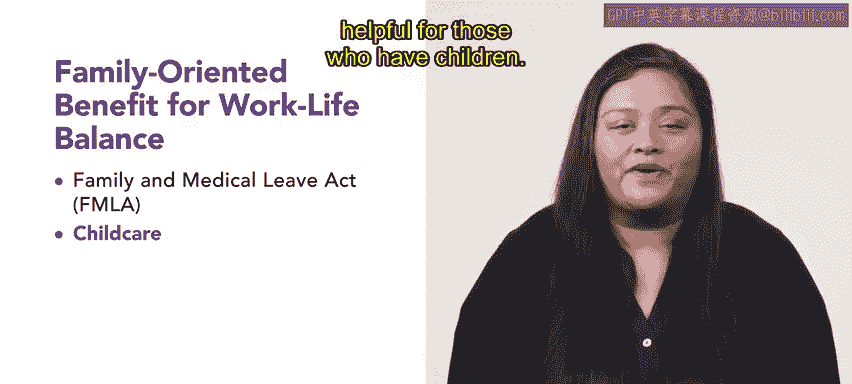

# 172：福利与工作生活平衡 😊

在本节课中，我们将学习如何通过一系列以家庭为导向的福利政策，帮助员工实现健康的工作与生活平衡。理解并实施这些福利，对于提升员工满意度与生产力至关重要。

---

### **概述：什么是工作与生活平衡？**

每个人的生活都由多个不同但有时又相互重叠的领域构成。许多人感到难以同时在所有领域都做到最好。当工作特别繁重时，专注于家庭生活尤其困难。工作与生活平衡的概念由此产生。

工作与生活平衡的具体形态因人而异，但其核心是调和**职业责任**与**工作之外能带来个人满足感的活动**之间的张力。

接下来，我们将介绍几种关键的以家庭为导向的福利。这些福利有助于员工在工作之外获得满足感，从而让他们在工作中更高效。

---

### **核心福利政策详解**

以下是几种有助于实现工作生活平衡的福利政策：

**1. 《家庭与医疗休假法案》**
该法案规定，雇主必须在特定情况下为员工提供最长12周的无薪假期。适用情况包括：员工生育、收养子女、需要照顾患有严重疾病的子女/父母/配偶，或员工本人患有严重疾病。

**2. 儿童保育支持**
儿童保育福利可以采取多种形式。最常见的是为员工免费提供寻找保育信息的帮助。例如，提供一份可供员工使用的本地日托中心列表，这对有子女的员工非常有帮助。

**3. 灵活支出账户**
雇主可能提供**灵活支出账户**。这是一种由雇主存入资金的账户，员工可将资金用于特定的医疗相关项目，例如个人护理或非处方药物。其运作模式可简化为：
`员工可用资金 = 雇主存入金额 - 已报销金额`

**4. 员工援助计划**
**员工援助计划**也是一个极佳的福利选择。这类计划高度可定制，旨在帮助员工感受到支持。

**5. 休假津贴**
另一种有助于工作生活平衡的福利是休假津贴。这可以表现为弹性工作时间或其他形式的休假。

**6. 志愿者服务假**
与休假津贴类似，志愿者服务假允许员工投身慈善事业或其他志愿活动。

**7. 远程工作**
远程工作是指允许员工部分或全部工作时间在家办公。

**8. 搬迁援助**
最后但同样重要的是搬迁援助。对于因新职位需要搬迁的员工，这可能包括搬迁奖金或协助寻找住房。

---

### **总结**

拥有健康的工作与生活平衡是保持员工满意和高效的关键。提供有助于实现这一目标的福利，是雇主需要考虑的重要方面。

本节课我们一起学习了《家庭与医疗休假法案》、儿童保育支持、灵活支出账户等多种以家庭为导向的福利政策。在接下来的课程中，你将进一步探索《家庭与医疗休假法案》等内容的更多细节。