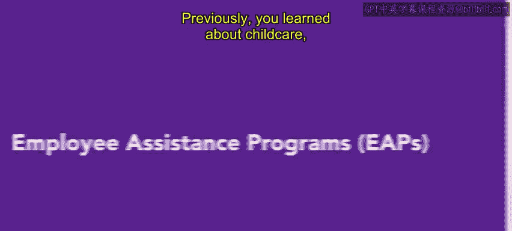
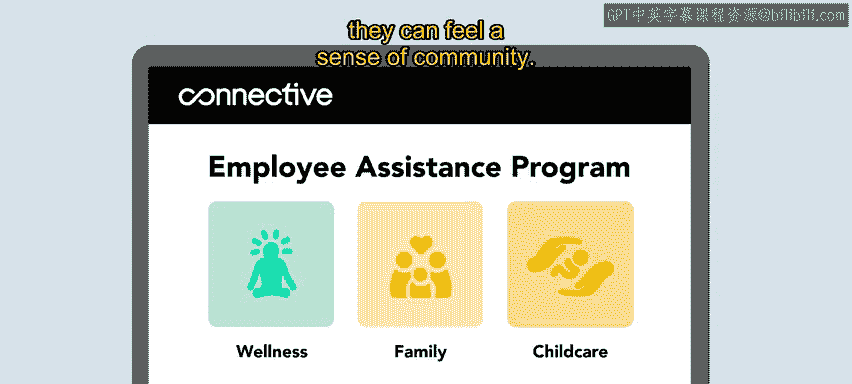

# 175：员工援助计划（EAPs）🧑‍💼

在本节课中，我们将要学习员工援助计划（EAPs）的概念、内容及其在全面福利体系中的重要性。员工援助计划是为员工提供支持的重要工具，涵盖从个人咨询到家庭事务协助等多个方面。

## 员工援助计划概述

上一节我们介绍了儿童保育、家庭休假等福利。这些福利是全面福利方案的重要组成部分。另一个值得考虑提供的重要福利是员工援助计划，简称 **EAP**。

本节中，我们将探讨EAPs及其功能。一些员工援助计划为个人问题提供咨询和顾问服务，这些问题包括儿童和老人护理、领养援助、心理健康咨询以及人生大事规划。

## EAPs的服务提供方式

通常，组织会与外部供应商签订合同来提供这些服务。例如，一些雇主为领养孩子的员工提供特定福利，包括法律协助和带薪休假。其他组织则通过与心理健康应用程序和项目合作，提供心理健康资源。

以下是EAPs可能包含的一些服务示例：
*   **领养援助**：提供法律咨询和带薪假期。
*   **心理健康支持**：提供免费的心理健康应用程序订阅或咨询服务。
*   **儿童保育补贴**：为符合资格的员工提供经济补助。
*   **员工资源小组**：为特定群体（如在职父母）建立社区支持网络。

## 实践案例：Alex的故事

让我们通过一个例子来具体了解。Alex在Connective公司工作了好几年。他们很高兴即将迎来第一个孩子。然而，尽管这是好消息，Alex也对成为新手父母感到紧张。他们决定研究一下Connective公司提供的员工援助计划。

Alex发现了一项免费的心理健康应用程序订阅服务并进行了注册。Alex还看到，Connective为在公司工作满一定时间的员工提供儿童保育补贴，他们很高兴自己有资格获得这项有用的福利。

最后，Alex还决定加入一个专门面向在职父母的员工资源小组，以便获得社区归属感。

## 福利覆盖范围的扩展

虽然员工福利传统上只覆盖员工的子女和配偶，但现在一些组织正在将员工福利扩展到家庭伴侣或事实配偶。

这些雇主认识到，现代家庭包括处于长期关系的员工和LGBT+伴侣。因此，福利政策的覆盖范围也随之扩展，以体现包容性。

## 总结与过渡

员工援助计划是支持员工和补充福利的绝佳工具。它通过提供专业、保密的支持，帮助员工处理工作和生活中的挑战，从而提升整体福祉与工作效率。

本节课中，我们一起学习了员工援助计划（EAPs）的定义、常见服务内容、实施方式以及其覆盖范围的现代发展趋势。接下来，我们将探索带薪休假和其他类型的福利。