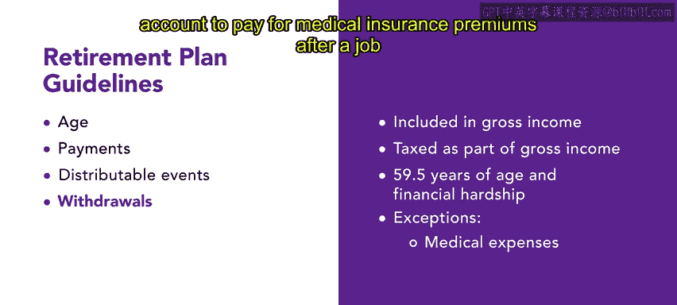
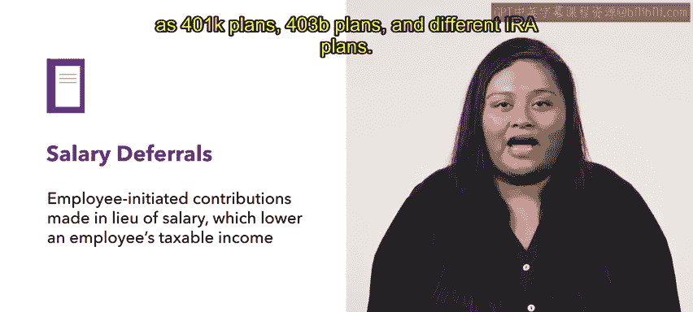
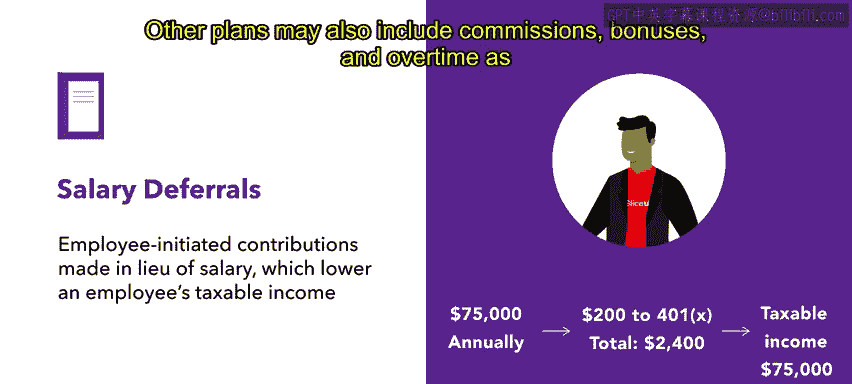

# 181：退休计划基础 💼

在本节课中，我们将要学习退休计划的基础知识。大多数员工都知道退休是需要考虑和准备的事情。如果他们在组织中工作，他们也可能知道雇主可以帮助进行退休供款。但雇主的支持具体包含哪些内容呢？通过本视频，你将了解退休计划的一些基本原理。

## 参与资格与领取规则

上一节我们介绍了退休计划的基本概念，本节中我们来看看参与资格和资金领取的基本规则。退休计划的许多基本准则都与参与者如何供款以及何时可以从退休储蓄中提取资金有关。

其中一个规则是关于年龄的。根据美国国税局的规定，员工必须年满21周岁，并且在当前工作单位服务至少满一年，才有资格参加合格的退休计划。

国税局还对开始领取退休金的时间提出了要求。除非参与者另有选择，否则退休福利必须在计划年度结束后的60天内开始发放，并且需要与某些特定事件节点相关联。

以下是这些关键的发放节点：
*   参与者年满65岁或达到计划中规定的正常退休年龄。
*   参与者终止与雇主的雇佣关系。
*   参与者达到其开始参与该计划的第十个周年。

## 可分配事件与提前支取

除了常规的领取节点，还存在一些被称为“可分配事件”的特殊情况。在这些情况下，可以从退休计划中分配资金而无需缴纳罚款。

以下是可分配事件的例子：
*   员工死亡。
*   员工残疾。
*   员工年满59岁半且遭遇经济困难。

通常，任何在59岁半之前从退休账户中提取资金的行为都会面临处罚。首先，提取的金额将计入个人的总收入并相应纳税。其次，个人还需为提前支取缴纳10%的额外税款。

不过，国税局允许一些例外情况免除这10%的罚款。例如，当个人失业后，从其退休账户中提取资金用于支付医疗保险费时。

## 核心概念：薪资延付

关于退休计划，还有两个核心概念需要记住，无论是对员工还是人力资源专业人士都同样重要。第一个是**薪资延付**。薪资延付是员工主动从工资中扣除一部分作为供款，这会降低员工的应税收入。

员工可以向合格的退休计划进行薪资延付，例如401(k)计划、403(b)计划以及不同类型的IRA计划。

**示例**：一名年收入为75，000美元的员工决定每月从其工资中向401(k)计划供款200美元，即每年延付2，400美元。那么，该员工的应税收入现在是72，600美元，而不是75，000美元。

不同计划对用于薪资延付的“薪酬”定义可能不同。在许多情况下，用于延付的薪酬可以是正常工作时间的收入。其他计划也可能将佣金、奖金和加班费计入薪酬范围。

## 核心概念：困难提取

退休计划的另一个特性是允许参与者在特定情况下进行提前支取，这被称为**困难提取**。为了符合困难提取的条件，个人必须是由于即时且沉重的财务需求而进行提取。提取的金额也必须恰好等于满足该需求所需的数额。

国税局列出了以下符合困难提取条件的情况：

*   为员工本人、配偶、受抚养人或受益人支付的医疗护理费用。
*   与购买员工主要住所直接相关的费用（不包括抵押贷款还款）。
*   为员工本人、配偶、子女、受抚养人或受益人支付未来12个月高等教育学费及食宿费用。
*   为防止员工从其主要住所被驱逐或该住所被止赎而必需的付款。
*   为员工本人、配偶、子女、受抚养人或受益人支付的丧葬费用。
*   为修复员工主要住所损坏而产生的某些费用。

## 总结

本节课中，我们一起学习了退休计划的基础知识。尽管每个退休计划都有其独特性，但这些基本原理普遍适用。在你构建自己的福利方案时，牢记这些要点非常重要。接下来，你将进一步探索不同类型的退休计划。