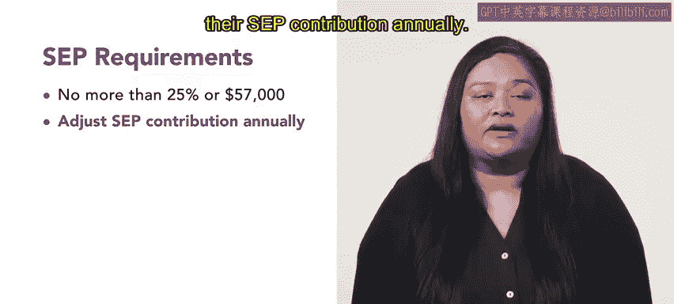

# 186：简化员工退休金计划 📘

在本节课中，我们将学习一种名为“简化员工退休金计划”的退休福利方案。我们将了解其基本定义、运作方式、缴款规则，并通过一个具体例子来加深理解。

## 什么是简化员工退休金计划？🤔

到目前为止，我们已经学习了诸如401K计划和IRA（个人退休账户）等多种退休计划。本节中，我们来看看另一种类型的退休计划。

简化员工退休金计划，英文简称**SEP**，是一种由雇主为员工设立并存入资金的退休账户。

顾名思义，SEP计划相对简单。员工无需向该计划缴款，并且资金**立即完全归属**于员工。这意味着员工可以随时离开公司并领取已分配的资金。

## SEP计划的缴款规则 💰

以下是关于SEP计划缴款的关键规则：

*   **缴款上限**：截至2020年，雇主为每位员工存入SEP计划的金额，不得超过该员工收入的**25%** 或 **57,000美元**（以较低者为准）。
*   **年度调整**：雇主可以每年调整其SEP缴款额度。
*   **统一比例**：所有符合条件的员工必须获得**相同薪资百分比**的缴款。

## 一个SEP计划示例 📊

为了更清晰地理解，让我们通过一个例子来说明。假设一家非常小的公司只有五名员工。

*   **创始人（CEO和CFO）**：两人的年薪均为 **$100,000**。公司决定为每位员工的SEP计划缴款比例为25%。因此，公司每年为这两人各自的退休计划存入 **$25,000**。
    *   计算公式：`$100,000 * 25% = $25,000`
*   **两名经理**：每人的年薪为 **$80,000**。按照25%的SEP缴款比例，公司每年为他们的退休计划各存入 **$20,000**。
    *   计算公式：`$80,000 * 25% = $20,000`
*   **一名初级员工**：年薪为 **$60,000**。其SEP缴款同样为25%，即公司每年存入 **$15,000**。
    *   计算公式：`$60,000 * 25% = $15,000`

虽然不同薪资级别的员工获得的美元金额不同，但他们**都获得了相同比例（25%）** 的缴款，这完全符合SEP计划的规则。

## 总结与前瞻 📝

本节课中，我们一起学习了简化员工退休金计划。我们了解到，SEP是一种由雇主全额供款、资金立即归属且缴款比例必须统一的退休计划。它是企业可以考虑为员工提供的优秀福利选项之一。

退休计划的选择多种多样，对不同类型有一个基本的了解非常重要。在后续课程中，我们还将学习关于“合格家庭关系令”的知识。