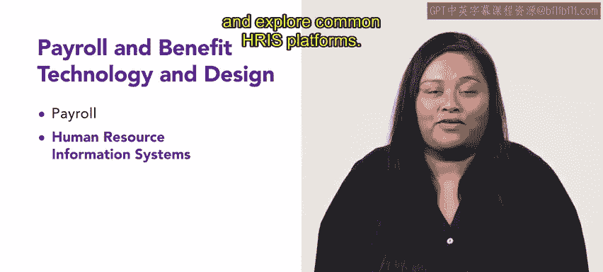

# 66周：薪酬与福利技术与设计 💻💰

在本节课中，我们将要学习薪酬与福利相关的技术与系统设计。我们将探讨薪酬管理的基本要素、人力资源信息系统（HRIS）的选择与应用、数据存储与报告要求，以及各类索赔处理流程。这些知识将帮助你更高效地管理组织的薪酬福利事务。

---

欢迎回来。到目前为止，你已经学习了许多关于福利与薪酬的知识。

现在，是时候通过回顾薪酬与福利的技术和设计来扩展这一讨论了。

作为一名人力资源专业人士，你需要向组织内的员工发放薪酬。同时，你也需要某种系统来管理与薪酬和福利相关的文书工作。本周，我们将探讨能够协助你进行薪酬与福利管理的各类系统。

---

## 一课：薪酬要素 📅

首先，你将学习薪酬的构成要素，包括薪酬发放周期和记录保存。

薪酬管理涉及多个关键部分。以下是其主要构成要素：

*   **薪酬周期**：指发放工资的频率，例如每周、每两周或每月。
*   **记录保存**：指依法保存所有与薪酬相关的文件和数据，如工时卡、工资单和税务表格。

---

## 二课：人力资源信息系统（HRIS）🔍

上一节我们介绍了薪酬的基本要素，本节中我们来看看用于管理这些要素的核心工具——人力资源信息系统。

接下来的课程将重点介绍人力资源信息系统，也称为HRIS。在这节课中，你将学习如何选择HRIS、回顾一个HRIS示例，并探索常见的HRIS平台。

HRIS是一个集成的软件解决方案，用于管理人力资源、薪酬和福利数据。以下是选择和使用HRIS时需要考虑的几个方面：

*   **系统选择**：评估组织的规模、预算和具体需求，以选择最合适的HRIS。
*   **系统示例**：一个典型的HRIS可能包含员工信息数据库、薪酬计算模块、福利管理门户和报告工具。
*   **常见平台**：市场上有多种HRIS平台，例如Workday、SAP SuccessFactors和Oracle HCM Cloud。

---

## 三课：数据存储与报告 📊

掌握了HRIS的基本知识后，我们需要关注系统中的数据如何被安全地存储和使用。本节将探讨数据存储与报告的相关主题。

第三课将涵盖数据存储和报告。主题包括数据存储、必需记录、数据处置、数据泄露、法定报告要求和数据保护。

数据是HRIS的核心，必须妥善管理。以下是数据管理的关键环节：

*   **数据存储**：确定数据存储的位置（如本地服务器或云端）和格式。
*   **必需记录**：了解法律要求必须保存的员工和薪酬记录类型及其保存期限。
*   **数据处置**：制定安全销毁过期或不再需要的数据的流程。
*   **数据泄露**：制定预防和应对数据安全事件的计划。
*   **法定报告**：遵守政府机构要求的报告义务，如EEO-1报告或税务表格。
*   **数据保护**：实施措施（如加密和访问控制）以保护员工数据的隐私和安全。

---

## 四课：索赔处理 ⚖️

在确保了数据安全的基础上，人力资源部门还需要处理各种与薪酬福利相关的员工索赔。这是本课程的最后一个重点。

在最后一课中，你将学习关于索赔处理的知识。这节课将涵盖工伤赔偿以及与工资工时、残疾福利和《家庭与医疗休假法》（FMLA）违规相关的索赔。

索赔处理是薪酬福利管理中的重要环节。以下是常见的索赔类型：

*   **工伤赔偿**：处理员工因工作相关伤害或疾病提出的医疗和工资补偿索赔。
*   **工资与工时索赔**：解决关于加班费、最低工资或错误分类的纠纷。
*   **残疾福利索赔**：管理短期或长期残疾福利的申请与支付。
*   **FMLA违规索赔**：处理涉嫌违反《家庭与医疗休假法》的投诉，该法为符合条件的员工提供无薪休假以处理特定家庭和医疗事务。

本周我们有很多内容要学习，让我们开始吧。我们将从薪酬管理开始。

---

本节课中我们一起学习了薪酬与福利管理的技术层面。我们从薪酬的基本要素出发，深入了解了人力资源信息系统（HRIS）作为核心管理工具的选择与应用。接着，我们探讨了至关重要的数据存储、报告与保护规范。最后，我们学习了如何处理各种员工索赔，包括工伤、工资纠纷及福利相关申诉。掌握这些知识，将使你能够更系统、更合规、更高效地支持组织的薪酬福利职能。