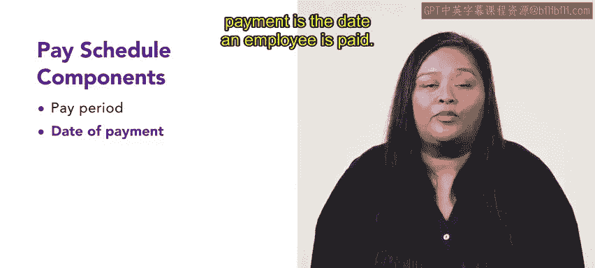

# 190：薪资发放周期 💰

在本节课中，我们将要学习薪资发放周期的核心概念，了解其组成部分，并通过实例理解不同发放周期的运作方式。

## 概述

薪资发放周期是每个组织薪酬管理的基础。一个清晰、合规的发放周期有助于确保员工及时获得报酬，同时平衡财务部门的工作负荷。本节内容将解析薪资发放周期的两个关键部分。

## 薪资发放周期的组成部分

薪资发放周期可以分解为两个不同的组成部分：**支付周期**和**支付日期**。让我们来逐一详细了解。

### 支付周期

支付周期是指计算员工薪酬所覆盖的时间段。虽然支付周期可能因组织的规模和行业而异，但最常见的周期是**每周**和**每两周**。

以下是常见的支付周期类型：
*   **每周支付周期**：员工在每个星期的同一天获得报酬。
*   **每两周支付周期**：员工每两周在同一天获得报酬。
*   **半月支付周期**：部分组织选择每月支付两次。
*   **每月支付周期**：员工每月获得一次报酬。

财务部门负责确定支付周期。研究表明，员工通常更喜欢更频繁的支付方式。然而，过于频繁的支付（如每周支付）可能会给同时负责其他月度报告的财务部门带来负担。

### 支付日期

支付日期是指员工实际收到薪酬的日期。它通常与支付周期的结束相关联。

## 实例分析

为了更直观地理解，我们来看两个例子。

### 实例一：每两周支付

Connective公司的财务部门为所有员工设定了**每两周**的支付周期。他们选择这个周期是因为知道员工喜欢经常获得报酬，同时这个频率也能平衡部门其他的工作职责。

员工Sam在Connective工作，他每两周获得一次报酬。他的支付日期是每个月的**1号和15号**。

### 实例二：每月支付

SlicU公司的经理是领取固定薪水的员工，他们采用**每月**支付的方式。固定的月薪使得薪资计算更为简便。

经理Avery的年薪是**$53,000**，按月支付。在扣除了税款和福利（包括家庭健康与牙科保险）后，Avery每月实得**$2,860**。

## 重要注意事项

在确定薪资发放周期前，**确认所在地区的法规要求至关重要**。法规因地区而异，但许多地区会设定支付频率的最低（有时也包括最高）要求。

## 总结

本节课中，我们一起学习了薪资发放周期的核心知识。我们了解到，薪资发放周期由**支付日期**和**支付周期**两部分构成。虽然由财务部门决定具体的发放安排，但选择一个既符合组织运营需求，又能让员工感到满意的周期方案非常重要。记住，在最终确定前，务必核查并遵守当地的相关法规。