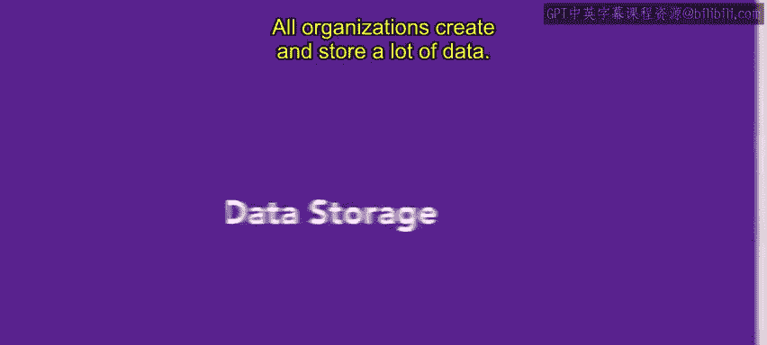
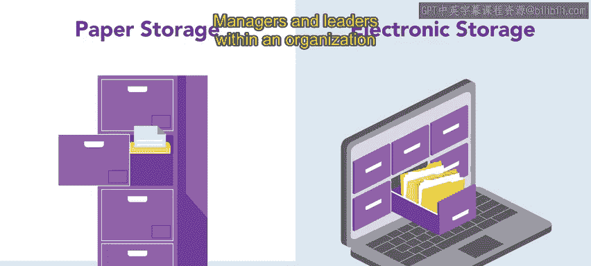
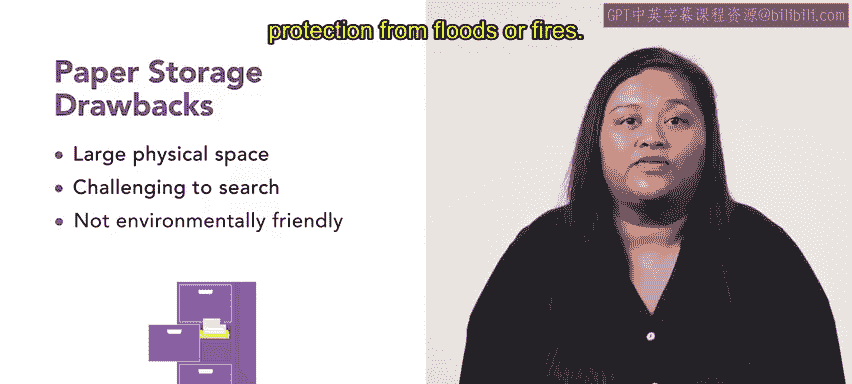

# 195：数据存储 📊

在本节课中，我们将学习组织如何创建、存储和管理数据，特别是人力资源数据。我们将探讨纸质与电子存储系统的优缺点，以及如何根据法规要求妥善保存各类文件。

所有组织都会创建并存储大量数据。当这些数据能够被快速搜索和评估时，其价值最大。

人力资源经理应仔细思考如何存储信息并管理对其的访问权限。

虽然电子数据存储对于分析尤其有价值，但一些组织也选择保留信息的纸质副本。

纸质和电子存储系统各有其优缺点。组织内的管理者和领导者必须确定哪种方法最适合他们的需求。

## 纸质文档的优势与劣势 📄

上一节我们提到了数据存储的两种主要形式，本节中我们来看看纸质文档的具体特点。

纸质文档的优势包括：关于机密材料存储的法规较少，以及被黑客访问的可能性较低。

相比之下，纸质文档需要物理存储空间，并且比电子文件更难搜索。纸质存储还有额外的缺点：环保性较差，并且缺乏对洪水或火灾的防护。

## 电子存储的优势与劣势 💾

了解了纸质存储后，我们来看看电子存储的特点。

电子存储的益处在于，可以通过电子存储方式将数据保存在小空间或远程服务器上。有价值的信息更不易丢失，因为它可以轻松备份。此外，电子数据可以被快速搜索、复制和合并。电子数据存储也可能更环保。

然而，电子存储确实存在缺点。电子存储包括持续的电费或云存储费用。当连接到互联网时，数据也容易受到黑客攻击。电子存储的法规也可能更严格，需要更多的监督。

电子存储的选择在不断演变，人力资源专业人员需要及时了解这些发展。

## 数据访问权限与保留期限 ⚖️

无论是电子数据还是纸质数据，只有合适的员工或管理者才能访问它们。例如，销售经理需要访问其团队员工的销售报告，但这些经理不应有权访问会计团队成员提交的内部投诉。

此外，某些类型的文件必须保存一定的时间。州和联邦法规规定了雇主必须保留哪些类型的文件以及保留多长时间。及时了解这些法规非常重要。

以下是几种常见人力资源文件的法定保留期限示例：

*   **求职申请**：必须保存一年，或如果提起诉讼，则保存至最终处置。
*   **工资记录**：必须保存三年，或如果提起诉讼，则保存至最终处置。
*   **职业伤害与疾病记录**（包括年度总结）：需要保存五年。

## 总结与预告 📝

本节课中，我们一起学习了数据存储的核心概念。无论选择哪种方法，仔细权衡各种选项以满足组织的需求至关重要。

接下来，你将进一步了解哪些记录是你必须保留的以及如何处理它们。