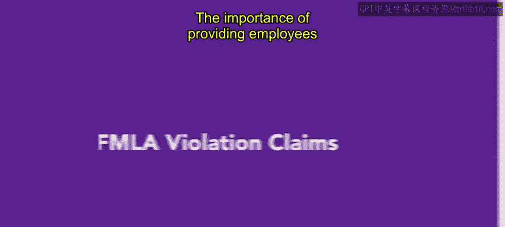
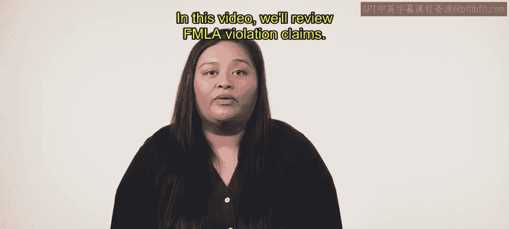
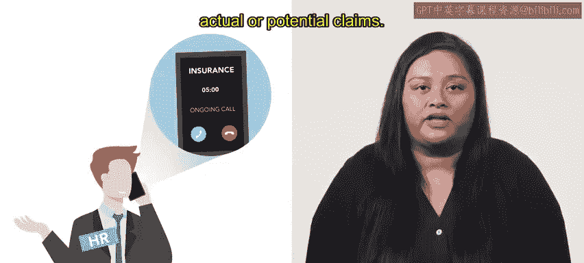
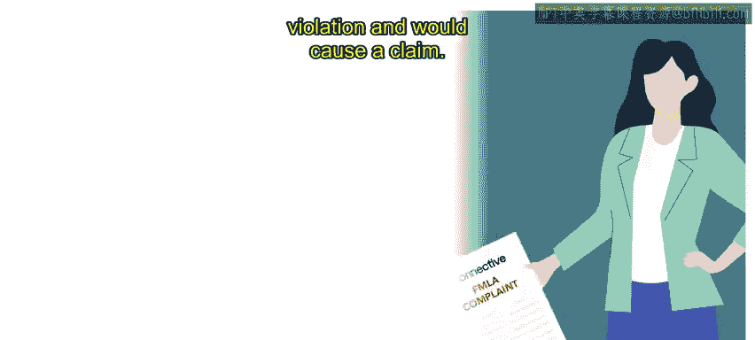

# 2：FMLA违规索赔处理指南

在本节课中，我们将学习如何处理《家庭与医疗休假法案》（FMLA）相关的违规索赔。我们将了解员工可能不符合FMLA资格的原因，以及当索赔发生时，人力资源部门应遵循的关键步骤。

---

### **FMLA索赔概述与重要性**

向员工提供关于《家庭与医疗休假法案》（FMLA）资格的信息至关重要。本节我们将回顾FMLA违规索赔的相关内容。

FMLA休假请求通常是合理的。然而，有时请求可能显得不合理，因而被拒绝。员工可能因多种原因不符合FMLA资格，谨慎沟通这些信息非常关键。

拒绝员工的医疗或家庭休假请求，可能导致其提出FMLA违规索赔。

---

### **处理FMLA索赔的关键步骤**

当员工提出FMLA违规索赔时，组织需要采取一系列行动。以下是处理此类索赔的核心流程。

1.  **立即寻求法律咨询**：员工提出索赔后，应迅速寻求法律顾问，以启动向劳工部申诉的程序，或在庭内/庭外解决此事。
2.  **保持全面准确的沟通**：在所有法律程序中，人力资源部门必须与内部和外部的法律代表保持彻底且准确的沟通。
3.  **核查保险覆盖范围**：并非所有保险提供商都承保因FMLA违规引发的索赔。应咨询保险提供商，以确认是否涵盖实际或潜在的索赔。

---

### **案例分析：一个典型的FMLA违规场景**

上一节我们介绍了处理索赔的步骤，本节我们通过一个具体案例来看看FMLA违规是如何发生的。

假设员工玛丽在该组织全职工作已超过一年。她最近通知主管，她需要请病假接受脊柱手术，预计需要四周恢复时间。她的主管拒绝了该请求，理由是组织无法承受员工离开这么长时间。主管建议玛丽只休一周，然后减少工时返回工作，直至完全康复。

**此回应构成了FMLA违规，并会引发索赔。** 主管的决定忽视了玛丽可能具备的FMLA资格（工作满一年、工时达标、有严重健康状况），单方面缩短了合法的医疗休假。

---

### **预防索赔的最佳实践**

与其他常见索赔类型一样，保持精确的记录和频繁的沟通至关重要，这能帮助您的组织避免遭受额外的处罚。

---

**总结**

本节课中，我们一起学习了FMLA违规索赔的处理。我们明确了及时沟通资格信息的重要性，掌握了索赔发生时的三个关键步骤（寻求法律咨询、保持沟通、核查保险），并通过案例分析了典型的违规情形。最后，我们再次强调了详尽文档和持续沟通在预防和应对索赔中的核心作用。