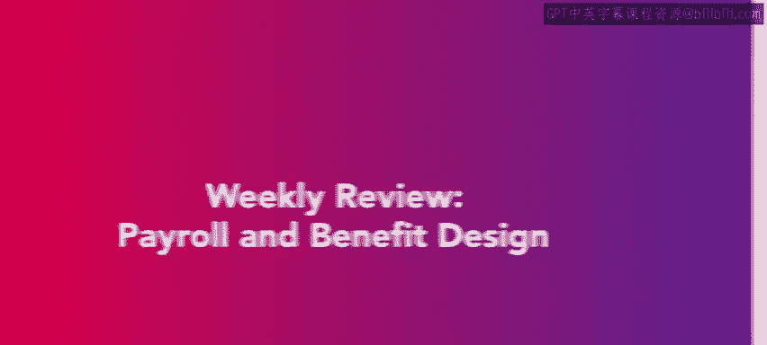
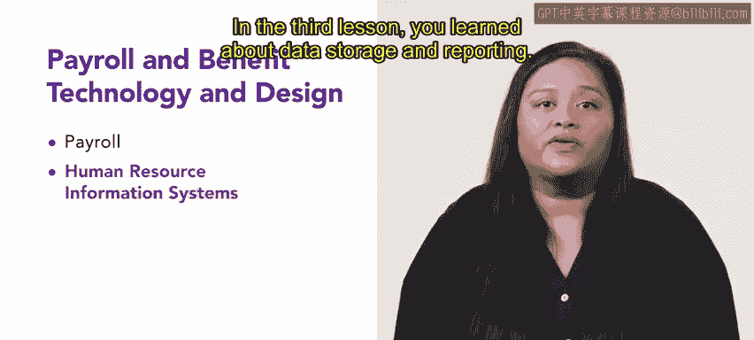

# 3：每周回顾：薪酬和福利设计 💼

在本节课中，我们将回顾第四周关于薪酬与福利技术与设计的核心内容。我们将总结本周所学，巩固对薪酬管理、人力资源信息系统、数据存储与报告以及索赔处理等关键概念的理解。

---

本周的学习已接近尾声。恭喜你完成了本课程的第四周，也是最后一周的学习。你学到了许多关于薪酬与福利技术与设计的知识。作为一名人力资源专业人士，理解哪种薪酬与福利设计最适合你的组织，是一项至关重要的技能。现在，让我们回顾一下本周所涵盖的内容。

在第一节课程中，我们学习了薪酬管理。薪酬管理涉及许多方面，例如排班和记录保存。你也学习了需要保存的记录类型。

上一节我们介绍了薪酬管理的基础，接下来我们来看看人力资源信息系统。

在下一节课中，你接触到了人力资源信息系统。你学习了不同类型的人力资源信息系统，以及如何根据组织的需求选择正确的系统。

在第三节课中，我们学习了数据存储与报告。数据存储与报告不仅仅是保存记录，还包括对记录的适当处置。你学到了很多关于正确存储数据和报告发现的方法。

最后，在最后一节课中，你学习了索赔处理。这些索赔包括工伤赔偿、意外死亡和伤残保险、家庭与医疗休假法案相关索赔、工资与工时索赔等。

---

本周关于薪酬与福利技术与设计的回顾到此结束。你现在已经完成了这门关于薪酬与福利的课程。

---

**总结**

本节课中，我们一起回顾了薪酬与福利设计的核心模块。我们总结了薪酬管理的要点，探讨了人力资源信息系统的选择与应用，理解了数据存储、报告及合规处置的重要性，并学习了各类员工索赔的处理流程。掌握这些知识，将帮助你更专业地设计和维护组织的薪酬福利体系。