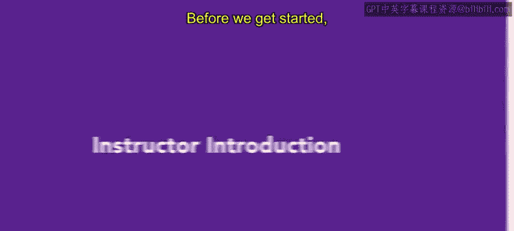

# 7：讲师介绍

在本节中，我们将了解本课程的讲师背景，这有助于你理解课程内容所基于的实践经验。

在课程正式开始前，我先做一下自我介绍。我是米歇尔·阿瓦拉多，将是你们今天的讲师。我的整个职业生涯都致力于人力资源领域。

我的职业生涯始于应用材料公司，担任人力资源专员。我在那里工作了近三年。在应用材料这样的大型公司工作，让我对公司内不同的人力资源角色有了很好的理解。

之后，我将从应用材料公司获得的经验带到了TVo公司，担任人力资源经理。最初，我是那里唯一的人力资源人员，负责所有人力资源事务，包括薪酬、福利、招聘和入职。在这个角色中，我学到了人力资源实践中许多具体的细节。

在TVo公司的17年间，我担任过多个专注于人力资源不同领域的职位，见证了公司和人力资源团队的成长。在TVo的最后五年，我担任人力资源副总裁，负责整个人力资源职能。

随后，我转向为高科技公司提供咨询服务。这真正让我有机会了解不同的业务以及人力资源在不同公司是如何运作的。我从事咨询工作两年。

自那以后，我曾在两家公司担任人力资源负责人，分别是Halio和Uster。在我担任过的每一个人力资源角色中，我都负责或接触过人才招聘流程的某个环节。

本课程将为你打下坚实的人力资源基础，供你进一步构建。那么，我们现在就开始吧。

---

本节课中，我们一起了解了讲师的职业背景，这为后续学习基于实践的人力资源知识提供了可信的视角。接下来，我们将正式进入课程内容的学习。